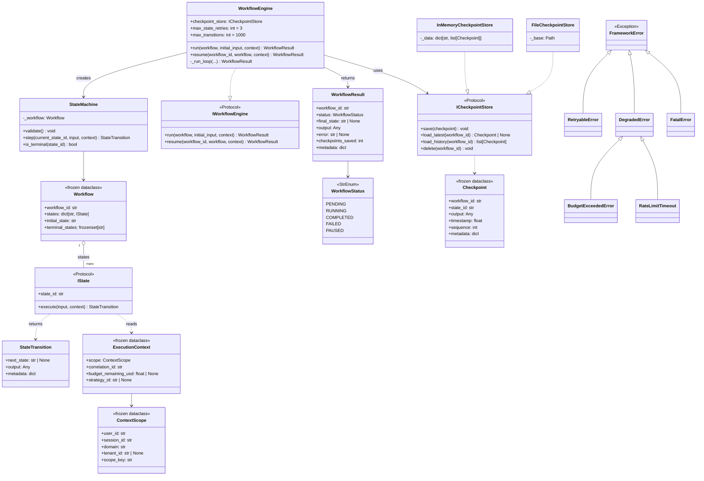
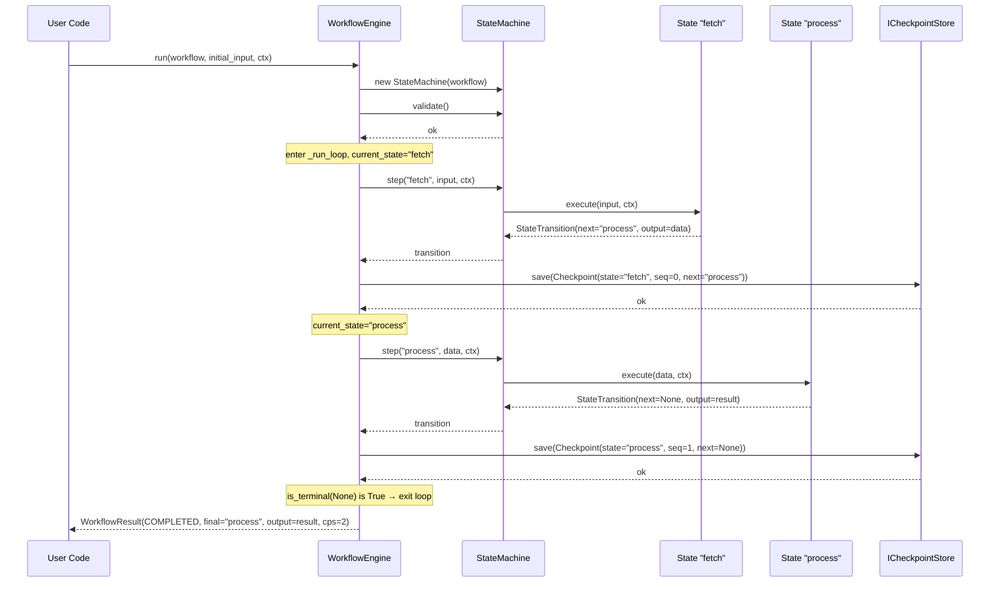
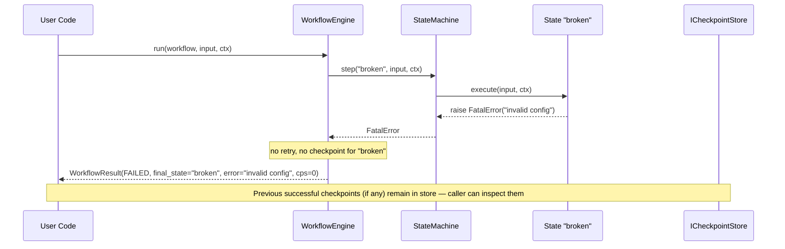

# `ryuu-workflow` — Architecture Document

| Field | Value |
|---|---|
| Document version | 0.1 |
| Last updated | 2026-05-12 |
| Status | Design — Phase 8.1 (pending implementation) |
| Owner | RYUU maintainers |
| Source of truth | Code currently at `ryuu/workflow/`, `ryuu/observability/errors.py`, `ryuu/runtime/context.py` (will be migrated to `packages/ryuu-workflow/`) |

## 1. Purpose & Scope

### 1.1 What it is

`ryuu-workflow` is a **standalone Python library** that runs **directed state graphs with checkpointing**. It is the kernel originally built inside RYUU Phase 7 to orchestrate batch pipelines, extracted as an independent PyPI package so that non-AI consumers (ETL pipelines, Wyckoff state-machine trading bots, code-analysis pipelines, generic DAG runners) can use it without pulling LLM SDKs or any AI machinery.

The library does three things, and nothing else:

1. **Define a workflow** — a finite set of named states with explicit transitions encoded as state output (`next_state`).
2. **Run the workflow** — an async engine drives state transitions, classifies errors into three tiers, retries with backoff where appropriate.
3. **Persist progress** — every successful state execution is checkpointed, so the workflow can resume after a SIGKILL, container restart, or process crash.

### 1.2 What it is NOT

- ❌ A workflow orchestrator like Airflow / Prefect / Temporal — no scheduling, no DAG UI, no distributed execution, no worker pool.
- ❌ A DAG library — workflow is a **state machine** (one state runs at a time), not a DAG (parallel branches).
- ❌ A task queue / message broker.
- ❌ An AI agent framework — no LLMs, no prompts, no embeddings.
- ❌ A retry library — retry is one feature among many, not the focus.

### 1.3 Relationship to RYUU

`ryuu` (the AI framework) depends on `ryuu-workflow` like any third-party library. RYUU uses workflow to drive multi-state batch pipelines (e.g., ingest → analyse → summarize for code analysis); it does NOT use workflow for chat-style conversational flows (those use `RequestHandler` + cognitive strategies, which are separate).

```
┌─────────────────┐         ┌─────────────────┐
│ ryuu (AI fwk)   │ depends │ ryuu-workflow   │
│ ───────────────  │ ─────▶  │ ─────────────── │
│ cognitive/      │         │ state machine + │
│ execution/      │         │ checkpoint engine│
│ providers/      │         │ error tiers     │
│ knowledge/      │         │ execution ctx   │
└─────────────────┘         └─────────────────┘
       ↑                            ↑
       │                            │
 pip install ryuu             pip install ryuu-workflow
 (auto-pulls workflow)        (standalone, no AI)
```

## 2. Functional Requirements

### 2.1 Workflow definition

| ID | Requirement | Verification |
|---|---|---|
| FR-1 | A workflow is an immutable bundle of (`workflow_id`, `states` dict, `initial_state`, `terminal_states` frozenset). Must be hashable & shareable across coroutines. | Frozen dataclass; unit test verifies `dataclasses.replace()` returns new instance. |
| FR-2 | States are user-defined classes implementing the `IState` protocol: must expose `state_id: str` and `async def execute(input, context) → StateTransition`. No inheritance required. | Protocol with `@runtime_checkable`; integration test with a plain `@dataclass` state. |
| FR-3 | A state returns a `StateTransition(next_state: str \| None, output: Any, metadata: dict)`. `next_state=None` signals the workflow is done. | Unit test: state returning `next_state=None` completes workflow. |
| FR-4 | A workflow definition must be **validated** before execution: initial state exists in `states` dict; every state's `.state_id` matches its dict key. Validation raises `FatalError`. | `StateMachine.validate()` unit tests covering both invalid cases. |

### 2.2 Workflow execution

| ID | Requirement | Verification |
|---|---|---|
| FR-5 | `WorkflowEngine.run(workflow, initial_input, context)` drives the state machine from `initial_state` until a state returns `next_state=None` or `next_state ∈ workflow.terminal_states`. | Integration test: 3-state linear pipeline → all 3 execute → `COMPLETED`. |
| FR-6 | Each state receives `(input, context)`. The previous state's `output` becomes the next state's `input`. The `ExecutionContext` is unchanged across the workflow (passed by reference). | Unit test: chain output through 3 states. |
| FR-7 | A state listed in `terminal_states` is an **exit marker** — engine stops *before* executing it. Useful for explicitly named end-points (`"DONE"`, `"CANCELLED"`). | Integration test: state in `terminal_states` is never invoked. |
| FR-8 | A state returning `next_state=None` **is executed and checkpointed** — it is the natural last step. (Historical bug fixed 2026-05-08: previously these were skipped.) | Regression test in `test_engine_terminal_semantics.py`. |
| FR-9 | The engine MUST bound the number of state transitions per run (`max_transitions`, default 1000) to prevent infinite loops in misconfigured workflows. Exceeding the bound returns `FAILED` with `error="max transitions exceeded — possible infinite loop"`. | Unit test: 2-state cyclic workflow → fails at bound. |

### 2.3 Error tiers & retry

| ID | Requirement | Verification |
|---|---|---|
| FR-10 | Three error tiers: `RetryableError` (transient), `DegradedError` (capability lost — fall back, don't retry), `FatalError` (non-recoverable — log & escalate). All inherit from `FrameworkError`. | Unit tests for `isinstance` chains and `retry_policy()` decisions. |
| FR-11 | On `RetryableError`, engine retries up to `max_state_retries` times (default 3) with **exponential backoff + jitter**. The backoff schedule is `[0.5, 1, 2, 4, 8, 16, 30]` seconds, capped at the last value. Jitter is up to 20% of the base wait. | Unit test verifies `retry_policy()` return shape per attempt index. |
| FR-12 | On `DegradedError`, engine logs a warning and **fails the workflow without retry** (workflow result `FAILED`). | Unit test asserts DegradedError → FAILED status. |
| FR-13 | On `FatalError`, engine fails immediately with no retry. | Unit test. |
| FR-14 | Engine MUST classify any non-`FrameworkError` exception into the fatal tier (catch-all). This prevents unknown exceptions from escaping the engine. | Unit test: state raises `ValueError` → workflow `FAILED`. |
| FR-15 | A separate adapter `classify_external_error(exc)` converts third-party SDK exceptions (e.g. OpenAI/Anthropic) into the right tier. This is an OPTIONAL helper — consumers using non-AI states can ignore it. | Unit test with a fake OpenAI rate-limit error → `RetryableError`. |

### 2.4 Checkpointing & resume

| ID | Requirement | Verification |
|---|---|---|
| FR-16 | After every successful state execution, the engine MUST persist a `Checkpoint(workflow_id, state_id, output, timestamp, sequence, metadata={"next_state": ...})` via the `ICheckpointStore`. | Integration test: 3-state run → 3 checkpoints saved. |
| FR-17 | `WorkflowEngine.resume(workflow_id, workflow, context)` reads the latest checkpoint and resumes from the state stored in `metadata["next_state"]`. If no checkpoint exists, behaves like `run()` with `initial_input=None`. | Integration test: kill mid-run, resume, verify states skipped. |
| FR-18 | If the last checkpoint's `next_state` is `None` (i.e. last state was terminal), `resume()` returns `COMPLETED` without re-executing anything. | Unit test. |
| FR-19 | The `ICheckpointStore` protocol provides four methods: `save(cp)`, `load_latest(wf_id) → Checkpoint \| None`, `load_history(wf_id) → list[Checkpoint]` (sorted by sequence asc), `delete(wf_id)`. | Contract tests applied to every concrete store. |
| FR-20 | `InMemoryCheckpointStore`: in-process dict; no persistence. Default for tests and single-process dev. | Unit test set in `tests/unit/workflow/stores/`. |
| FR-21 | `FileCheckpointStore`: JSON-on-disk; layout `<base_dir>/<workflow_id>/<sequence>.json`; **atomic writes** (`<seq>.tmp` → `os.replace(.tmp, .json)`) — SIGKILL-safe. Single-writer per workflow_id (concurrent writes to the same workflow are NOT supported in v1). | Crash test: `kill -9` mid-write → no corrupted JSON; new sequence resumes cleanly. |
| FR-22 | `FileCheckpointStore` MUST raise `FatalError` if a checkpoint output is not JSON-serializable (TypeError/ValueError) — fails loudly rather than silently dropping data. | Unit test with non-serializable output (e.g. a lambda). |

### 2.5 Execution context

| ID | Requirement | Verification |
|---|---|---|
| FR-23 | `ExecutionContext` is a **frozen** dataclass carrying `scope: ContextScope`, `correlation_id: str`, optional `budget_remaining_usd`, optional `strategy_id`. Modification via `dataclasses.replace()`. | Unit test: attempting `ctx.scope = ...` raises `FrozenInstanceError`. |
| FR-24 | `ContextScope` is frozen with `user_id`, `session_id`, `domain`, optional `tenant_id`. Has a `scope_key` property returning a deterministic colon-separated string. | Unit test. |
| FR-25 | The workflow engine MUST NOT mutate `ExecutionContext` while a workflow runs. States receive the same `context` reference throughout. | Integration test asserts `id(ctx) == id(ctx_received_by_state)`. |

## 3. Non-Functional Requirements

### 3.1 Runtime & deployment

| ID | Requirement | Rationale |
|---|---|---|
| NFR-1 | **Async-first.** All I/O methods on `IState`, `IWorkflowEngine`, `ICheckpointStore` are `async def`. Sync wrappers are out of scope. | Workflow tier was extracted from an async-native framework; sync support adds complexity for low value. |
| NFR-2 | **Minimal dependencies.** Only `anyio>=4.0`. No pydantic, no pyyaml, no OpenTelemetry, no LLM SDKs. | Library must be cheap to embed in unrelated projects. The full RYUU AI tier is ~12 transitive deps; workflow is ~3. |
| NFR-3 | **Python ≥ 3.11.** Uses `StrEnum`, PEP 604 union syntax (`X \| None`), `Self` typing. Matches RYUU baseline. | Avoid backport packages; modern Python is the runtime RYUU targets. |
| NFR-4 | **Type-safe.** Library MUST pass `mypy --strict` on its own source and ship a `py.typed` marker (PEP 561). | Consumers using strict typing should get inference for free. |
| NFR-5 | **PEP 604 / PEP 612 idioms** — protocols, generics, `runtime_checkable` decorators. No metaclasses, no abstract base classes for user-facing API. | User-defined states should be plain dataclasses, not subclasses of a framework class. |

### 3.2 Reliability & durability

| ID | Requirement | Rationale |
|---|---|---|
| NFR-6 | **SIGKILL-safe with `FileCheckpointStore`.** A `kill -9` between state executions must NEVER corrupt the checkpoint store. Resume from the last successfully-written sequence must produce identical output as a clean run. | Workflow consumers often run long batch jobs (ingestion, code analysis) where mid-run process loss is realistic. |
| NFR-7 | **Idempotent resume.** Calling `resume(wf_id)` after a successful `run()` returns `COMPLETED` without re-executing states. | Allows operators to safely re-invoke resume scripts. |
| NFR-8 | **Bounded retries.** Hard ceiling on `max_state_retries` (default 3) and `max_transitions` (default 1000). The engine must NEVER loop unboundedly. | Misbehaving states must not hang the process. |
| NFR-9 | **No background tasks.** Engine runs entirely in the caller's coroutine; no spawned tasks, no thread pool, no scheduler. | Predictable lifecycle for embedding in larger async apps. |

### 3.3 Performance

| ID | Requirement | Rationale |
|---|---|---|
| NFR-10 | **Engine overhead per state ≤ 1 ms** (excluding state execution + checkpoint I/O). | Workflow tier should not be a bottleneck — domain code dominates. |
| NFR-11 | **Checkpoint serialization cost is the consumer's choice.** `FileCheckpointStore` uses `json.dumps` (no compression). For large outputs, consumers may write a custom store. | Don't pay for what you don't use. |
| NFR-12 | **No global state.** Multiple `WorkflowEngine` instances may coexist with separate stores. | Required for testing + multi-tenant embeddings. |

### 3.4 API stability

| ID | Requirement | Rationale |
|---|---|---|
| NFR-13 | Public API surface = the symbols re-exported by `ryuu_workflow/__init__.py`. Anything not re-exported is **internal**. | Smaller stable surface = freedom to refactor internals. |
| NFR-14 | Semver: pre-1.0 is allowed to break minor versions. Post-1.0, public API changes require a major bump. | Standard for libraries pre/post stabilization. |
| NFR-15 | Protocol-based extensibility: users add states by implementing `IState`; they add stores by implementing `ICheckpointStore`. No inheritance from concrete classes. | Avoids fragile-base-class problem; future-proofs the public API. |

## 4. High-Level Architecture

### 4.1 Module map

```
ryuu_workflow/
├── __init__.py          ← public API (re-exports)
├── py.typed
├── checkpoint.py        ← Checkpoint dataclass + ICheckpointStore protocol
├── state_machine.py     ← IState protocol, StateTransition, Workflow, StateMachine
├── engine.py            ← WorkflowEngine, IWorkflowEngine, WorkflowResult, WorkflowStatus
├── errors.py            ← Error tier hierarchy + retry_policy + classify_external_error
├── context.py           ← ContextScope, ExecutionContext
└── stores/
    ├── __init__.py
    ├── in_memory.py     ← InMemoryCheckpointStore
    └── file.py          ← FileCheckpointStore
```

### 4.2 Component responsibilities

| Component | Responsibility | Stability |
|---|---|---|
| `Workflow` | Immutable graph definition. No behavior. | Public, stable. |
| `IState` | User-defined state behavior. Protocol — users implement. | Public, stable. |
| `StateTransition` | Carrier of (next_state, output) returned by a state. | Public, stable. |
| `StateMachine` | Validates graph structurally; executes one state step. Internal helper used by engine. | Public but advanced — users normally don't touch. |
| `WorkflowEngine` | Orchestrates the run loop: step → checkpoint → next. Handles retries, terminal semantics, transition bounds. | Public, stable. |
| `IWorkflowEngine` | Engine protocol — allows substitution (e.g., fake engine for tests). | Public, stable. |
| `WorkflowResult` | Engine return value: status, final state, output, error, checkpoints_saved. | Public, stable. |
| `WorkflowStatus` | Enum: PENDING, RUNNING, COMPLETED, FAILED, PAUSED. | Public, stable. |
| `Checkpoint` | Immutable snapshot of a state's output + metadata. | Public, stable. |
| `ICheckpointStore` | Persistence protocol. Users implement for custom backends. | Public, stable. |
| `InMemoryCheckpointStore` | Default for tests/dev. | Public, stable. |
| `FileCheckpointStore` | JSON-on-disk, atomic writes. | Public, stable. |
| `FrameworkError`, `RetryableError`, `DegradedError`, `FatalError` | Error tier hierarchy. | Public, stable. |
| `retry_policy()`, `RetryDecision` | Pure decision function — useful for custom retry loops. | Public, stable. |
| `classify_external_error()` | OpenAI/Anthropic SDK adapter. | Public but OPTIONAL — consumers without LLM states ignore. |
| `ExecutionContext`, `ContextScope` | Identity bundle passed to every state. | Public, stable. |

### 4.3 Layered view

```
┌─────────────────────────────────────────────────────────────┐
│                         User Code                            │
│   (IState implementations + Workflow definition + run call)  │
└──────────────────────────────┬──────────────────────────────┘
                               │
                               ▼
┌─────────────────────────────────────────────────────────────┐
│                      WorkflowEngine                          │
│   run / resume / _run_loop (the orchestration logic)        │
│   ─ retries / terminal-state semantics / transition bound   │
└──────────────────────────────┬──────────────────────────────┘
                               │
              ┌────────────────┴────────────────┐
              ▼                                  ▼
┌──────────────────────────┐      ┌──────────────────────────┐
│      StateMachine        │      │     ICheckpointStore     │
│   validate + step        │      │ save/load_latest/history │
│   (graph correctness)    │      │  (persistence boundary)  │
└──────────┬───────────────┘      └────────────┬─────────────┘
           │                                   │
           ▼                                   ▼
┌──────────────────────────┐      ┌──────────────────────────┐
│     IState (user impl)   │      │ InMemory- or File-       │
│   async execute(input, ctx)     │ CheckpointStore          │
└──────────────────────────┘      └──────────────────────────┘

           ┌─────────────────────────────────────┐
           │  Cross-cutting: errors / context    │
           │  (RetryableError, DegradedError,    │
           │   FatalError, ExecutionContext)     │
           └─────────────────────────────────────┘
```

## 5. Low-Level Architecture

### 5.1 Data flow during a run

Given a workflow with states `S1 → S2 → S3 (terminal)`:

```
initial_input ──▶ S1.execute(initial_input, ctx)
                     │
                     ▼
                  StateTransition(next_state="S2", output=O1)
                     │
                     ▼
                  Checkpoint(state_id="S1", output=O1, seq=0, metadata={next: S2})
                     │
                     ▼ (saved to store)
                  S2.execute(O1, ctx)
                     │
                     ▼
                  StateTransition(next_state=None, output=O2)
                     │
                     ▼
                  Checkpoint(state_id="S2", output=O2, seq=1, metadata={next: None})
                     │
                     ▼ (saved)
                  loop exits because is_terminal(None) is True
                     │
                     ▼
                  WorkflowResult(status=COMPLETED, final_state="S2", output=O2, checkpoints_saved=2)
```

Key invariants:
- A state is checkpointed **after** it returns successfully. A state that raises is NOT checkpointed.
- The checkpoint's `output` is what gets fed into the next state's `input` on a resume.
- The `next_state` is stored in `checkpoint.metadata["next_state"]` — the resume path reads this and continues.

### 5.2 Run loop algorithm

```
function _run_loop(workflow, machine, current_state, current_input, sequence, context):
    transitions = 0
    while not machine.is_terminal(current_state):
        if transitions >= max_transitions:
            return FAILED("max transitions exceeded")
        
        # Retry loop for this single state
        transition = None
        attempt = 0
        while attempt < max_state_retries:
            try:
                transition = await machine.step(current_state, current_input, context)
                break  # success
            except RetryableError as exc:
                decision = retry_policy(exc, attempt)
                if decision.wait_seconds:
                    await anyio.sleep(decision.wait_seconds)
                attempt += 1
            except DegradedError:
                break  # fall through with transition=None → FAILED
            except FatalError as exc:
                return FAILED(str(exc))
        
        if attempt >= max_state_retries and transition is None:
            return FAILED("max retries exceeded")
        if transition is None:
            return FAILED("DegradedError without returning transition")
        
        # Checkpoint
        cp = Checkpoint(workflow_id, current_state, transition.output, time.time(), sequence,
                        metadata={"next_state": transition.next_state})
        await checkpoint_store.save(cp)
        sequence += 1
        transitions += 1
        
        current_state = transition.next_state  # may be None
        current_input = transition.output
    
    return COMPLETED(final_state=current_state, output=current_input)
```

### 5.3 Resume algorithm

```
function resume(workflow_id, workflow, context):
    cp = await checkpoint_store.load_latest(workflow_id)
    if cp is None:
        return await run(workflow, initial_input=None, context)  # fresh run
    
    next_state = cp.metadata.get("next_state")
    if next_state is None:
        # Last checkpoint was terminal — workflow already completed
        return COMPLETED(final_state=cp.state_id, output=cp.output, checkpoints_saved=cp.sequence + 1)
    
    machine = StateMachine(workflow); machine.validate()
    if next_state not in workflow.states:
        return FAILED(f"Checkpoint next_state {next_state} not in workflow")
    
    return await _run_loop(
        workflow=workflow,
        machine=machine,
        current_state=next_state,
        current_input=cp.output,
        sequence=cp.sequence + 1,
        context=context,
    )
```

### 5.4 Concurrency model

| Surface | Concurrency stance |
|---|---|
| `WorkflowEngine.run()` | Single coroutine. Sequential state execution. No internal concurrency. |
| `IState.execute()` | User code — may use its own concurrency (`anyio.create_task_group`, async I/O) internally. |
| `ICheckpointStore` | Methods are `async` but assumed **single-writer per `workflow_id`**. Concurrent writes to the same `workflow_id` from two engine instances are NOT supported. Single-reader is fine. |
| Multiple workflows on the same engine | Safe — engine has no per-run state; each `run()` call is independent. Different `workflow_id`s with `FileCheckpointStore` are write-isolated by directory layout. |
| Cancellation | If the calling coroutine is cancelled, the in-flight `state.execute()` is cancelled (propagation through `await`). Last successful checkpoint is preserved. No special cleanup is performed by the engine. |

### 5.5 Error tier classification

The three tiers are NOT interchangeable. Choosing the wrong tier changes the workflow outcome:

| Tier | Engine action | When to raise |
|---|---|---|
| `RetryableError` | Backoff + retry up to N times. Counts toward `max_state_retries`. | Transient: network blip, rate-limit, DB deadlock. Caller has reason to believe the next attempt will succeed. |
| `DegradedError` | Stop workflow with FAILED. NO retry. | Capability lost: out of budget, dependent service unhealthy. Retry would not help. |
| `FatalError` | Stop workflow with FAILED. NO retry. | Programming bug, corrupted state, auth failure. Human intervention required. |
| _any other `Exception`_ | Wrapped as `FatalError` internally — workflow FAILS. | Don't rely on this; raise an explicit tier. |

The distinction between `DegradedError` and `FatalError` exists because **callers above the engine** (e.g., RYUU's cognitive strategies) can use `retry_policy()` directly to make different fallback decisions per tier. The engine itself treats them equivalently (both → FAILED no-retry).

## 6. Class Diagram



## 7. Sequence Diagrams

### 7.1 Normal happy-path run



### 7.2 Resume after crash

```mermaid
sequenceDiagram
    participant U as User Code (new process)
    participant E as WorkflowEngine
    participant CS as FileCheckpointStore
    participant M as StateMachine
    participant S2 as State "process"
    
    Note over U,CS: Previous process was killed AFTER "fetch" checkpointed, BEFORE "process" ran
    
    U->>E: resume(workflow_id, workflow, ctx)
    E->>CS: load_latest(workflow_id)
    CS-->>E: Checkpoint(state="fetch", seq=0, output=data, metadata{next:"process"})
    
    Note over E: cp.metadata.next_state = "process" → re-enter _run_loop
    
    E->>M: new StateMachine(workflow); validate()
    M-->>E: ok
    
    E->>M: step("process", data, ctx)
    M->>S2: execute(data, ctx)
    S2-->>M: StateTransition(next=None, output=result)
    M-->>E: transition
    E->>CS: save(Checkpoint(state="process", seq=1, next=None))
    
    E-->>U: WorkflowResult(COMPLETED, output=result, cps=2)
    
    Note over U,CS: "fetch" was NOT re-executed — sequence 0 already persisted
```

### 7.3 Retry on RetryableError

```mermaid
sequenceDiagram
    participant E as WorkflowEngine
    participant M as StateMachine
    participant S as State "flakey"
    
    Note over E: attempt = 0
    E->>M: step("flakey", input, ctx)
    M->>S: execute(input, ctx)
    S-->>M: raise RetryableError("rate limited")
    M-->>E: RetryableError
    
    E->>E: retry_policy(exc, attempt=0) → wait 0.5s + jitter
    E->>E: anyio.sleep(~0.6s)
    
    Note over E: attempt = 1
    E->>M: step("flakey", input, ctx)
    M->>S: execute(input, ctx)
    S-->>M: raise RetryableError("rate limited")
    M-->>E: RetryableError
    
    E->>E: retry_policy(exc, attempt=1) → wait 1.0s + jitter
    E->>E: anyio.sleep(~1.2s)
    
    Note over E: attempt = 2 (last allowed)
    E->>M: step("flakey", input, ctx)
    M->>S: execute(input, ctx)
    S-->>M: StateTransition(next=None, output="ok")
    M-->>E: transition
    
    Note over E: success on 3rd attempt; checkpoint + continue
```

### 7.4 FatalError aborts immediately



## 8. Failure Mitigation

| # | Failure mode | Impact | Mitigation | Residual risk |
|---|---|---|---|---|
| F1 | Process killed mid-state-execution | State did not complete; checkpoint not written | Resume re-runs the state from the prior checkpoint's output. State `execute` MUST be idempotent w.r.t. external side effects (this is the consumer's responsibility — document loudly in user-facing README). | If state's external side-effect is non-idempotent (e.g., money transfer), resume will double-execute. Mitigation is consumer-side: idempotency keys. |
| F2 | Process killed mid-checkpoint-write (`FileCheckpointStore`) | Partial JSON on disk | Atomic write: `<seq>.tmp` → `os.replace(.tmp, .json)`. `os.replace` is atomic on POSIX. After kill, either the new file is fully present or the directory shows no `<seq>.json` (only `<seq>.tmp` left, which is ignored by `load_history`). | None for POSIX. Windows: `os.replace` is atomic since Python 3.3. |
| F3 | Concurrent writes to same `workflow_id` | File overwrite / race | Documented: single-writer per `workflow_id`. Engine does NOT enforce locking. | Consumer-side: must coordinate (file lock, distributed lock, queue). Phase 9 may add an `acquire_lock(wf_id)` to `ICheckpointStore`. |
| F4 | Misconfigured workflow with cycle | Infinite loop | `max_transitions=1000` hard cap. Engine returns `FAILED("max transitions exceeded")`. | Consumer should design DAG-shaped workflows. Cycles are allowed but bounded. |
| F5 | State raises `RetryableError` forever | Infinite retry | `max_state_retries=3` hard cap. After exhaustion, engine returns `FAILED("max retries exceeded")`. Each retry consumes a transition count too. | None within library. Consumer can tune `max_state_retries`. |
| F6 | State raises an unknown exception (e.g., `ValueError`) | Engine state corruption | Engine treats it as `FatalError`-equivalent: workflow FAILED, no retry. (Currently NOT wrapped explicitly — relies on Python's `except FatalError` falling through. **DESIGN GAP: should wrap into `FrameworkError`.** See §11.) | Consumer sees `error=str(exc)` but loses type info. |
| F7 | Checkpoint output not JSON-serializable (with `FileCheckpointStore`) | Save fails silently OR with unclear error | Adapter raises `FatalError` with explanatory message including workflow_id + state_id. | None — failure is loud. |
| F8 | Disk full when saving checkpoint | Write fails | `FileCheckpointStore` does NOT catch `OSError` — propagates up. Engine wraps via outer try/except as workflow FAILED. | Consumer must monitor disk. May add disk-space pre-check in Phase 9. |
| F9 | Stale `tmp` files left behind by killed writes | Leftover garbage | `load_history` ignores non-`.json` files (`sorted(wf_dir.glob("*.json"))`). | Minor disk waste. Add periodic cleanup in Phase 9 if it matters. |
| F10 | Resume called with a workflow definition whose `state_id`s have changed | Resume references missing state | Engine checks `next_state in workflow.states` → returns `FAILED("Checkpoint next_state X not found in workflow states")`. | Consumer must version their workflow definition. May add `workflow_version` field in Phase 9. |
| F11 | Memory exhaustion from huge checkpoint outputs (e.g., a state returns gigabytes) | OOM | Library does NOT enforce a size limit. | Consumer responsibility. May add an optional `max_checkpoint_bytes` in Phase 9. |
| F12 | `InMemoryCheckpointStore` loses everything on process exit | Resume returns "no checkpoint" → fresh run | Documented: in-memory store is dev/test only. | None within library. Production usage requires `FileCheckpointStore` or custom. |
| F13 | Clock drift between checkpointing and reading `cp.timestamp` | Misleading timestamps | Stored timestamps are best-effort (`time.time()` at save time). Library does NOT use them for ordering — `sequence` is authoritative. | None — `sequence` is monotonic per workflow run. |
| F14 | Validation passes but a state's `state_id` mutates at runtime | Engine's `is_terminal` check uses string equality; mutation between checks could break logic | Engine reads `state_id` once per `step()` call via `workflow.states.get(current_state_id)`. `IState` does NOT mandate immutability of `state_id`, but the protocol's contract implies it. | None enforced. Could add validation that `state.state_id == key` at every `step()` call (currently only at `validate()` time). |

## 9. Component Tradeoffs

### 9.1 `Workflow` as frozen dataclass (vs. builder pattern)

**Choice:** Plain frozen dataclass — user constructs `Workflow(workflow_id=..., states={...}, initial_state="x", terminal_states=frozenset())` directly.

**Alternatives considered:**
- *Builder pattern*: `WorkflowBuilder().add_state(s).initial("x").build()`. Pro: nicer API for incremental construction. Con: ~80 lines of plumbing, no clear win.
- *YAML/JSON config*: load workflow from a file. Pro: declarative. Con: requires schema deps (pydantic/marshmallow). Out of scope for `anyio`-only lib.

**Rationale:** The dataclass form is Pythonic, has zero dependencies, and is trivially testable. If a consumer wants a builder, they can write one in 20 lines.

### 9.2 `IState` as Protocol (vs. ABC base class)

**Choice:** `runtime_checkable` Protocol; user states are plain dataclasses with no inheritance.

**Alternatives considered:**
- *ABC `BaseState`*: forces `class MyState(BaseState):`. Pro: helps autocomplete, can provide default methods. Con: inheritance coupling, harder to unit-test, requires `super().__init__()` ritual.

**Rationale:** Protocols favor composition over inheritance; user state classes can be defined with `@dataclass` (1 line of decoration) and work seamlessly. The `runtime_checkable` decorator allows `isinstance(s, IState)` checks where needed.

**Tradeoff:** Protocols are checked structurally — typos in `state_id` will fail at runtime, not at definition time. Mitigation: mypy catches missing attributes if users annotate; `StateMachine.validate()` catches misaligned keys.

### 9.3 Checkpoint **after** state execution (vs. before)

**Choice:** Checkpoint is written *after* a state returns successfully. The checkpoint stores the state's *output* + `next_state`.

**Alternatives considered:**
- *Checkpoint before*: persist intent ("about to run X") before executing. Pro: caller knows what was attempted. Con: doubles the I/O; requires distinguishing "attempted" vs "completed" checkpoints; conflicts with idempotent-resume semantics.

**Rationale:** "Checkpoint after success" means the checkpoint represents *what has been done*. Resume reads "I've done X, what's next?" — simpler invariant. If a state crashes mid-execution, it left no checkpoint, so resume retries that state from scratch (which is what we want, assuming idempotency).

**Tradeoff:** A long-running state that fails near completion loses all in-state work. Mitigation: consumers can split long states into sub-states.

### 9.4 `next_state` carried by state output (vs. declared in `Workflow`)

**Choice:** Each state's `execute()` returns the next state name in its `StateTransition`. The `Workflow` definition does NOT declare transitions statically.

**Alternatives considered:**
- *Static transition table*: `Workflow.transitions: dict[str, list[str]]`. Pro: graph is statically inspectable; can validate reachability. Con: state has to encode "which transition to take" with a separate field (e.g. `transition_label`), adding indirection.

**Rationale:** State-driven transitions give consumers full control: a state can branch dynamically based on input (e.g., `if data.is_valid → "process" else "error"`). This is essential for state-machine patterns (Wyckoff stage transitions, validation pipelines).

**Tradeoff:** Workflow is harder to visualize statically. There's no built-in "list all reachable states from X". For visualization, consumers can run a workflow with a tracing `IState` wrapper.

### 9.5 `terminal_states` separate from `next_state=None`

**Choice:** Two ways to end a workflow — both supported.

| Mechanism | Behavior |
|---|---|
| Return `StateTransition(next_state=None, output=X)` | State **executes**, output is checkpointed, then workflow completes. |
| Add `state_id` to `Workflow.terminal_states` | Engine stops **before** invoking the state. (Useful for "DONE" or "CANCELLED" markers.) |

**Rationale for both:** Most pipelines end naturally with the last state returning `next_state=None`. Some need explicit named exit points (e.g., for branching workflows where multiple paths converge to a "CANCELLED" state that doesn't need to execute anything).

**Bug history:** Originally the engine skipped states with `next_state=None` without executing them. Fixed 2026-05-08 (Phase 7-T03 bug). The two mechanisms are now clearly distinguished.

### 9.6 Three error tiers (vs. one or two)

**Choice:** `RetryableError`, `DegradedError`, `FatalError`.

**Alternatives considered:**
- *Two tiers* (`RetryableError` / `FatalError`): simpler but loses the "capability lost but not a bug" semantics. RYUU cognitive strategies use `DegradedError` to mean "fall back to cheaper model" — engine doesn't care, but the tier is useful at higher levels.
- *Exception-class-per-failure* (e.g., `RateLimitError`, `BudgetExceededError`): more specific but explodes the surface area. Resolution: tier base classes + named subclasses (`BudgetExceededError(DegradedError)`, `RateLimitTimeout(DegradedError)`).

**Rationale:** Three tiers map cleanly to three caller responses: retry / fall-back / abort. Subclassing within tiers preserves specificity. `retry_policy()` returns a `RetryDecision` parameterized by tier so callers can act differently.

### 9.7 `ExecutionContext.strategy_id` lives in workflow library

**Choice:** Keep `strategy_id: str | None = None` field in `ExecutionContext` even though it's RYUU-specific.

**Alternatives considered:**
- *Drop the field*: forces RYUU to subclass or wrap `ExecutionContext`. Complicates RYUU code.
- *Use a generic `metadata: dict`*: type-unsafe.
- *Generic Context[T]*: heavy generic machinery.

**Rationale (compromise):** Workflow consumers ignore the field (it stays `None`). RYUU sets it before dispatching to a cognitive strategy. The cost is one unused field in the workflow-only case (~0 bytes for None).

**Known design debt:** Track in Phase 9. If a workflow-only consumer asks for cleaner separation, generalize via TypeVar-parameterized context.

### 9.8 `FileCheckpointStore` uses JSON (vs. pickle / msgpack / protobuf)

**Choice:** Standard library `json`.

**Alternatives considered:**
- *Pickle*: handles any Python object. Pro: zero serialization effort. Con: not portable across versions, security risk (pickle.loads arbitrary code), opaque.
- *msgpack / protobuf / cbor*: faster, smaller. Con: extra dependency; breaks NFR-2 (only `anyio`).

**Rationale:** JSON is stdlib, human-readable (debugging!), language-portable. State outputs are expected to be small and structured (dicts, lists, primitives, dataclasses serialized as dicts). For specialized needs, consumers implement a custom `ICheckpointStore`.

**Tradeoff:** Outputs must be JSON-serializable. The store raises `FatalError` on failure with a clear message. Consumers can `dataclasses.asdict(my_obj)` in their state.

### 9.9 Atomic write via `os.replace` (vs. `fsync` + `rename`)

**Choice:** Write `<seq>.tmp`, then `os.replace(.tmp, <seq>.json)`. No explicit `fsync`.

**Alternatives considered:**
- *Add `fsync()` before `os.replace`*: forces data to disk before rename. Pro: stronger durability — survives power loss. Con: order-of-magnitude slower (~10ms per checkpoint on rotating disk).

**Rationale:** `os.replace` is atomic with respect to **concurrent readers** (the swap is either visible or not). For a SIGKILL of our own process, the data is already in the kernel page cache → `os.replace` is enough. For a power loss before the kernel flushes, we lose the most recent checkpoint — but resume from the previous checkpoint is still valid (idempotency).

**Tradeoff:** Pre-1.0 we don't fsync. If a consumer demands power-loss durability, Phase 9 may add a `FileCheckpointStore(fsync=True)` flag.

### 9.10 `WorkflowEngine` is a `@dataclass` (vs. plain class)

**Choice:** `@dataclass` with `checkpoint_store`, `max_state_retries=3`, `max_transitions=1000`.

**Rationale:** Decisions are encoded as field defaults; users instantiate `WorkflowEngine(checkpoint_store=...)` and tune knobs without remembering positional args. Trivially copyable for tests. No `__init__` boilerplate.

**Tradeoff:** Field mutation is allowed (dataclass is not frozen). If a consumer mutates `engine.max_state_retries` mid-run, the change takes effect immediately. Considered acceptable — engine has no internal invariants that depend on these fields being constant during a run.

## 10. Public API Surface

After Phase 8.1 ships, `ryuu_workflow/__init__.py` re-exports the following symbols:

```python
# From state_machine.py
from ryuu_workflow.state_machine import IState, StateTransition, Workflow, StateMachine

# From engine.py
from ryuu_workflow.engine import (
    IWorkflowEngine,
    WorkflowEngine,
    WorkflowResult,
    WorkflowStatus,
)

# From checkpoint.py
from ryuu_workflow.checkpoint import Checkpoint, ICheckpointStore

# From stores/
from ryuu_workflow.stores.in_memory import InMemoryCheckpointStore
from ryuu_workflow.stores.file import FileCheckpointStore

# From errors.py
from ryuu_workflow.errors import (
    FrameworkError,
    RetryableError,
    DegradedError,
    FatalError,
    BudgetExceededError,
    RateLimitTimeout,
    RetryDecision,
    retry_policy,
    classify_external_error,
)

# From context.py
from ryuu_workflow.context import ContextScope, ExecutionContext
```

Users can `import ryuu_workflow as wf` for ergonomic short-form access.

## 11. Out of Scope (Explicitly)

The following are explicit non-goals for `ryuu-workflow` v0.2 / v1.x:

1. **Distributed execution** — workflow runs in-process. No worker pool, no cross-machine coordination.
2. **Parallel state execution** — exactly one state runs at a time per workflow run. (A state can internally parallelize work.)
3. **Workflow scheduler** — no cron, no triggers, no event bus. Workflows are started by direct `engine.run()` calls.
4. **UI / visualization** — no web dashboard, no graphviz output.
5. **Versioned workflows** — if consumers change state IDs, resume may fail. No migration tooling.
6. **Compensation / saga** — no built-in rollback semantics. Consumers implement via explicit error states.
7. **Multi-language clients** — Python-only.

## 12. Future considerations (Phase 9+)

| # | Idea | Trigger |
|---|---|---|
| C1 | Generic `ExecutionContext[T]` parameterized by domain payload — drops `strategy_id` hard-coding | A workflow-only consumer reports the field as noise |
| C2 | `FileCheckpointStore(fsync=True)` for power-loss durability | A consumer reports a real production data loss |
| C3 | `acquire_lock(workflow_id)` method on `ICheckpointStore` | Multi-writer / distributed consumers emerge |
| C4 | Workflow-level retry policy (e.g., "retry the whole workflow N times") | Asked for repeatedly |
| C5 | Optional `state.compensate(input, ctx)` for saga-style rollback | Asked for by a financial-domain consumer |
| C6 | Telemetry hooks (`on_state_start`, `on_state_complete`, `on_state_fail`) wired to a `WorkflowObserver` Protocol | More than one consumer asks for OpenTelemetry integration |
| C7 | Explicit `FrameworkError` wrap for non-tier exceptions in `_run_loop` (F6 gap) | Next bugfix release |
| C8 | `Workflow.workflow_version: int` field; resume validates version match | A consumer reports a stale-resume incident |

Each is gated on a real signal — none ship speculatively.

## 13. Glossary

| Term | Meaning |
|---|---|
| State | One node in the workflow graph; a unit of work that consumes input and emits a transition. |
| Transition | A state's return value carrying (`next_state`, `output`). |
| Terminal state | A state ID listed in `Workflow.terminal_states` — engine stops before invoking. |
| Sequence | Monotonic int per workflow run, assigned at checkpoint time. Starts at 0. |
| Checkpoint | Immutable record `(workflow_id, state_id, output, sequence, metadata)` persisted after each successful state. |
| Tier | One of `retryable / degraded / fatal` — describes how a caller should respond. |
| Correlation ID | Free-form string in `ExecutionContext.correlation_id` used by consumers for distributed tracing. Workflow library does not interpret it. |
| Scope | `ContextScope(user_id, session_id, domain, tenant_id?)` — identity bundle. Used by RYUU for budget bucketing; workflow-only consumers can pass placeholder values. |
