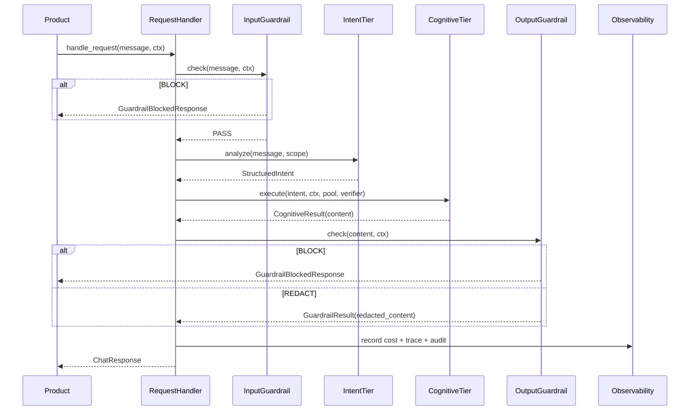

# UAAF v2 — Revised Architecture

> **Status**: Proposed revision — supersedes `uaaf-framework-spec.md` §4 và §7  
> **Date**: 2026-05-20 (rev 2 — incorporates internal review)  
> **Changes từ v1.1**: Tách monolith thành packages riêng, thêm Guardrail tier, thêm Eval package, NullObject defaults cho cross-cutting, align với bài học từ LangChain + Bedrock AgentCore  
> **Rev 2 changes**: Tách `uaaf-knowledge` → 4 sub-packages, tách `uaaf-execution` khỏi `uaaf-runtime`, thu hẹp Phase 2 Guardrail, làm rõ optional dependency qua Protocol, thêm streaming, align với `tasks/plan-phase8-modular-packaging.md`

---

## 1. Vấn đề với v1.1

| Vấn đề | Chi tiết |
|---|---|
| **Monolith package** | `pip install uaaf` kéo theo tất cả — OTel, anyio, openai, anthropic — dù product chỉ cần 1 provider |
| **Thiếu Guardrail** | Không có content filtering, PII detection, topic blocking — gap so với Bedrock AgentCore |
| **Cross-cutting mandatory** | `BaseAgent` bắt buộc inject 4 dependency, test đơn giản phải mock hết |
| **Eval không có chỗ** | Eval framework tự define lại `TokenUsage`, pricing, cost tracker — duplicate UAAF |
| **"Modular" chỉ là tên** | Các tier phụ thuộc nhau trong cùng 1 package — không swap được riêng lẻ |

---

## 2. Core Principle — Thay đổi

**v1.1:**
```
uaaf/  ← 1 package, tất cả mọi thứ
```

**v2:**
```
uaaf-core              ← Protocol + models + errors + NullObject defaults.
                         Zero dep ngoài stdlib + anyio.
uaaf-providers         ← ILLMProvider + adapters + pricing + IEmbedder + Embedder impls.
                         Dep: uaaf-core, openai, anthropic.
uaaf-observability     ← CostTracker, Tracer, AuditLogger impls (Real, OTel-backed).
                         Dep: uaaf-core, opentelemetry.
uaaf-guardrail         ← IGuardrail Protocol + PII/Topic/Injection filters + Passthrough.
                         Dep: uaaf-core. MỚI.
uaaf-cognitive         ← Strategies, Verifier pipeline.
                         Dep: uaaf-core, uaaf-providers.
                         OPTIONAL (qua NullObject): uaaf-observability.

uaaf-knowledge-core    ← IKnowledgeBackbone + ContextAssembler.
                         Dep: uaaf-core.
uaaf-knowledge-stores  ← IVectorStore + IDocumentStore + IGraphStore + InMemory impls.
                         Dep: uaaf-knowledge-core.
uaaf-knowledge-rag     ← RAGPipeline + IChunker + IRetriever + IReranker.
                         Dep: uaaf-knowledge-stores, uaaf-providers (IEmbedder).
uaaf-knowledge-memory  ← Working/Episodic/Semantic memory stores.
                         Dep: uaaf-knowledge-rag (semantic dùng RAG).

uaaf-workflow          ← WorkflowEngine + StateMachine + ICheckpointStore.
                         Dep: uaaf-core, anyio.
uaaf-execution         ← BaseAgent, AgentPool, ToolRegistry, SandboxManager.
                         Dep: uaaf-core, uaaf-providers.
                         OPTIONAL: uaaf-observability, uaaf-guardrail.
uaaf-runtime           ← UAAFRuntime facade + RequestHandler + StreamManager.
                         Dep: uaaf-execution, uaaf-cognitive, uaaf-knowledge-core, uaaf-workflow.

uaaf-eval              ← Eval framework. Dep: uaaf-core, uaaf-providers. Dev-only.
```

**Nguyên tắc:**
- `uaaf-core` không import bất cứ thứ gì ngoài stdlib + `anyio`
- Mỗi package có thể install độc lập
- Dependency graph một chiều — không circular
- **Optional dependency qua Protocol + NullObject**: Khi package A cần một capability từ package B nhưng không muốn cứng hoá dep, A định nghĩa Protocol ở `uaaf-core`, ship NullObject default. User wire impl thật từ B khi cần. Xem §3.1.
- `uaaf-eval` là **dev dependency** — không deploy lên production

---

## 3. Package Dependency Graph

```
                              uaaf-core
                  (Protocols, models, errors, NullObjects)
                                  │
        ┌─────────────────────────┼─────────────────────────┐
        │                         │                         │
 uaaf-providers           uaaf-observability          uaaf-guardrail
 (ILLMProvider impls,     (Real CostTracker,          (PIIFilter,
  IEmbedder impls,         Tracer, AuditLogger,        TopicBlocker,
  adapters, pricing)       RateLimiter — OTel)         InjectionDetector,
        │                         │                    Passthrough)
        │                         │                         │
        │                         │ (optional)              │ (optional)
        │              ┌──────────┴────────────────────┐    │
        │              │                               │    │
        ▼              ▼                               ▼    │
 uaaf-cognitive   uaaf-knowledge-core             uaaf-execution
 (Strategies,     (IBackbone Protocol,            (BaseAgent, AgentPool,
  Verifier         ContextAssembler)               ToolRegistry, Sandbox)
  pipeline)             │                               │
        │               ▼                               │
        │     uaaf-knowledge-stores                     │
        │     (IVectorStore, IGraphStore,               │
        │      IDocumentStore + InMemory)               │
        │               │                               │
        │               ▼                               │
        │     uaaf-knowledge-rag                        │
        │     (RAGPipeline, Chunker,                    │
        │      Retriever, Reranker)                     │
        │               │                               │
        │               ▼                               │
        │     uaaf-knowledge-memory                     │
        │     (Working/Episodic/Semantic)               │
        │               │                               │
        │               │           uaaf-workflow       │
        │               │           (Engine, State,     │
        │               │            Checkpoint)        │
        │               │                  │            │
        └───────────────┴──────────┬───────┴────────────┘
                                   ▼
                            uaaf-runtime
                  (UAAFRuntime facade, RequestHandler,
                   StreamManager — orchestration only)
                                   │
                                   ▼
                            PRODUCT LAYER
                  (QdrantVectorStore, Neo4jGraphStore,
                   LocalEmbedder, domain plugins...)

   ─ ─ ─ ─ ─ ─ dev dependency only ─ ─ ─ ─ ─ ─
                            uaaf-eval
              (EvalRunner, Scorer, Fixture, Renderers)
              dep: uaaf-core + uaaf-providers
```

### 3.1 Optional dependencies qua Protocol + NullObject

`uaaf-cognitive` và `uaaf-execution` **không** depend `uaaf-observability` ở `pyproject.toml`. Cách hoạt động:

1. `uaaf-core` định nghĩa Protocol — vd `ICostTracker`, `ITracer`, `IAuditLogger`, `IGuardrail`.
2. `uaaf-core` ship NullObject impl — `NullCostTracker`, `NullTracer`, `NullAuditLogger`, `PassthroughGuardrail`.
3. Cognitive/Execution code nhận Protocol type qua constructor, default = NullObject.
4. Khi user install `uaaf-observability` và inject `RealCostTracker(...)`, code chạy thật.

**Lợi ích**:
- Cài `uaaf-cognitive` không kéo `opentelemetry` vào.
- Test không cần mock.
- Production wire đầy đủ bằng DI ở `uaaf-runtime`.

**Nguyên tắc đặt Protocol**: Protocol thuộc về **consumer**, NullObject ở `uaaf-core` để tránh circular. Real impl ở package "downstream" (observability, guardrail).

### 3.2 Pricing: LLM vs Embedding

`TokenUsage` của LLM có 3 field — `prompt_tokens`, `completion_tokens`, `cached_tokens`. Embedding chỉ có `input_tokens`, không có completion. Để tránh union type khó dùng:

```python
# uaaf-core/models.py
@dataclass(frozen=True)
class TokenUsage:           # LLM only
    prompt_tokens: int
    completion_tokens: int
    cached_tokens: int = 0

@dataclass(frozen=True)
class EmbeddingUsage:       # Embedding only
    input_tokens: int
    model_id: str

# uaaf-providers/pricing.py
class Cost:
    @classmethod
    def from_llm_usage(cls, usage: TokenUsage, model: str) -> "Cost": ...
    @classmethod
    def from_embedding_usage(cls, usage: EmbeddingUsage) -> "Cost": ...
```

`pricing.yaml` chứa cả 2 namespace `llm:` và `embedding:` để 1 source of truth.

---

## 4. Repo Structure — Monorepo

```
uaaf-framework/                        # 1 repo, nhiều packages (Python workspace)
├── pyproject.toml                     # workspace root
├── packages/
│   ├── uaaf-core/
│   │   ├── pyproject.toml             # zero dep (stdlib only + anyio)
│   │   └── src/uaaf/core/
│   │       ├── protocols.py           # tất cả Protocol definitions
│   │       │                          # (ICostTracker, ITracer, IAuditLogger,
│   │       │                          #  IRateLimiter, IGuardrail, IVerifier, ...)
│   │       ├── models.py              # StructuredIntent, AgentResult, TokenUsage,
│   │       │                          # Cost, EmbeddingUsage (xem §3.2)
│   │       ├── errors.py              # RetryableError, DegradedError, FatalError,
│   │       │                          # GuardrailBlockedError, BudgetExceededError
│   │       ├── context.py             # ExecutionContext, ContextScope, TrustLevel
│   │       └── nulls.py               # NullCostTracker, NullTracer,
│   │                                  # NullAuditLogger, NullRateLimiter,
│   │                                  # PassthroughGuardrail — defaults cho mọi Protocol
│   │
│   ├── uaaf-providers/
│   │   ├── pyproject.toml             # dep: uaaf-core, openai, anthropic
│   │   └── src/uaaf/providers/
│   │       ├── llm.py                 # ILLMProvider Protocol
│   │       ├── models.py              # CompletionRequest, CompletionResponse
│   │       │                          # (TokenUsage, EmbeddingUsage move xuống uaaf-core)
│   │       ├── pricing.yaml           # Source of truth giá model (LLM + Embedding)
│   │       ├── pricing.py             # Cost.from_llm_usage(), Cost.from_embedding_usage()
│   │       │                          # 2 hàm rõ ràng, không gộp (xem §3.2)
│   │       ├── adapters/
│   │       │   ├── openai.py          # OpenAIProvider (LLM)
│   │       │   ├── anthropic.py       # AnthropicProvider (LLM)
│   │       │   └── self_hosted.py
│   │       ├── embedders/             # ← MỚI
│   │       │   ├── protocol.py        # IEmbedder Protocol
│   │       │   ├── openai.py          # OpenAIEmbedder
│   │       │   └── anthropic.py       # AnthropicEmbedder (voyage-3)
│   │       ├── router.py              # ModelRouter
│   │       └── circuit_breaker.py
│   │
│   ├── uaaf-observability/
│   │   ├── pyproject.toml             # dep: uaaf-core, opentelemetry-api
│   │   └── src/uaaf/observability/
│   │       ├── cost.py                # RealCostTracker (impl ICostTracker), CostPolicy
│   │       ├── tracer.py              # OTelTracer (impl ITracer)
│   │       ├── audit.py               # FileAuditLogger, JSONAuditLogger (impl IAuditLogger)
│   │       └── rate_limit.py          # TokenBucketRateLimiter (impl IRateLimiter)
│   │                                  # NullObjects đã ở uaaf-core, không duplicate
│   │
│   ├── uaaf-guardrail/                # ← PACKAGE MỚI HOÀN TOÀN
│   │   ├── pyproject.toml             # dep: uaaf-core (IGuardrail Protocol đã ở core)
│   │   └── src/uaaf/guardrail/
│   │       ├── pipeline.py            # GuardrailPipeline
│   │       └── filters/
│   │           ├── pii.py             # PIIFilter — rule-based (regex: email/phone/SSN/CC)
│   │           ├── topic.py           # TopicBlocker — config-based deny list
│   │           └── injection.py       # PromptInjectionDetector — pattern-based
│   │
│   │   # NOTE — Phase 2 (rule-based only, no ML):
│   │   #   - IContentFilter Protocol định nghĩa ở uaaf-core
│   │   #   - Concrete ContentFilter (hate/violence/NSFW) → Phase 2.5
│   │   #     vì cần ML classifier, sẽ là plugin riêng (uaaf-guardrail-ml)
│   │   #   - PassthroughGuardrail đã ở uaaf-core/nulls.py
│   │
│   ├── uaaf-cognitive/
│   │   ├── pyproject.toml             # dep: uaaf-core, uaaf-providers
│   │   └── src/uaaf/cognitive/
│   │       ├── strategy.py            # ICognitiveStrategy Protocol
│   │       ├── strategies/
│   │       │   ├── direct.py
│   │       │   ├── react.py
│   │       │   ├── best_of_n.py
│   │       │   ├── evaluator_optimizer.py
│   │       │   └── parallel_fanout.py
│   │       ├── verifier.py            # IVerifier Protocol
│   │       ├── verifiers/
│   │       │   ├── schema.py
│   │       │   ├── llm_judge.py
│   │       │   ├── ground_truth.py
│   │       │   └── human_review.py
│   │       └── pipeline.py            # VerifierPipeline
│   │
│   # ─── Knowledge tách thành 4 sub-packages (rev 2) ───
│   ├── uaaf-knowledge-core/
│   │   ├── pyproject.toml             # dep: uaaf-core
│   │   └── src/uaaf/knowledge/core/
│   │       ├── backbone.py            # IKnowledgeBackbone Protocol
│   │       ├── backbones/             # default impls (composition over inheritance)
│   │       │   ├── memory_backbone.py
│   │       │   ├── graph_backbone.py
│   │       │   └── hybrid_backbone.py
│   │       └── context_assembler.py   # ContextAssembler (token budget trim)
│   │
│   ├── uaaf-knowledge-stores/
│   │   ├── pyproject.toml             # dep: uaaf-knowledge-core
│   │   └── src/uaaf/knowledge/stores/
│   │       ├── vector.py              # IVectorStore + InMemoryVectorStore
│   │       ├── document.py            # IDocumentStore + InMemoryDocumentStore
│   │       └── graph.py               # IGraphStore + InMemoryGraphStore
│   │
│   ├── uaaf-knowledge-rag/
│   │   ├── pyproject.toml             # dep: uaaf-knowledge-stores, uaaf-providers
│   │   └── src/uaaf/knowledge/rag/
│   │       ├── chunker.py             # IChunker + RecursiveChunker, MarkdownChunker,
│   │       │                          #            CodeChunker (SemanticChunker Protocol only)
│   │       ├── retriever.py           # IRetriever + DenseRetriever, HybridRetriever
│   │       ├── reranker.py            # IReranker Protocol (impl ở product layer)
│   │       └── pipeline.py            # RAGPipeline (ingest + ingest_batch + retrieve)
│   │
│   ├── uaaf-knowledge-memory/
│   │   ├── pyproject.toml             # dep: uaaf-knowledge-rag
│   │   └── src/uaaf/knowledge/memory/
│   │       ├── store.py               # IMemoryStore Protocol
│   │       ├── working.py
│   │       ├── episodic.py
│   │       └── semantic.py            # SemanticMemoryStore — wraps RAGPipeline
│   │
│   ├── uaaf-workflow/
│   │   ├── pyproject.toml             # dep: uaaf-core, anyio
│   │   └── src/uaaf/workflow/
│   │       ├── engine.py              # WorkflowEngine
│   │       ├── state_machine.py
│   │       └── checkpoint.py          # FileCheckpointStore (ICheckpointStore ở core)
│   │
│   ├── uaaf-execution/                # ← TÁCH KHỎI uaaf-runtime (rev 2)
│   │   ├── pyproject.toml             # dep: uaaf-core, uaaf-providers
│   │   │                              # optional: uaaf-observability, uaaf-guardrail
│   │   └── src/uaaf/execution/
│   │       ├── agent.py               # BaseAgent (template method + NullObject defaults)
│   │       ├── pool.py                # AgentPool
│   │       ├── tool.py                # ToolRegistry, ToolExecutor
│   │       └── sandbox.py             # SandboxManager (subprocess isolation)
│   │
│   ├── uaaf-runtime/                  # facade thuần, không chứa BaseAgent nữa
│   │   ├── pyproject.toml             # dep: uaaf-execution, uaaf-cognitive,
│   │   │                              #      uaaf-knowledge-core, uaaf-workflow
│   │   └── src/uaaf/runtime/
│   │       ├── config.py              # RuntimeConfig, DomainConfig
│   │       ├── runtime.py             # UAAFRuntime facade
│   │       ├── handler.py             # RequestHandler
│   │       └── streaming.py           # StreamManager (SSE / QueueCallbacks)
│   │
│   └── uaaf-eval/                    # ← PACKAGE MỚI (dev dependency)
│       ├── pyproject.toml             # dep: uaaf-core, uaaf-providers. DEV ONLY.
│       └── src/uaaf/eval/
│           ├── protocols.py           # EvalTarget, Scorer Protocols
│           ├── models.py              # EvalCase, RunResult, CaseResult, SuiteResult
│           ├── scorers.py             # ExactMatch, Constraint, Threshold, LLMJudge, Composite
│           ├── cost_tracker.py        # EvalCostTracker (wraps uaaf-observability)
│           ├── fixture_loader.py      # Load + validate JSON fixtures
│           ├── runner.py              # EvalRunner
│           └── renderers/
│               ├── terminal.py
│               ├── github_actions.py
│               └── api.py
│
├── tests/                             # Cross-package integration + contract tests
│   ├── contract/
│   └── integration/
│
├── examples/
│   ├── todo_app/
│   ├── stock_advisory/
│   ├── flashcard/
│   ├── coding_practice/
│   └── code_analysis/
│
└── docs/
```

---

## 5. Tier Architecture — Revised

```
┌─────────────────────────────────────────────────────────────────────────┐
│                          PRODUCT LAYER                                  │
│  Code Analysis │ Todo │ Stock │ Flashcard │ Coding Practice             │
└────────────────────────────┬────────────────────────────────────────────┘
                             │ uses uaaf-runtime
┌────────────────────────────▼────────────────────────────────────────────┐
│                         UAAF RUNTIME                                    │
│                                                                         │
│  ┌──────────────────────────────────────────────────────────────────┐  │
│  │ INTERACTION TIER  RequestHandler │ WorkflowEngine │ StreamManager│  │
│  └──────────────────────────────────────────────────────────────────┘  │
│                                                                         │
│  ┌──────────────────────────────────────────────────────────────────┐  │
│  │ GUARDRAIL TIER  ← MỚI                                           │  │
│  │  Input Guardrail  → chạy TRƯỚC Intent (block prompt injection)   │  │
│  │  Output Guardrail → chạy SAU Cognitive (block PII leak, hate)    │  │
│  │  [PIIFilter │ TopicBlocker │ ContentFilter │ InjectionDetector]  │  │
│  └──────────────────────────────────────────────────────────────────┘  │
│                                                                         │
│  ┌──────────────────────────────────────────────────────────────────┐  │
│  │ INTENT TIER   IntentAnalyzer │ ComplexityEstimator │ Selector    │  │
│  └──────────────────────────────────────────────────────────────────┘  │
│                                                                         │
│  ┌──────────────────────────────────────────────────────────────────┐  │
│  │ COGNITIVE TIER  Strategies (Direct/ReAct/BestN/EvalOpt/Fanout)   │  │
│  │                 Verifier Pipeline (Schema/LLMJudge/GroundTruth)  │  │
│  └──────────────────────────────────────────────────────────────────┘  │
│                                                                         │
│  ┌──────────────────────────────────────────────────────────────────┐  │
│  │ EXECUTION TIER  AgentPool │ ToolRegistry │ ToolExecutor │ Sandbox│  │
│  └──────────────────────────────────────────────────────────────────┘  │
│                                                                         │
│  ┌──────────────────────────────────────────────────────────────────┐  │
│  │ KNOWLEDGE TIER  KnowledgeBackbone (Memory │ Graph │ Hybrid)      │  │
│  │                 ContextAssembler (token budget)                  │  │
│  └──────────────────────────────────────────────────────────────────┘  │
│                                                                         │
│  ┌──────────────────────────────────────────────────────────────────┐  │
│  │ PROVIDER TIER   ModelRouter │ Adapters │ CircuitBreaker           │  │
│  └──────────────────────────────────────────────────────────────────┘  │
│                                                                         │
│  ┌──────────────────────────────────────────────────────────────────┐  │
│  │ CROSS-CUTTING   CostTracker │ RateLimiter │ Tracer │ AuditLogger  │  │
│  │                 (inject qua constructor, NullObject defaults)     │  │
│  └──────────────────────────────────────────────────────────────────┘  │
└─────────────────────────────────────────────────────────────────────────┘

     ─ ─ ─ ─ ─ ─ offline tooling, không deploy ─ ─ ─ ─ ─ ─
┌─────────────────────────────────────────────────────────────────────────┐
│  EVAL LAYER  (uaaf-eval — dev dependency)                               │
│  EvalRunner │ Scorer (ExactMatch/Constraint/Threshold/LLMJudge)         │
│  FixtureLoader │ SuiteResult │ Renderers (Terminal/CI/Web)              │
│  reuse: ILLMProvider, TokenUsage, pricing.yaml từ uaaf-providers        │
└─────────────────────────────────────────────────────────────────────────┘
```

---

## 6. Guardrail Tier — Design Chi Tiết

### Tại sao cần Guardrail riêng (không phải Verifier)

| | Verifier (Cognitive tier) | Guardrail (Guardrail tier) |
|---|---|---|
| **Khi nào chạy** | Sau khi LLM generate output | Trước (input) VÀ sau (output) |
| **Mục đích** | Đánh giá chất lượng reasoning | Enforce safety + compliance policy |
| **Failure action** | Regenerate hoặc escalate | Block ngay, không regenerate |
| **Domain-specific** | Có — domain implement IVerifier riêng | Không — policy-driven, config-based |
| **Cost** | Cao (gọi LLM judge) | Thấp (regex + classifier nhẹ) |

### Protocol

```python
# uaaf/guardrail/protocol.py

@runtime_checkable
class IGuardrail(Protocol):
    guardrail_id: str
    applies_to: Literal["input", "output", "both"]

    async def check(
        self,
        content: str,
        ctx: ExecutionContext,
    ) -> GuardrailResult: ...

@dataclass(frozen=True)
class GuardrailResult:
    passed: bool
    action: GuardrailAction   # PASS | BLOCK | REDACT | WARN
    reason: str = ""
    redacted_content: str = ""   # nếu action=REDACT

class GuardrailAction(StrEnum):
    PASS   = "pass"
    BLOCK  = "block"    # raise GuardrailBlockedError → caller handle
    REDACT = "redact"   # thay thế content bằng redacted_content
    WARN   = "warn"     # log warning, tiếp tục
```

### GuardrailPipeline — chạy theo TrustLevel

```python
# uaaf/guardrail/pipeline.py

class GuardrailPipeline:
    """
    Chạy tuần tự. Gặp BLOCK → raise ngay, không tiếp tục.
    TrustLevel.LOW  → PassthroughGuardrail (zero overhead)
    TrustLevel.HIGH → full stack: PII + Topic + Content + Injection
    """
    def __init__(self, guardrails: list[IGuardrail]):
        self.guardrails = guardrails

    @classmethod
    def for_trust_level(cls, level: TrustLevel) -> "GuardrailPipeline":
        if level == TrustLevel.LOW:
            return cls([PassthroughGuardrail()])
        if level == TrustLevel.MEDIUM:
            return cls([PIIFilter(), PromptInjectionDetector()])
        # HIGH — Phase 2 ship rule-based only
        return cls([
            PromptInjectionDetector(),   # input only — check trước tiên
            PIIFilter(),
            TopicBlocker(),
            # ContentFilter() — Phase 2.5, cần ML classifier, plugin riêng
        ])
```

### Built-in Filters — Phase 2 ship (rule-based only)

| Filter | applies_to | Mô tả | Configurable | Phase |
|---|---|---|---|---|
| `PromptInjectionDetector` | input | Phát hiện "ignore previous instructions", jailbreak pattern | pattern list | **2** |
| `PIIFilter` | both | Redact email, phone, SSN, credit card | entity types | **2** |
| `TopicBlocker` | both | Block topic theo domain policy (vd Stock: không trade meme coins) | deny list per domain | **2** |
| `PassthroughGuardrail` | both | NullObject — không check gì, zero cost | — | **2** (ở core) |
| `IContentFilter` (Protocol) | output | Interface cho hate/violence/NSFW classifier | — | **2** (Protocol only) |
| `MLContentFilter` (impl) | output | Concrete ML classifier (HuggingFace/Detoxify) | model_id, threshold | **2.5** (`uaaf-guardrail-ml`) |

**Lý do tách Phase 2.5**: ML classifier kéo theo torch/transformers (>1GB). Để rule-based Phase 2 light (chỉ stdlib + uaaf-core), product nào cần content moderation tự install `uaaf-guardrail-ml` plugin.

### Vị trí trong request flow

```
User input
    │
    ▼
[Input Guardrail] ← PromptInjectionDetector, TopicBlocker(input)
    │  BLOCK → return GuardrailBlockedResponse ngay
    │  PASS  ↓
Intent Tier
    │
Cognitive Tier → LLM generates output
    │
    ▼
[Output Guardrail] ← PIIFilter, ContentFilter, TopicBlocker(output)
    │  BLOCK  → return GuardrailBlockedResponse
    │  REDACT → trả output đã redact, log audit
    │  PASS   ↓
Response → Product
```

---

## 7. Cross-cutting — NullObject Defaults

**Vấn đề v1.1**: Test agent đơn giản phải mock 4 dependency.

**Fix v2**: NullObject defaults — inject khi cần, bỏ qua khi test.

```python
# uaaf/core/nulls.py — NullObjects ở core để mọi package dùng được không tạo dep ngược

class NullCostTracker:
    """No-op. Dùng trong test hoặc TrustLevel.LOW domain không cần tracking."""
    def record(self, scope, cost): pass
    def enforce(self, scope, estimated): pass   # không raise
    def summary(self, scope): return Cost.zero()

class NullTracer:
    @contextmanager
    def span(self, *args, **kwargs): yield

class NullAuditLogger:
    def log_start(self, *args): pass
    def log_complete(self, *args): pass
    def log_error(self, *args): pass

class NullRateLimiter:
    async def acquire(self, *args): pass   # không block
```

```python
# uaaf/execution/agent.py — v2 (đã tách khỏi uaaf-runtime)

@dataclass
class BaseAgent(ABC):
    agent_id: str

    # NullObject defaults — test không cần mock, production inject thật
    cost_tracker: CostTracker = field(default_factory=NullCostTracker)
    tracer: Tracer             = field(default_factory=NullTracer)
    audit_logger: AuditLogger  = field(default_factory=NullAuditLogger)
    rate_limiter: RateLimiter  = field(default_factory=NullRateLimiter)

    # Template method — KHÔNG override
    async def execute(self, task: Task, ctx: ExecutionContext) -> AgentResult:
        async with self.tracer.span(self.agent_id, task.task_id, ctx.correlation_id):
            await self.rate_limiter.acquire(ctx.scope, self.agent_id)
            self.audit_logger.log_start(task, ctx)
            try:
                result = await self._execute(task, ctx)
                self.cost_tracker.record(ctx.scope, result.cost)
                self.audit_logger.log_complete(task, result)
                return result
            except RetryableError:
                raise
            except Exception as exc:
                self.audit_logger.log_error(task, exc)
                raise

    @abstractmethod
    async def _execute(self, task: Task, ctx: ExecutionContext) -> AgentResult: ...
```

**Kết quả**: Test đơn giản chỉ cần:
```python
agent = MyAgent(agent_id="test")   # không mock gì cả
result = await agent.execute(task, ctx)
```
Production inject đầy đủ:
```python
agent = MyAgent(
    agent_id="prod",
    cost_tracker=real_tracker,
    tracer=real_tracer,
    audit_logger=real_logger,
    rate_limiter=real_limiter,
)
```

---

## 8. Eval Package — Integration với UAAF

### Nguyên tắc reuse

```
uaaf-providers (reuse)              uaaf-eval (own)
────────────────────────────        ──────────────────────────────────
ILLMProvider          ──────►       EvalTarget.run() gọi provider
TokenUsage            ──────►       TargetResult.usage
pricing.yaml          ──────►       Cost.from_usage() tính tiền
CostTracker (core)    ──────►       EvalCostTracker wrap lại
BudgetExceededError   ──────►       propagate nguyên lên runner

                                    EvalCase / ScoreResult / SuiteResult
                                    Scorer (ExactMatch/Constraint/Threshold)
                                    FixtureLoader + JSON Schema validation
                                    EvalRunner orchestration
                                    Renderers (Terminal/CI/Web)
```

### Product sử dụng

```toml
# pyproject.toml của code-analysis product
[project]
dependencies = [
    "uaaf-core>=0.2",
    "uaaf-providers>=0.2",
    "uaaf-workflow>=0.2",
    "uaaf-runtime>=0.2",
]

[project.optional-dependencies]
eval = [
    "uaaf-eval>=0.2",      # chỉ install khi chạy eval
]
```

```bash
# CI pipeline
pip install "prod-code-analysis[eval]"
python -m uaaf.eval run --suite crud_matrix --budget 2.0 --models claude-sonnet-4-20250514
```

### EvalCostTracker — dùng trực tiếp RealCostTracker

Rev 2: bỏ wrapper, eval code dùng thẳng `RealCostTracker` với scope `"eval_suite"`. Breakdown by model/prompt_version để bên ngoài (EvalRunner) tự gom.

```python
# uaaf/eval/runner.py — không cần class wrapper riêng
from uaaf.observability.cost import RealCostTracker, CostPolicy
from uaaf.core.models import TokenUsage
from uaaf.providers.pricing import Cost

class EvalRunner:
    def __init__(self, budget_usd: float):
        self.tracker = RealCostTracker(CostPolicy(max_usd_per_session=budget_usd))
        self.by_model: dict[str, float] = {}
        self.by_prompt_version: dict[str, list[float]] = {}

    def record_call(self, usage: TokenUsage, model: str, prompt_version: str):
        cost = Cost.from_llm_usage(usage, model=model)
        self.tracker.record("eval_suite", cost)
        self.by_model[model] = self.by_model.get(model, 0) + cost.usd
        self.by_prompt_version.setdefault(prompt_version, []).append(cost.usd)
```

**Quyết định**: Wrapper chỉ thêm 2 dict, không đáng để có class riêng. Khi nào logic eval-specific phình ra (>5 method) thì mới extract.

---

## 9. Request Flow — Revised với Guardrail



---

## 10. Install Guide theo Use Case

```bash
# Chỉ cần gọi LLM với cost tracking
pip install uaaf-providers uaaf-observability

# Build conversational agent đầy đủ (kéo theo execution + cognitive + knowledge-core + workflow)
pip install uaaf-runtime

# Thêm RAG cho semantic memory
pip install uaaf-runtime uaaf-knowledge-rag

# Thêm guardrail rule-based
pip install uaaf-runtime uaaf-guardrail

# Thêm content moderation ML
pip install uaaf-runtime uaaf-guardrail uaaf-guardrail-ml

# Chạy eval (CI/CD, dev machine)
pip install uaaf-eval --group dev
```

---

## 11. So sánh với Bedrock AgentCore

| Dimension | Bedrock AgentCore | UAAF v2 |
|---|---|---|
| **Mô hình** | Managed service (AWS runs) | Library (bạn run) |
| **Modular** | Composable services — swap provider không được | Pluggable implementations — swap backend được |
| **Guardrail** | Built-in, managed | `uaaf-guardrail` — self-hosted, configurable |
| **Eval** | Built-in evaluation service | `uaaf-eval` — offline, CI/CD integrated |
| **Vendor lock** | AWS ecosystem | Zero vendor lock — bất kỳ cloud/on-prem |
| **Scale-out** | AWS tự động | Deploy thêm workers |
| **Cost model** | Pay-per-call | Free (self-hosted infra cost) |
| **Customize deep** | Giới hạn bởi API | Full control — implement Protocol |
| **Khi nào chọn** | Team nhỏ, ship nhanh, AWS-native | Custom domain logic, multi-cloud, compliance đặc biệt |

**Quan trọng**: Hai thứ không loại trừ nhau. Có thể chạy UAAF Runtime **trên** Bedrock AgentCore Runtime nếu muốn managed execution + self-controlled logic.

---

## 12. Thay đổi Breaking so với v1.1

| Thay đổi | v1.1 | v2 | Migration |
|---|---|---|---|
| Package install | `pip install uaaf` | `pip install uaaf-runtime` | Update pyproject.toml |
| Import path | `from uaaf.observability.cost import CostTracker` | `from uaaf.observability.cost import CostTracker` | Không đổi (namespace giữ nguyên) |
| BaseAgent constructor | 4 dep bắt buộc | 4 dep optional (NullObject) | Xóa mock boilerplate trong test |
| Guardrail | Không có | Inject vào RuntimeConfig | Config mới, không break existing |
| Eval | Tự define | `pip install uaaf-eval` | Migrate sang package mới |

**Import namespace giữ nguyên** — đây là quyết định quan trọng. Dù tách thành nhiều package nhưng vẫn dùng namespace `uaaf.*` thống nhất. Product code không cần sửa import, chỉ sửa `pyproject.toml`.

---

## 13. Phase Rollout

| Phase | Package | Nội dung |
|---|---|---|
| **0** (xong) | uaaf-core, uaaf-providers, uaaf-observability | Foundation |
| **1** (xong) | uaaf-cognitive | Strategies + Verifier pipeline |
| **2** | uaaf-guardrail | Rule-based filters (Injection, PII, Topic) + IContentFilter Protocol |
| **2.5** (optional) | uaaf-guardrail-ml | ML-based ContentFilter (hate/violence/NSFW) — plugin riêng |
| **3** (xong) | uaaf-workflow | WorkflowEngine + StateMachine + Checkpoint |
| **4** | uaaf-knowledge-core, uaaf-knowledge-stores, uaaf-knowledge-rag, uaaf-knowledge-memory | Tách thành 4 sub-packages (rev 2). IEmbedder bundled trong uaaf-providers |
| **5** | uaaf-execution | BaseAgent + AgentPool + ToolRegistry + Sandbox (tách khỏi runtime) |
| **6** | uaaf-runtime | Facade thuần: UAAFRuntime + RequestHandler + StreamManager |
| **7** | uaaf-eval | Eval framework (dev-only) |
| **8** | Open source prep | Docs, examples, license, PyPI publish |

**Phase 8 (modular packaging)**: Repo hiện tại đang là 1 package `uaaf`. Việc tách thành 11 packages theo §4 là một effort riêng — xem `tasks/plan-phase8-modular-packaging.md` cho chi tiết. Phase 2-7 ở trên là **content** (tính năng cần build), Phase 8 là **packaging** (tách wheel).

Guardrail (Phase 2) được ưu tiên cao vì Stock trading và AI coding practice cần ngay từ đầu — không thể bolt-on sau.

---

## 14. Decisions Mới — Cần Confirm

| # | Quyết định | Default đề xuất |
|---|---|---|
| D1 | Monorepo (1 repo, nhiều package) hay polyrepo? | Monorepo — dễ develop, đổi interface đồng bộ |
| D2 | `uaaf-guardrail` có bundled ML model không? | Không — rule-based v1, ML model là plugin sau |
| D3 | Guardrail bypass được không với TrustLevel.LOW? | Có — `PassthroughGuardrail` là default cho LOW |
| D4 | NullObject defaults hay Optional types? | NullObject — tránh None check khắp code. NullObjects nằm ở `uaaf-core/nulls.py` để mọi package dùng được mà không tạo dep ngược |
| D5 | `uaaf-eval` publish lên PyPI không? | **Hoãn tới v0.2 stable** — Phase 7 chỉ cần dev install nội bộ. Publish khi API ổn định |
| D6 | Tách `uaaf-knowledge` thành 4 sub-packages? (rev 2) | Có — knowledge-core/stores/rag/memory. Product chỉ cần in-memory không phải pull torch+faiss |
| D7 | Tách `uaaf-execution` khỏi `uaaf-runtime`? (rev 2) | Có — runtime thành facade thuần, execution chứa BaseAgent+Sandbox (security concern khác orchestration concern) |
| D8 | ContentFilter ML có ship Phase 2 không? (rev 2) | Không — Phase 2 rule-based only. ML là plugin `uaaf-guardrail-ml` Phase 2.5 |
| D9 | StreamManager đặt ở đâu? (rev 2) | `uaaf-runtime/streaming.py` — vì SSE serve request flow, gắn với RequestHandler |
