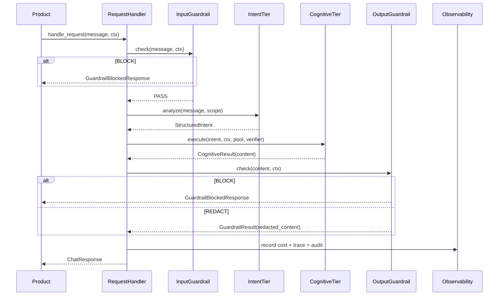

# RYUU v2 — Revised Architecture

> **Status**: Proposed revision — supersedes `ryuu-framework-spec.md` §4 và §7
> **Date**: 2026-05-21 (rev 3 — adds Hook tier, Factory facade, Reasoning, async guarantees)
> **Changes từ v1.1**: Tách monolith thành packages riêng, thêm Guardrail tier, thêm Eval package, NullObject defaults cho cross-cutting, align với bài học từ LangChain + Bedrock AgentCore
> **Rev 2 changes**: Tách `ryuu-knowledge` → 4 sub-packages, tách `ryuu-execution` khỏi `ryuu-runtime`, thu hẹp Phase 2 Guardrail, làm rõ optional dependency qua Protocol, thêm streaming, align với `tasks/plan-phase8-modular-packaging.md`
> **Rev 3 changes**: Thêm **Hook tier** (`ryuu-core/hooks.py` + lifecycle injection), thêm **Factory facade** (top-level `ryuu` package với `Agent()`), thêm `ryuu-reasoning` (Z3/Prolog/Soufflé formal verifier), thêm `ryuu-batch` và `ryuu-prompt-optimizer`, ràng buộc **async non-blocking** cho cross-cutting (cost/audit/tracer/rate-limit), bật/tắt observability qua kwarg trong Factory. Roadmap mở rộng Phase 8.8 → 14. Xem `tasks/roadmap-phase8.8-to-14.md`.

---

## 1. Vấn đề với v1.1

| Vấn đề | Chi tiết |
|---|---|
| **Monolith package** | `pip install ryuu` kéo theo tất cả — OTel, anyio, openai, anthropic — dù product chỉ cần 1 provider |
| **Thiếu Guardrail** | Không có content filtering, PII detection, topic blocking — gap so với Bedrock AgentCore |
| **Cross-cutting mandatory** | `BaseAgent` bắt buộc inject 4 dependency, test đơn giản phải mock hết |
| **Eval không có chỗ** | Eval framework tự define lại `TokenUsage`, pricing, cost tracker — duplicate RYUU |
| **"Modular" chỉ là tên** | Các tier phụ thuộc nhau trong cùng 1 package — không swap được riêng lẻ |

---

## 2. Core Principle — Thay đổi

**v1.1:**
```
ryuu/  ← 1 package, tất cả mọi thứ
```

**v2 (rev 3 — incl. Hook + Factory + Reasoning):**
```
ryuu-core              ← Protocol + models + errors + NullObject defaults +
                         Hook system (HookEvent, HookContext, HookRegistry).
                         Zero dep ngoài stdlib + anyio.
ryuu-providers         ← ILLMProvider + adapters + pricing + IEmbedder + Embedder impls.
                         Dep: ryuu-core, openai, anthropic.
ryuu-observability     ← CostTracker, Tracer, AuditLogger impls (Real, OTel-backed).
                         BẮT BUỘC async non-blocking (xem §7.6).
                         Dep: ryuu-core, opentelemetry, aiofiles.
ryuu-guardrail         ← IGuardrail Protocol + PII/Topic/Injection filters + Passthrough.
                         Dep: ryuu-core.
ryuu-cognitive         ← Strategies, Verifier pipeline.
                         Dep: ryuu-core, ryuu-providers.
                         OPTIONAL (qua NullObject): ryuu-observability.

ryuu-knowledge-base    ← IKnowledgeBackbone + ContextAssembler.
                         Dep: ryuu-core.
ryuu-knowledge-memory  ← WorkingMemoryStore + EpisodicMemoryStore.
                         Dep: ryuu-knowledge-base.
ryuu-knowledge-graph   ← InMemoryGraphStore + text search.
                         Dep: ryuu-knowledge-base.
ryuu-knowledge         ← HybridBackbone (memory + graph, 60/40 split).
                         Dep: ryuu-knowledge-memory, ryuu-knowledge-graph.
ryuu-knowledge-rag     ← RAGPipeline + IChunker + IRetriever + IReranker (MỚI — Phase 11).
                         Dep: ryuu-knowledge-base, ryuu-providers (IEmbedder).

ryuu-workflow          ← WorkflowEngine + StateMachine + ICheckpointStore.
                         Dep: ryuu-core, anyio.
ryuu-execution         ← BaseAgent, AgentPool, ToolRegistry, SandboxManager.
                         Lifecycle integrated với HookRegistry (rev 3).
                         Dep: ryuu-core, ryuu-providers.
                         OPTIONAL: ryuu-observability, ryuu-guardrail.
ryuu-runtime           ← RYUURuntime facade + RequestHandler + StreamManager.
                         Dep: ryuu-execution, ryuu-cognitive, ryuu-knowledge-base, ryuu-workflow.

ryuu                   ← TOP-LEVEL FACADE (rev 3 — Phase 10).
                         Agent() factory cho 90% use case lean.
                         Dep: ryuu-runtime (re-exports + factory build logic).

# === Add-ons (Phase 12-14) ===
ryuu-reasoning         ← Formal verifier (Z3/Prolog/Soufflé).
                         IVerifier impl plugged vào VerifierPipeline.
                         Dep: ryuu-core, z3-solver, pyswip. MỚI — Phase 14.
ryuu-batch             ← BatchRunner (OpenAI/Anthropic batch API, 50% discount).
                         Dep: ryuu-execution, ryuu-providers. MỚI — Phase 12.
ryuu-prompt-optimizer  ← Auto-tune prompts qua eval feedback loop.
                         Dep: ryuu-eval, ryuu-providers. MỚI — Phase 13.

ryuu-eval              ← Eval framework. Dep: ryuu-core, ryuu-providers. Dev-only.
```

**Nguyên tắc:**
- `ryuu-core` không import bất cứ thứ gì ngoài stdlib + `anyio`
- Mỗi package có thể install độc lập
- Dependency graph một chiều — không circular
- **Optional dependency qua Protocol + NullObject**: Khi package A cần một capability từ package B nhưng không muốn cứng hoá dep, A định nghĩa Protocol ở `ryuu-core`, ship NullObject default. User wire impl thật từ B khi cần. Xem §3.1.
- `ryuu-eval` là **dev dependency** — không deploy lên production

---

## 3. Package Dependency Graph

```
                              ryuu-core
                  (Protocols, models, errors, NullObjects)
                                  │
        ┌─────────────────────────┼─────────────────────────┐
        │                         │                         │
 ryuu-providers           ryuu-observability          ryuu-guardrail
 (ILLMProvider impls,     (Real CostTracker,          (PIIFilter,
  IEmbedder impls,         Tracer, AuditLogger,        TopicBlocker,
  adapters, pricing)       RateLimiter — OTel)         InjectionDetector,
        │                         │                    Passthrough)
        │                         │                         │
        │                         │ (optional)              │ (optional)
        │              ┌──────────┴────────────────────┐    │
        │              │                               │    │
        ▼              ▼                               ▼    │
 ryuu-cognitive   ryuu-knowledge-core             ryuu-execution
 (Strategies,     (IBackbone Protocol,            (BaseAgent, AgentPool,
  Verifier         ContextAssembler)               ToolRegistry, Sandbox)
  pipeline)             │                               │
        │               ▼                               │
        │     ryuu-knowledge-stores                     │
        │     (IVectorStore, IGraphStore,               │
        │      IDocumentStore + InMemory)               │
        │               │                               │
        │               ▼                               │
        │     ryuu-knowledge-rag                        │
        │     (RAGPipeline, Chunker,                    │
        │      Retriever, Reranker)                     │
        │               │                               │
        │               ▼                               │
        │     ryuu-knowledge-memory                     │
        │     (Working/Episodic/Semantic)               │
        │               │                               │
        │               │           ryuu-workflow       │
        │               │           (Engine, State,     │
        │               │            Checkpoint)        │
        │               │                  │            │
        └───────────────┴──────────┬───────┴────────────┘
                                   ▼
                            ryuu-runtime
                  (RYUURuntime facade, RequestHandler,
                   StreamManager — orchestration only)
                                   │
                                   ▼
                            PRODUCT LAYER
                  (QdrantVectorStore, Neo4jGraphStore,
                   LocalEmbedder, domain plugins...)

   ─ ─ ─ ─ ─ ─ dev dependency only ─ ─ ─ ─ ─ ─
                            ryuu-eval
              (EvalRunner, Scorer, Fixture, Renderers)
              dep: ryuu-core + ryuu-providers
```

### 3.1 Optional dependencies qua Protocol + NullObject

`ryuu-cognitive` và `ryuu-execution` **không** depend `ryuu-observability` ở `pyproject.toml`. Cách hoạt động:

1. `ryuu-core` định nghĩa Protocol — vd `ICostTracker`, `ITracer`, `IAuditLogger`, `IGuardrail`.
2. `ryuu-core` ship NullObject impl — `NullCostTracker`, `NullTracer`, `NullAuditLogger`, `PassthroughGuardrail`.
3. Cognitive/Execution code nhận Protocol type qua constructor, default = NullObject.
4. Khi user install `ryuu-observability` và inject `RealCostTracker(...)`, code chạy thật.

**Lợi ích**:
- Cài `ryuu-cognitive` không kéo `opentelemetry` vào.
- Test không cần mock.
- Production wire đầy đủ bằng DI ở `ryuu-runtime`.

**Nguyên tắc đặt Protocol**: Protocol thuộc về **consumer**, NullObject ở `ryuu-core` để tránh circular. Real impl ở package "downstream" (observability, guardrail).

### 3.2 Pricing: LLM vs Embedding

`TokenUsage` của LLM có 3 field — `prompt_tokens`, `completion_tokens`, `cached_tokens`. Embedding chỉ có `input_tokens`, không có completion. Để tránh union type khó dùng:

```python
# ryuu-core/models.py
@dataclass(frozen=True)
class TokenUsage:           # LLM only
    prompt_tokens: int
    completion_tokens: int
    cached_tokens: int = 0

@dataclass(frozen=True)
class EmbeddingUsage:       # Embedding only
    input_tokens: int
    model_id: str

# ryuu-providers/pricing.py
class Cost:
    @classmethod
    def from_llm_usage(cls, usage: TokenUsage, model: str) -> "Cost": ...
    @classmethod
    def from_embedding_usage(cls, usage: EmbeddingUsage) -> "Cost": ...
```

`pricing.yaml` chứa cả 2 namespace `llm:` và `embedding:` để 1 source of truth.

---

## 4. Repo Structure — Monorepo

```
ryuu-framework/                        # 1 repo, nhiều packages (Python workspace)
├── pyproject.toml                     # workspace root
├── packages/
│   ├── ryuu-core/
│   │   ├── pyproject.toml             # zero dep (stdlib only + anyio)
│   │   └── src/ryuu/core/
│   │       ├── protocols.py           # tất cả Protocol definitions
│   │       │                          # (ICostTracker, ITracer, IAuditLogger,
│   │       │                          #  IRateLimiter, IGuardrail, IVerifier, ...)
│   │       ├── models.py              # StructuredIntent, AgentResult, TokenUsage,
│   │       │                          # Cost, EmbeddingUsage (xem §3.2)
│   │       ├── errors.py              # RetryableError, DegradedError, FatalError,
│   │       │                          # GuardrailBlockedError, BudgetExceededError
│   │       ├── context.py             # ExecutionContext, ContextScope, TrustLevel
│   │       └── nulls.py               # NullCostTracker, NullTracer,
│   │                                  # NullAuditLogger, NullRateLimiter,
│   │                                  # PassthroughGuardrail — defaults cho mọi Protocol
│   │
│   ├── ryuu-providers/
│   │   ├── pyproject.toml             # dep: ryuu-core, openai, anthropic
│   │   └── src/ryuu/providers/
│   │       ├── llm.py                 # ILLMProvider Protocol
│   │       ├── models.py              # CompletionRequest, CompletionResponse
│   │       │                          # (TokenUsage, EmbeddingUsage move xuống ryuu-core)
│   │       ├── pricing.yaml           # Source of truth giá model (LLM + Embedding)
│   │       ├── pricing.py             # Cost.from_llm_usage(), Cost.from_embedding_usage()
│   │       │                          # 2 hàm rõ ràng, không gộp (xem §3.2)
│   │       ├── adapters/
│   │       │   ├── openai.py          # OpenAIProvider (LLM)
│   │       │   ├── anthropic.py       # AnthropicProvider (LLM)
│   │       │   └── self_hosted.py
│   │       ├── embedders/             # ← MỚI
│   │       │   ├── protocol.py        # IEmbedder Protocol
│   │       │   ├── openai.py          # OpenAIEmbedder
│   │       │   └── anthropic.py       # AnthropicEmbedder (voyage-3)
│   │       ├── router.py              # ModelRouter
│   │       └── circuit_breaker.py
│   │
│   ├── ryuu-observability/
│   │   ├── pyproject.toml             # dep: ryuu-core, opentelemetry-api
│   │   └── src/ryuu/observability/
│   │       ├── cost.py                # RealCostTracker (impl ICostTracker), CostPolicy
│   │       ├── tracer.py              # OTelTracer (impl ITracer)
│   │       ├── audit.py               # FileAuditLogger, JSONAuditLogger (impl IAuditLogger)
│   │       └── rate_limit.py          # TokenBucketRateLimiter (impl IRateLimiter)
│   │                                  # NullObjects đã ở ryuu-core, không duplicate
│   │
│   ├── ryuu-guardrail/                # ← PACKAGE MỚI HOÀN TOÀN
│   │   ├── pyproject.toml             # dep: ryuu-core (IGuardrail Protocol đã ở core)
│   │   └── src/ryuu/guardrail/
│   │       ├── pipeline.py            # GuardrailPipeline
│   │       └── filters/
│   │           ├── pii.py             # PIIFilter — rule-based (regex: email/phone/SSN/CC)
│   │           ├── topic.py           # TopicBlocker — config-based deny list
│   │           └── injection.py       # PromptInjectionDetector — pattern-based
│   │
│   │   # NOTE — Phase 2 (rule-based only, no ML):
│   │   #   - IContentFilter Protocol định nghĩa ở ryuu-core
│   │   #   - Concrete ContentFilter (hate/violence/NSFW) → Phase 2.5
│   │   #     vì cần ML classifier, sẽ là plugin riêng (ryuu-guardrail-ml)
│   │   #   - PassthroughGuardrail đã ở ryuu-core/nulls.py
│   │
│   ├── ryuu-cognitive/
│   │   ├── pyproject.toml             # dep: ryuu-core, ryuu-providers
│   │   └── src/ryuu/cognitive/
│   │       ├── strategy.py            # ICognitiveStrategy Protocol
│   │       ├── strategies/
│   │       │   ├── direct.py
│   │       │   ├── react.py
│   │       │   ├── best_of_n.py
│   │       │   ├── evaluator_optimizer.py
│   │       │   └── parallel_fanout.py
│   │       ├── verifier.py            # IVerifier Protocol
│   │       ├── verifiers/
│   │       │   ├── schema.py
│   │       │   ├── llm_judge.py
│   │       │   ├── ground_truth.py
│   │       │   └── human_review.py
│   │       └── pipeline.py            # VerifierPipeline
│   │
│   # ─── Knowledge tách thành 4 sub-packages (rev 2) ───
│   ├── ryuu-knowledge-core/
│   │   ├── pyproject.toml             # dep: ryuu-core
│   │   └── src/ryuu/knowledge/core/
│   │       ├── backbone.py            # IKnowledgeBackbone Protocol
│   │       ├── backbones/             # default impls (composition over inheritance)
│   │       │   ├── memory_backbone.py
│   │       │   ├── graph_backbone.py
│   │       │   └── hybrid_backbone.py
│   │       └── context_assembler.py   # ContextAssembler (token budget trim)
│   │
│   ├── ryuu-knowledge-stores/
│   │   ├── pyproject.toml             # dep: ryuu-knowledge-core
│   │   └── src/ryuu/knowledge/stores/
│   │       ├── vector.py              # IVectorStore + InMemoryVectorStore
│   │       ├── document.py            # IDocumentStore + InMemoryDocumentStore
│   │       └── graph.py               # IGraphStore + InMemoryGraphStore
│   │
│   ├── ryuu-knowledge-rag/
│   │   ├── pyproject.toml             # dep: ryuu-knowledge-stores, ryuu-providers
│   │   └── src/ryuu/knowledge/rag/
│   │       ├── chunker.py             # IChunker + RecursiveChunker, MarkdownChunker,
│   │       │                          #            CodeChunker (SemanticChunker Protocol only)
│   │       ├── retriever.py           # IRetriever + DenseRetriever, HybridRetriever
│   │       ├── reranker.py            # IReranker Protocol (impl ở product layer)
│   │       └── pipeline.py            # RAGPipeline (ingest + ingest_batch + retrieve)
│   │
│   ├── ryuu-knowledge-memory/
│   │   ├── pyproject.toml             # dep: ryuu-knowledge-rag
│   │   └── src/ryuu/knowledge/memory/
│   │       ├── store.py               # IMemoryStore Protocol
│   │       ├── working.py
│   │       ├── episodic.py
│   │       └── semantic.py            # SemanticMemoryStore — wraps RAGPipeline
│   │
│   ├── ryuu-workflow/
│   │   ├── pyproject.toml             # dep: ryuu-core, anyio
│   │   └── src/ryuu/workflow/
│   │       ├── engine.py              # WorkflowEngine
│   │       ├── state_machine.py
│   │       └── checkpoint.py          # FileCheckpointStore (ICheckpointStore ở core)
│   │
│   ├── ryuu-execution/                # ← TÁCH KHỎI ryuu-runtime (rev 2)
│   │   ├── pyproject.toml             # dep: ryuu-core, ryuu-providers
│   │   │                              # optional: ryuu-observability, ryuu-guardrail
│   │   └── src/ryuu/execution/
│   │       ├── agent.py               # BaseAgent (template method + NullObject defaults)
│   │       ├── pool.py                # AgentPool
│   │       ├── tool.py                # ToolRegistry, ToolExecutor
│   │       └── sandbox.py             # SandboxManager (subprocess isolation)
│   │
│   ├── ryuu-runtime/                  # facade thuần, không chứa BaseAgent nữa
│   │   ├── pyproject.toml             # dep: ryuu-execution, ryuu-cognitive,
│   │   │                              #      ryuu-knowledge-core, ryuu-workflow
│   │   └── src/ryuu/runtime/
│   │       ├── config.py              # RuntimeConfig, DomainConfig
│   │       ├── runtime.py             # RYUURuntime facade
│   │       ├── handler.py             # RequestHandler
│   │       └── streaming.py           # StreamManager (SSE / QueueCallbacks)
│   │
│   └── ryuu-eval/                    # ← PACKAGE MỚI (dev dependency)
│       ├── pyproject.toml             # dep: ryuu-core, ryuu-providers. DEV ONLY.
│       └── src/ryuu/eval/
│           ├── protocols.py           # EvalTarget, Scorer Protocols
│           ├── models.py              # EvalCase, RunResult, CaseResult, SuiteResult
│           ├── scorers.py             # ExactMatch, Constraint, Threshold, LLMJudge, Composite
│           ├── cost_tracker.py        # EvalCostTracker (wraps ryuu-observability)
│           ├── fixture_loader.py      # Load + validate JSON fixtures
│           ├── runner.py              # EvalRunner
│           └── renderers/
│               ├── terminal.py
│               ├── github_actions.py
│               └── api.py
│
├── tests/                             # Cross-package integration + contract tests
│   ├── contract/
│   └── integration/
│
├── examples/
│   ├── todo_app/
│   ├── stock_advisory/
│   ├── flashcard/
│   ├── coding_practice/
│   └── code_analysis/
│
└── docs/
```

---

## 5. Tier Architecture — Revised

```
┌─────────────────────────────────────────────────────────────────────────┐
│                          PRODUCT LAYER                                  │
│  Code Analysis │ Todo │ Stock │ Flashcard │ Coding Practice             │
└────────────────────────────┬────────────────────────────────────────────┘
                             │ uses `ryuu` (factory) or `ryuu-runtime`
┌────────────────────────────▼────────────────────────────────────────────┐
│                FACADE LAYER (rev 3 — Phase 10)                          │
│  `ryuu.Agent(model, tools=[...], hooks={...}, budget_usd=1.0)`          │
│  Lean factory — 90% use case. Class-based vẫn available cho advanced.   │
└────────────────────────────┬────────────────────────────────────────────┘
                             │
┌────────────────────────────▼────────────────────────────────────────────┐
│                         RYUU RUNTIME                                    │
│                                                                         │
│  ┌──────────────────────────────────────────────────────────────────┐  │
│  │ INTERACTION TIER  RequestHandler │ WorkflowEngine │ StreamManager│  │
│  └──────────────────────────────────────────────────────────────────┘  │
│                                                                         │
│  ┌──────────────────────────────────────────────────────────────────┐  │
│  │ HOOK TIER  ← MỚI (rev 3)                                         │  │
│  │  HookRegistry fires events vào lifecycle:                        │  │
│  │  pre_execute → pre_llm → post_llm → pre_tool → post_tool →       │  │
│  │   post_execute → on_complete (+ on_error, on_budget_exceeded)    │  │
│  │  Handlers: mutate ctx, block (raise), fire-and-forget metrics    │  │
│  └──────────────────────────────────────────────────────────────────┘  │
│                                                                         │
│  ┌──────────────────────────────────────────────────────────────────┐  │
│  │ GUARDRAIL TIER  ← MỚI                                           │  │
│  │  Input Guardrail  → chạy TRƯỚC Intent (block prompt injection)   │  │
│  │  Output Guardrail → chạy SAU Cognitive (block PII leak, hate)    │  │
│  │  [PIIFilter │ TopicBlocker │ ContentFilter │ InjectionDetector]  │  │
│  └──────────────────────────────────────────────────────────────────┘  │
│                                                                         │
│  ┌──────────────────────────────────────────────────────────────────┐  │
│  │ INTENT TIER   IntentAnalyzer │ ComplexityEstimator │ Selector    │  │
│  └──────────────────────────────────────────────────────────────────┘  │
│                                                                         │
│  ┌──────────────────────────────────────────────────────────────────┐  │
│  │ COGNITIVE TIER  Strategies (Direct/ReAct/BestN/EvalOpt/Fanout)   │  │
│  │                 Verifier Pipeline:                               │  │
│  │                   Schema → LLMJudge → GroundTruth                │  │
│  │                   → Formal (Z3/Prolog) ← rev 3, ryuu-reasoning   │  │
│  └──────────────────────────────────────────────────────────────────┘  │
│                                                                         │
│  ┌──────────────────────────────────────────────────────────────────┐  │
│  │ EXECUTION TIER  AgentPool │ ToolRegistry │ ToolExecutor │ Sandbox│  │
│  └──────────────────────────────────────────────────────────────────┘  │
│                                                                         │
│  ┌──────────────────────────────────────────────────────────────────┐  │
│  │ KNOWLEDGE TIER  KnowledgeBackbone (Memory │ Graph │ Hybrid)      │  │
│  │                 ContextAssembler (token budget)                  │  │
│  └──────────────────────────────────────────────────────────────────┘  │
│                                                                         │
│  ┌──────────────────────────────────────────────────────────────────┐  │
│  │ PROVIDER TIER   ModelRouter │ Adapters │ CircuitBreaker           │  │
│  └──────────────────────────────────────────────────────────────────┘  │
│                                                                         │
│  ┌──────────────────────────────────────────────────────────────────┐  │
│  │ CROSS-CUTTING   CostTracker │ RateLimiter │ Tracer │ AuditLogger  │  │
│  │                 (inject qua constructor, NullObject defaults)     │  │
│  └──────────────────────────────────────────────────────────────────┘  │
└─────────────────────────────────────────────────────────────────────────┘

     ─ ─ ─ ─ ─ ─ offline tooling, không deploy ─ ─ ─ ─ ─ ─
┌─────────────────────────────────────────────────────────────────────────┐
│  EVAL LAYER  (ryuu-eval — dev dependency)                               │
│  EvalRunner │ Scorer (ExactMatch/Constraint/Threshold/LLMJudge)         │
│  FixtureLoader │ SuiteResult │ Renderers (Terminal/CI/Web)              │
│  reuse: ILLMProvider, TokenUsage, pricing.yaml từ ryuu-providers        │
└─────────────────────────────────────────────────────────────────────────┘
```

---

## 6. Guardrail Tier — Design Chi Tiết

### Tại sao cần Guardrail riêng (không phải Verifier)

| | Verifier (Cognitive tier) | Guardrail (Guardrail tier) |
|---|---|---|
| **Khi nào chạy** | Sau khi LLM generate output | Trước (input) VÀ sau (output) |
| **Mục đích** | Đánh giá chất lượng reasoning | Enforce safety + compliance policy |
| **Failure action** | Regenerate hoặc escalate | Block ngay, không regenerate |
| **Domain-specific** | Có — domain implement IVerifier riêng | Không — policy-driven, config-based |
| **Cost** | Cao (gọi LLM judge) | Thấp (regex + classifier nhẹ) |

### Protocol

```python
# ryuu/guardrail/protocol.py

@runtime_checkable
class IGuardrail(Protocol):
    guardrail_id: str
    applies_to: Literal["input", "output", "both"]

    async def check(
        self,
        content: str,
        ctx: ExecutionContext,
    ) -> GuardrailResult: ...

@dataclass(frozen=True)
class GuardrailResult:
    passed: bool
    action: GuardrailAction   # PASS | BLOCK | REDACT | WARN
    reason: str = ""
    redacted_content: str = ""   # nếu action=REDACT

class GuardrailAction(StrEnum):
    PASS   = "pass"
    BLOCK  = "block"    # raise GuardrailBlockedError → caller handle
    REDACT = "redact"   # thay thế content bằng redacted_content
    WARN   = "warn"     # log warning, tiếp tục
```

### GuardrailPipeline — chạy theo TrustLevel

```python
# ryuu/guardrail/pipeline.py

class GuardrailPipeline:
    """
    Chạy tuần tự. Gặp BLOCK → raise ngay, không tiếp tục.
    TrustLevel.LOW  → PassthroughGuardrail (zero overhead)
    TrustLevel.HIGH → full stack: PII + Topic + Content + Injection
    """
    def __init__(self, guardrails: list[IGuardrail]):
        self.guardrails = guardrails

    @classmethod
    def for_trust_level(cls, level: TrustLevel) -> "GuardrailPipeline":
        if level == TrustLevel.LOW:
            return cls([PassthroughGuardrail()])
        if level == TrustLevel.MEDIUM:
            return cls([PIIFilter(), PromptInjectionDetector()])
        # HIGH — Phase 2 ship rule-based only
        return cls([
            PromptInjectionDetector(),   # input only — check trước tiên
            PIIFilter(),
            TopicBlocker(),
            # ContentFilter() — Phase 2.5, cần ML classifier, plugin riêng
        ])
```

### Built-in Filters — Phase 2 ship (rule-based only)

| Filter | applies_to | Mô tả | Configurable | Phase |
|---|---|---|---|---|
| `PromptInjectionDetector` | input | Phát hiện "ignore previous instructions", jailbreak pattern | pattern list | **2** |
| `PIIFilter` | both | Redact email, phone, SSN, credit card | entity types | **2** |
| `TopicBlocker` | both | Block topic theo domain policy (vd Stock: không trade meme coins) | deny list per domain | **2** |
| `PassthroughGuardrail` | both | NullObject — không check gì, zero cost | — | **2** (ở core) |
| `IContentFilter` (Protocol) | output | Interface cho hate/violence/NSFW classifier | — | **2** (Protocol only) |
| `MLContentFilter` (impl) | output | Concrete ML classifier (HuggingFace/Detoxify) | model_id, threshold | **2.5** (`ryuu-guardrail-ml`) |

**Lý do tách Phase 2.5**: ML classifier kéo theo torch/transformers (>1GB). Để rule-based Phase 2 light (chỉ stdlib + ryuu-core), product nào cần content moderation tự install `ryuu-guardrail-ml` plugin.

### Vị trí trong request flow

```
User input
    │
    ▼
[Input Guardrail] ← PromptInjectionDetector, TopicBlocker(input)
    │  BLOCK → return GuardrailBlockedResponse ngay
    │  PASS  ↓
Intent Tier
    │
Cognitive Tier → LLM generates output
    │
    ▼
[Output Guardrail] ← PIIFilter, ContentFilter, TopicBlocker(output)
    │  BLOCK  → return GuardrailBlockedResponse
    │  REDACT → trả output đã redact, log audit
    │  PASS   ↓
Response → Product
```

---

## 7. Cross-cutting — NullObject Defaults

**Vấn đề v1.1**: Test agent đơn giản phải mock 4 dependency.

**Fix v2**: NullObject defaults — inject khi cần, bỏ qua khi test.

```python
# ryuu/core/nulls.py — NullObjects ở core để mọi package dùng được không tạo dep ngược

class NullCostTracker:
    """No-op. Dùng trong test hoặc TrustLevel.LOW domain không cần tracking."""
    def record(self, scope, cost): pass
    def enforce(self, scope, estimated): pass   # không raise
    def summary(self, scope): return Cost.zero()

class NullTracer:
    @contextmanager
    def span(self, *args, **kwargs): yield

class NullAuditLogger:
    def log_start(self, *args): pass
    def log_complete(self, *args): pass
    def log_error(self, *args): pass

class NullRateLimiter:
    async def acquire(self, *args): pass   # không block
```

```python
# ryuu/execution/agent.py — v2 (đã tách khỏi ryuu-runtime)

@dataclass
class BaseAgent(ABC):
    agent_id: str

    # NullObject defaults — test không cần mock, production inject thật
    cost_tracker: CostTracker = field(default_factory=NullCostTracker)
    tracer: Tracer             = field(default_factory=NullTracer)
    audit_logger: AuditLogger  = field(default_factory=NullAuditLogger)
    rate_limiter: RateLimiter  = field(default_factory=NullRateLimiter)

    # Template method — KHÔNG override
    async def execute(self, task: Task, ctx: ExecutionContext) -> AgentResult:
        async with self.tracer.span(self.agent_id, task.task_id, ctx.correlation_id):
            await self.rate_limiter.acquire(ctx.scope, self.agent_id)
            self.audit_logger.log_start(task, ctx)
            try:
                result = await self._execute(task, ctx)
                self.cost_tracker.record(ctx.scope, result.cost)
                self.audit_logger.log_complete(task, result)
                return result
            except RetryableError:
                raise
            except Exception as exc:
                self.audit_logger.log_error(task, exc)
                raise

    @abstractmethod
    async def _execute(self, task: Task, ctx: ExecutionContext) -> AgentResult: ...
```

**Kết quả**: Test đơn giản chỉ cần:
```python
agent = MyAgent(agent_id="test")   # không mock gì cả
result = await agent.execute(task, ctx)
```
Production inject đầy đủ:
```python
agent = MyAgent(
    agent_id="prod",
    cost_tracker=real_tracker,
    tracer=real_tracer,
    audit_logger=real_logger,
    rate_limiter=real_limiter,
)
```

---

## 7.5 Hook System — Dynamic Lifecycle Injection (rev 3)

### Vấn đề giải quyết

`BaseAgent` template method cứng — pre/post logic phải override class. Mỗi cross-cutting concern (PII scrub, approval gate, metrics) đều phải subclass → rắc rối khi product chỉ muốn inject 1 hành vi nhỏ.

**Lấy cảm hứng từ Claude Agent SDK hooks**: product cung cấp `dict` mapping event → list callable. HookRegistry fire tuần tự (sequential, block on raise) hoặc parallel (fire-and-forget cho metrics).

### Protocol & Events

```python
# ryuu-core/hooks.py

class HookEvent(StrEnum):
    PRE_EXECUTE         = "pre_execute"          # before agent.execute()
    POST_EXECUTE        = "post_execute"         # after agent.execute()
    PRE_LLM             = "pre_llm"              # before provider.complete()
    POST_LLM            = "post_llm"             # after provider.complete()
    PRE_TOOL            = "pre_tool"             # before tool invocation
    POST_TOOL           = "post_tool"            # after tool invocation
    ON_ERROR            = "on_error"             # any exception in lifecycle
    ON_BUDGET_EXCEEDED  = "on_budget_exceeded"   # CostTracker raised
    ON_RATE_LIMITED     = "on_rate_limited"      # RateLimiter blocked
    ON_COMPLETE         = "on_complete"          # final success path

@dataclass
class HookContext:
    """Base context. Specific events extend with typed fields."""
    event: HookEvent
    correlation_id: str
    scope: ContextScope

@dataclass
class PreToolContext(HookContext):
    tool_name: str
    args: dict
    def replace(self, *, args: dict) -> "PreToolContext": ...

@dataclass
class PostToolContext(HookContext):
    tool_name: str
    args: dict
    result: Any
```

```python
# ryuu-core/hook_registry.py

class HookRegistry:
    def __init__(self):
        self._handlers: dict[HookEvent, list[Callable]] = defaultdict(list)

    def register(self, event: HookEvent, handler: Callable, *, mode: Literal["sequential","parallel"]="sequential") -> None: ...

    async def fire(self, event: HookEvent, ctx: HookContext) -> HookContext:
        """Sequential: each handler may mutate ctx or raise to block.
        Parallel: fire-and-forget via anyio.create_task_group, swallow exceptions."""
        ...
```

### Integration với BaseAgent

```python
# ryuu-execution/agent.py (rev 3)

async def execute(self, task: Task, ctx: ExecutionContext) -> AgentResult:
    await self.hooks.fire(HookEvent.PRE_EXECUTE, PreExecuteContext(...))
    try:
        result = await self._execute(task, ctx)
        await self.hooks.fire(HookEvent.POST_EXECUTE, PostExecuteContext(result=result, ...))
        await self.hooks.fire(HookEvent.ON_COMPLETE, ...)
        return result
    except BudgetExceededError as exc:
        await self.hooks.fire(HookEvent.ON_BUDGET_EXCEEDED, ...)
        raise
    except Exception as exc:
        await self.hooks.fire(HookEvent.ON_ERROR, OnErrorContext(error=exc, ...))
        raise
```

### Quan hệ Hook ↔ Verifier ↔ Guardrail

| Cơ chế | Khi nào | Mục đích | Có retry loop? |
|---|---|---|---|
| **Hook** | Mọi event (10+) | Generic injection | Không |
| **Verifier** | Sau LLM output | Quality check | Có (EvaluatorStrategy refines) |
| **Guardrail** | Input + Output | Safety policy | Không (BLOCK ngay) |

Hook có thể implement Verifier hoặc Guardrail nhưng KHÔNG ngược lại — Verifier/Guardrail có semantic riêng (passed/confidence/feedback, action enum).

### Phase rollout

- **Phase 9.1 (MVP)**: 6 events (pre/post_execute, pre/post_llm, on_error, on_complete), dict registration, sequential mode. Tests: 12 cases.
- **Phase 9.2 (extend)**: thêm pre/post_tool, on_budget/rate, decorator + class registration, parallel mode.

---

## 7.6 Async Guarantees — Cross-cutting Non-blocking (rev 3)

### Yêu cầu bắt buộc

Tất cả cross-cutting concerns (`CostTracker`, `Tracer`, `AuditLogger`, `RateLimiter`) **không được block event loop** dưới 10k QPS.

### Cách hiện thực

| Concern | Risk | Fix |
|---|---|---|
| **CostTracker.record()** | `dict` mutation OK, nhưng `enforce()` đọc/ghi summary | In-memory atomic, fsync flush qua background task |
| **AuditLogger.log_***  | JSONL `open()`/`write()` block disk I/O | `aiofiles.open()` + append queue, flush mỗi 100ms hoặc 1000 entries |
| **Tracer.span()** | OTel exporter sync HTTP | OTLP gRPC async exporter, batch span processor |
| **RateLimiter.acquire()** | Token bucket lock contention | `anyio.Semaphore` thay `threading.Lock` |

### Verification strategy

Phase 8.8 audit cụ thể:
1. Stress test: `asyncio.gather(*[agent.execute(...) for _ in range(1000)])`
2. Đo `p50/p99` latency với và không có cross-cutting
3. Threshold: overhead < 5ms p99 cho cả 4 concerns

**Status: ✅ Phase 8.8 DONE (2026-05-21).** Measured results at 200 concurrent:

| Concern | Verdict | Overhead (wall) |
|---|---|---|
| CostTracker | ✅ Non-blocking | ~0% |
| RateLimiter | ✅ Non-blocking | ~0% |
| Tracer (Console default) | ⚠️ Sync export | 10x wall, p99 0.38ms |
| AuditLogger (File) | ⚠️ Sync open/write | 6x wall, p99 0.19ms |

p99 still < 1ms in all cases — **acceptable for typical load** (< 1000 concurrent).
For 10k+ QPS production, switch Tracer to `BatchSpanProcessor` + OTLP, and
AuditLogger to background queue or `aiofiles`. See full report:
`docs/architecture/phase-8.8-async-audit-report.md`.

Stress test artifact: `tests/perf/test_observability_concurrency.py`

### Document API contract

```python
class ICostTracker(Protocol):
    """All methods MUST be async non-blocking. Recording may buffer;
    enforce() may use stale data within last 100ms window."""
    async def record(self, scope: ContextScope, cost: Cost) -> None: ...
    async def enforce(self, scope: ContextScope, estimated_usd: float) -> None: ...
```

**Breaking change vs rev 2**: `record()`, `acquire()` đổi từ sync sang async. Migration: thêm `await`. NullObjects giữ no-op nhưng cũng phải `async`.

---

## 7.7 Factory Facade — `ryuu.Agent()` (rev 3, Phase 10)

### Vấn đề giải quyết

Class-based pattern (BaseAgent subclass) verbose cho 90% use case (chatbot, tool-calling, RAG). Cần API lean như Pydantic AI / OpenAI Agents SDK.

### API

```python
# ryuu/__init__.py (top-level package)
from ryuu.factory import Agent

# Usage
from ryuu import Agent

agent = Agent(
    model="gpt-4o-mini",                  # str | list (fallback chain)
    instructions="You are a helper",
    tools=[lookup_customer, check_order], # callables → auto JSON schema

    # Observability — None = NullObject (tắt). Set giá trị = bật.
    budget_usd=1.00,                       # bật CostTracker
    rate_limit_rps=10,                     # bật RateLimiter
    audit=True,                            # bật AuditLogger (JSONL hash chain)
    trace=True,                            # bật OTel Tracer

    # Hooks — empty = không inject
    hooks={
        "pre_tool":  [pii_filter],
        "post_tool": [refund_limit],
    },

    # Knowledge (optional)
    knowledge=rag_backbone,                # IKnowledgeBackbone | None

    # Strategy hint — "auto" = analyzer chọn
    strategy="auto",
    verifiers=["schema", "llm_judge"],     # subset of pipeline; "formal" = thêm Z3
)

result = await agent.run("Check order #123", user_id="u-1", session_id="s-1")
```

### Build logic (factory.py)

1. Parse `model` → ILLMProvider (prefix `openai:` / `anthropic:` hoặc auto-detect)
2. `tools` callables → JSON schema (qua `inspect.signature` + docstring)
3. Cross-cutting wiring:
   - `budget_usd=None` → `NullCostTracker`
   - `budget_usd=1.0` → `RealCostTracker(CostPolicy(max_usd_per_session=1.0))`
   - Tương tự cho `audit`, `trace`, `rate_limit_rps`
4. Hooks dict → `HookRegistry`
5. `verifiers=["schema","llm_judge","formal"]` → build `VerifierPipeline` (formal kéo `ryuu-reasoning`)
6. `**scope` kwargs trong `.run()` (`user_id`, `session_id`, `domain`) → auto `ContextScope`
7. Return `_LeanAgent(BaseAgent + tool loop)`

### Compatibility với class-based

Factory build ra `BaseAgent` instance — class-based vẫn dùng cùng underlying primitives. Migration factory → class chỉ cần inline `factory.build()` thành constructor args.

---

## 7.8 Reasoning Tier — `ryuu-reasoning` (rev 3, Phase 14)

### Vị trí trong stack

```
VerifierPipeline:
  SchemaVerifier        ← syntax (JSON schema)
  LLMJudgeVerifier      ← semantic (LLM grades)
  GroundTruthVerifier   ← accuracy (golden answers)
  FormalVerifier        ← proof (Z3/Prolog/Soufflé) ← MỚI, ryuu-reasoning
```

### Three backends

| Backend | Use case | Strength |
|---|---|---|
| **Z3** (SMT solver) | Numerical constraints, optimization | Fast, counterexamples |
| **Prolog** (rule engine) | Business rules, logical chains | Explanatory, intuitive |
| **Soufflé** (datalog) | Fraud/anomaly pattern detection | Scale: 100k facts in ms |

### API

```python
# ryuu-reasoning/formal_verifier.py
class FormalVerifier(IVerifier):
    verifier_id = "formal"

    def __init__(self, *, z3_constraints: str | None = None,
                 prolog_rules: str | None = None,
                 soufflé_program: str | None = None):
        self._z3 = Z3Backend(z3_constraints) if z3_constraints else None
        # ... etc

    async def verify(self, result: AgentResult, ctx: ExecutionContext) -> VerifierResult:
        if self._z3:
            check = await self._z3.verify(result.output, ctx.scope.constraints)
            if not check.passed:
                return VerifierResult(passed=False, feedback=check.counterexample, confidence=0.0)
        # ... Prolog, Soufflé checks
        return VerifierResult(passed=True, confidence=0.99)
```

### Khi nào dùng

- ✅ High-stakes domain: trading, medical, legal, compliance
- ✅ Có constraint formal hoá được (số, rule, pattern)
- ❌ NLP-style "this answer feels right" → dùng LLMJudge thay
- ❌ Free-form output (essay, code) → schema không định nghĩa được

### Cognitive ≠ Reasoning

Thường nhầm — clarify:

| | `ryuu-cognitive` (ReAct/CoT) | `ryuu-reasoning` (Z3/Prolog) |
|---|---|---|
| Logic type | Soft (LLM tự suy) | Hard (proof toán học) |
| Output | Probabilistic | Deterministic |
| Vai trò | *Generate* decision | *Verify* decision |
| Phase | Đã có (Phase 1) | Phase 14 |

Reasoning luôn chạy **sau** Cognitive, không thay thế.

---

## 8. Eval Package — Integration với RYUU

### Nguyên tắc reuse

```
ryuu-providers (reuse)              ryuu-eval (own)
────────────────────────────        ──────────────────────────────────
ILLMProvider          ──────►       EvalTarget.run() gọi provider
TokenUsage            ──────►       TargetResult.usage
pricing.yaml          ──────►       Cost.from_usage() tính tiền
CostTracker (core)    ──────►       EvalCostTracker wrap lại
BudgetExceededError   ──────►       propagate nguyên lên runner

                                    EvalCase / ScoreResult / SuiteResult
                                    Scorer (ExactMatch/Constraint/Threshold)
                                    FixtureLoader + JSON Schema validation
                                    EvalRunner orchestration
                                    Renderers (Terminal/CI/Web)
```

### Product sử dụng

```toml
# pyproject.toml của code-analysis product
[project]
dependencies = [
    "ryuu-core>=0.2",
    "ryuu-providers>=0.2",
    "ryuu-workflow>=0.2",
    "ryuu-runtime>=0.2",
]

[project.optional-dependencies]
eval = [
    "ryuu-eval>=0.2",      # chỉ install khi chạy eval
]
```

```bash
# CI pipeline
pip install "prod-code-analysis[eval]"
python -m ryuu.eval run --suite crud_matrix --budget 2.0 --models claude-sonnet-4-20250514
```

### EvalCostTracker — dùng trực tiếp RealCostTracker

Rev 2: bỏ wrapper, eval code dùng thẳng `RealCostTracker` với scope `"eval_suite"`. Breakdown by model/prompt_version để bên ngoài (EvalRunner) tự gom.

```python
# ryuu/eval/runner.py — không cần class wrapper riêng
from ryuu.observability.cost import RealCostTracker, CostPolicy
from ryuu.core.models import TokenUsage
from ryuu.providers.pricing import Cost

class EvalRunner:
    def __init__(self, budget_usd: float):
        self.tracker = RealCostTracker(CostPolicy(max_usd_per_session=budget_usd))
        self.by_model: dict[str, float] = {}
        self.by_prompt_version: dict[str, list[float]] = {}

    def record_call(self, usage: TokenUsage, model: str, prompt_version: str):
        cost = Cost.from_llm_usage(usage, model=model)
        self.tracker.record("eval_suite", cost)
        self.by_model[model] = self.by_model.get(model, 0) + cost.usd
        self.by_prompt_version.setdefault(prompt_version, []).append(cost.usd)
```

**Quyết định**: Wrapper chỉ thêm 2 dict, không đáng để có class riêng. Khi nào logic eval-specific phình ra (>5 method) thì mới extract.

---

## 9. Request Flow — Revised với Guardrail



---

## 10. Install Guide theo Use Case

```bash
# Lean factory cho 90% case (kéo runtime + execution + providers)
pip install ryuu

# Chỉ cần gọi LLM với cost tracking, không cần agent loop
pip install ryuu-providers ryuu-observability

# Build conversational agent từ class-based (không cần factory)
pip install ryuu-runtime

# Thêm RAG cho semantic memory
pip install ryuu ryuu-knowledge-rag

# Thêm guardrail rule-based
pip install ryuu ryuu-guardrail

# Thêm content moderation ML
pip install ryuu ryuu-guardrail ryuu-guardrail-ml

# Thêm formal reasoning (Z3/Prolog)
pip install ryuu ryuu-reasoning

# Batch inference (50% discount)
pip install ryuu ryuu-batch

# Auto-tune prompts
pip install ryuu ryuu-prompt-optimizer ryuu-eval

# Chạy eval (CI/CD, dev machine)
pip install ryuu-eval --group dev
```

---

## 11. So sánh với Bedrock AgentCore

| Dimension | Bedrock AgentCore | RYUU v2 |
|---|---|---|
| **Mô hình** | Managed service (AWS runs) | Library (bạn run) |
| **Modular** | Composable services — swap provider không được | Pluggable implementations — swap backend được |
| **Guardrail** | Built-in, managed | `ryuu-guardrail` — self-hosted, configurable |
| **Eval** | Built-in evaluation service | `ryuu-eval` — offline, CI/CD integrated |
| **Vendor lock** | AWS ecosystem | Zero vendor lock — bất kỳ cloud/on-prem |
| **Scale-out** | AWS tự động | Deploy thêm workers |
| **Cost model** | Pay-per-call | Free (self-hosted infra cost) |
| **Customize deep** | Giới hạn bởi API | Full control — implement Protocol |
| **Khi nào chọn** | Team nhỏ, ship nhanh, AWS-native | Custom domain logic, multi-cloud, compliance đặc biệt |

**Quan trọng**: Hai thứ không loại trừ nhau. Có thể chạy RYUU Runtime **trên** Bedrock AgentCore Runtime nếu muốn managed execution + self-controlled logic.

---

## 12. Thay đổi Breaking so với v1.1

| Thay đổi | v1.1 | v2 | Migration |
|---|---|---|---|
| Package install | `pip install ryuu` | `pip install ryuu-runtime` | Update pyproject.toml |
| Import path | `from ryuu.observability.cost import CostTracker` | `from ryuu.observability.cost import CostTracker` | Không đổi (namespace giữ nguyên) |
| BaseAgent constructor | 4 dep bắt buộc | 4 dep optional (NullObject) | Xóa mock boilerplate trong test |
| Guardrail | Không có | Inject vào RuntimeConfig | Config mới, không break existing |
| Eval | Tự define | `pip install ryuu-eval` | Migrate sang package mới |

**Import namespace giữ nguyên** — đây là quyết định quan trọng. Dù tách thành nhiều package nhưng vẫn dùng namespace `ryuu.*` thống nhất. Product code không cần sửa import, chỉ sửa `pyproject.toml`.

---

## 13. Phase Rollout

| Phase | Package | Nội dung | Status |
|---|---|---|---|
| **0** | ryuu-core, ryuu-providers, ryuu-observability | Foundation | ✅ Done |
| **1** | ryuu-cognitive | Strategies + Verifier pipeline | ✅ Done |
| **2** | ryuu-guardrail | Rule-based filters (Injection, PII, Topic) + IContentFilter Protocol | 🔲 Planned |
| **2.5** (optional) | ryuu-guardrail-ml | ML-based ContentFilter (hate/violence/NSFW) — plugin riêng | 🔲 Optional |
| **3** | ryuu-workflow | WorkflowEngine + StateMachine + Checkpoint | ✅ Done |
| **4** | ryuu-knowledge-base/-memory/-graph/-knowledge | Knowledge backbones (4 sub-packages) | ✅ Done |
| **5** | ryuu-execution | BaseAgent + AgentPool + ToolRegistry + Sandbox | ✅ Done |
| **6** | ryuu-runtime | Facade: RYUURuntime + RequestHandler + StreamManager | ✅ Done |
| **7** | ryuu-eval | Eval framework (dev-only) | ✅ Done |
| **8.1–8.7** | Modular packaging | Tách monolith → 13 standalone PyPI packages | ✅ Done |
| **8.8** | Async audit | Verify cross-cutting non-blocking ≤ 10k QPS (xem §7.6) | 🔲 Next |
| **9** | ryuu-core (hooks) | HookEvent + HookRegistry + lifecycle integration (xem §7.5) | 🔲 |
| **10** | ryuu (factory) | Top-level `Agent()` facade (xem §7.7) | 🔲 |
| **11** | ryuu-knowledge-rag | RAG pipeline (chunker/retriever/reranker) | 🔲 |
| **12** | ryuu-batch | BatchRunner cho OpenAI/Anthropic batch API (50% discount) | 🔲 |
| **13** | ryuu-prompt-optimizer | Auto-tune prompts qua eval feedback loop | 🔲 |
| **14** | ryuu-reasoning | FormalVerifier (Z3/Prolog/Soufflé) — xem §7.8 | 🔲 |

**Lộ trình chi tiết Phase 8.8 → 14**: `tasks/roadmap-phase8.8-to-14.md`. Tổng ~12 tuần.

**Ưu tiên rev 3**: Async audit (8.8) → Hook (9) → Factory (10) → RAG (11). Reasoning (14) hoãn cuối vì niche use case.

Guardrail (Phase 2) được ưu tiên cao vì Stock trading và AI coding practice cần ngay từ đầu — không thể bolt-on sau.

---

## 14. Decisions Mới — Cần Confirm

| # | Quyết định | Default đề xuất |
|---|---|---|
| D1 | Monorepo (1 repo, nhiều package) hay polyrepo? | Monorepo — dễ develop, đổi interface đồng bộ |
| D2 | `ryuu-guardrail` có bundled ML model không? | Không — rule-based v1, ML model là plugin sau |
| D3 | Guardrail bypass được không với TrustLevel.LOW? | Có — `PassthroughGuardrail` là default cho LOW |
| D4 | NullObject defaults hay Optional types? | NullObject — tránh None check khắp code. NullObjects nằm ở `ryuu-core/nulls.py` để mọi package dùng được mà không tạo dep ngược |
| D5 | `ryuu-eval` publish lên PyPI không? | **Hoãn tới v0.2 stable** — Phase 7 chỉ cần dev install nội bộ. Publish khi API ổn định |
| D6 | Tách `ryuu-knowledge` thành 4 sub-packages? (rev 2) | Có — knowledge-core/stores/rag/memory. Product chỉ cần in-memory không phải pull torch+faiss |
| D7 | Tách `ryuu-execution` khỏi `ryuu-runtime`? (rev 2) | Có — runtime thành facade thuần, execution chứa BaseAgent+Sandbox (security concern khác orchestration concern) |
| D8 | ContentFilter ML có ship Phase 2 không? (rev 2) | Không — Phase 2 rule-based only. ML là plugin `ryuu-guardrail-ml` Phase 2.5 |
| D9 | StreamManager đặt ở đâu? (rev 2) | `ryuu-runtime/streaming.py` — vì SSE serve request flow, gắn với RequestHandler |
| D10 | Hook system đặt ở đâu? (rev 3) | `ryuu-core/hooks.py` — Protocol + Registry ở core để cognitive/execution dùng chung không tạo dep ngược |
| D11 | Factory `Agent()` là package riêng hay top-level? (rev 3) | Top-level `ryuu` — user `from ryuu import Agent`, kéo theo `ryuu-runtime` |
| D12 | Cross-cutting đổi sang async-only? (rev 3) | Có — breaking change, NullObject cũng phải `async def`. Lý do: blocking I/O ở 10k QPS không chấp nhận được |
| D13 | Hook event nào MVP Phase 9.1? (rev 3) | 6 events: pre/post_execute, pre/post_llm, on_error, on_complete. Tool + budget hooks vào 9.2 |
| D14 | `ryuu-reasoning` ship Z3 + Prolog + Soufflé cùng lúc? (rev 3) | Không — Phase 14.1 Z3 only (lightest dep), Prolog/Soufflé là 14.2/14.3 optional |
| D15 | Verifier có thể implement bằng hook không? (rev 3) | Về cơ chế có, nhưng giữ riêng — Verifier có retry/refine loop qua EvaluatorStrategy, hook không có |
