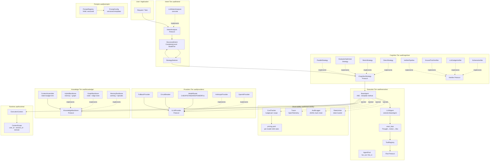

# Architecture Overview

High-level tier diagram of the UAAF framework. Each tier has a single responsibility; tiers communicate through Protocols (interfaces), not concrete types.

---

## Tier Responsibilities

| Tier | Answers | Key Interface |
|---|---|---|
| Intent | What does the user want? How complex? | `IIntentAnalyzer` |
| Cognitive | Which reasoning pattern should run? | `ICognitiveStrategy` |
| Execution | How does one agent run + tool-call? | `BaseAgent` / `LLMAgent` |
| Providers | Which LLM handles this request? | `ILLMProvider` |
| Knowledge | What context does the agent need? | `IKnowledgeBackbone` |
| Observability | Cost, latency, audit, rate limit | injected into `BaseAgent` |
| Prompts | How is the LLM instructed? | `PromptRegistry` |
| Runtime | Who is calling? What session? | `ExecutionContext` |

---

## Design Rules

1. **Protocols over classes** — tiers depend on `Protocol`, never on concrete implementations.
2. **Cross-cutting injected** — `CostTracker`, `Tracer`, `AuditLogger`, `RateLimiter` are constructor-injected into `BaseAgent`; product code cannot bypass them.
3. **`_execute()` only** — subclasses implement domain logic only; `execute()` is sealed.
4. **Vertical slices** — each request flows top-to-bottom; no tier calls a tier above it.
