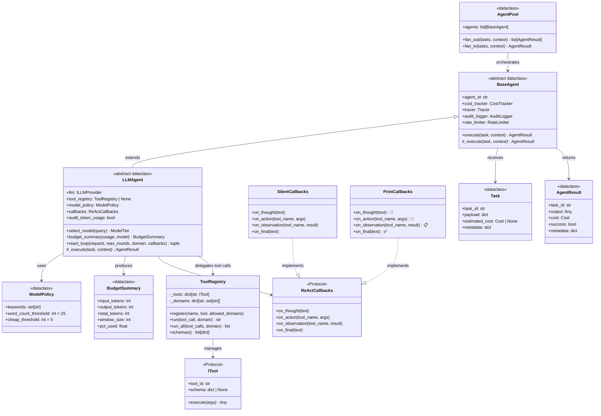
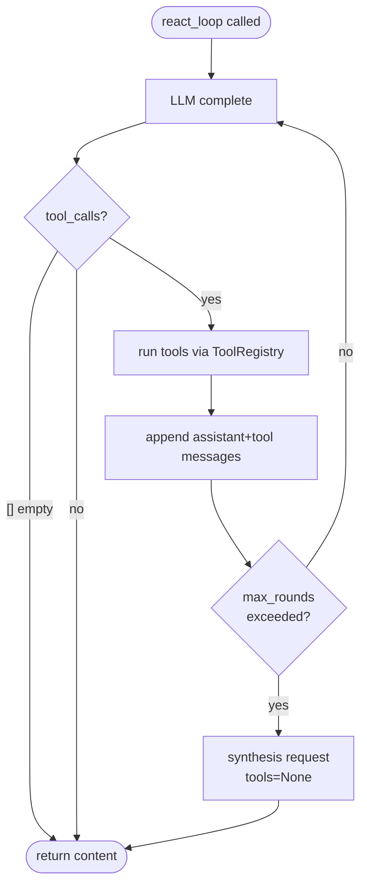

# Execution Tier — Class Diagram

`uaaf/execution/` — agent base classes, LLM loop, tool registry, agent pool.



---

## react_loop() — 4 Cases



| Case | Trigger | Result |
|---|---|---|
| 1 | Round 1, no `tool_calls` | return immediately |
| 2 | `tool_calls` present | execute, accumulate, continue |
| 3 | `tool_calls=[]` mid-round | LLM changed mind → return |
| 4 | `max_rounds` exceeded | synthesis request → return |

---

## ToolRegistry — Domain Allowlist

```python
reg = ToolRegistry()
reg.register("buy_stock", buy_tool, allowed_domains={"finance"})
reg.register("list_tasks", list_tool)   # no restriction

# domain="finance" → buy_stock allowed
await reg.run(tool_call, domain="finance")

# domain="chat" → PermissionError for buy_stock
await reg.run(tool_call, domain="chat")
```

`ITool` can be a bare `async def` (auto-wrapped) or a class implementing the Protocol.
