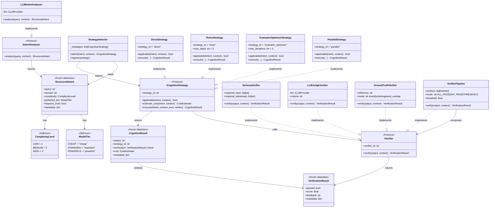

# Intent & Cognitive Tier — Class Diagram

`ryuu/intent/` + `ryuu/cognitive/` — understand the request, select a reasoning strategy, verify the output.



---

## StrategySelector — Selection Logic

```
ComplexityLevel.LOW    → DirectStrategy      (single LLM call, no tools)
ComplexityLevel.MEDIUM → ReActStrategy       (Thought→Action→Obs loop)
ComplexityLevel.HIGH   → EvaluatorOptimizer  (generate → evaluate → refine)
requires_parallel=True → ParallelStrategy    (fan_out across AgentPool)
```

Strategies are checked via `applicable()` in priority order. First match wins.

---

## VerifierPipeline — Aggregation Modes

| Mode | Passes when |
|---|---|
| `ALL_PASS` | every verifier passes |
| `ANY_PASS` | at least one verifier passes |
| `THRESHOLD` | fraction of passing verifiers ≥ threshold |

```python
pipeline = VerifierPipeline(
    verifiers=[schema_v, ground_truth_v, llm_judge_v],
    mode="THRESHOLD",
    threshold=0.67,   # 2 of 3 must pass
)
```
