# Providers & Observability — Class Diagram

`uaaf/providers/` + `uaaf/observability/` + `uaaf/runtime/` — LLM abstraction, routing, cost, tracing.

```mermaid
classDiagram
    class ILLMProvider {
        <<Protocol>>
        +complete(request) Response
        +embed(texts) list[Embedding]
    }

    class CompletionRequest {
        <<dataclass>>
        +messages: list[Message]
        +model: str
        +temperature: float | None
        +max_tokens: int | None
        +tools: list[dict] | None
    }

    class Message {
        <<dataclass>>
        +role: str
        +content: str
        +tool_calls: list[dict] | None
        +tool_call_id: str | None
    }

    class Response {
        <<dataclass>>
        +content: str
        +model: str
        +usage: TokenUsage
        +finish_reason: str
        +metadata: dict
    }

    class TokenUsage {
        <<dataclass>>
        +input_tokens: int
        +output_tokens: int
    }

    class OpenAIProvider {
        -_client: AsyncOpenAI
        +complete(request) Response
        +embed(texts) list[Embedding]
    }

    class AnthropicProvider {
        -_client: AsyncAnthropic
        +complete(request) Response
        +embed(texts) list[Embedding]
    }

    class ModelRouter {
        -providers: dict[ModelTier, ILLMProvider]
        -fallback: ILLMProvider | None
        -failure_threshold: int
        -recovery_timeout: float
        +complete(request) Response
        +_model_to_tier(model) ModelTier
    }

    class CircuitBreaker {
        -provider: ILLMProvider
        -failure_threshold: int
        -recovery_timeout: float
        +complete(request) Response
    }

    class FallbackProvider {
        -primary: ILLMProvider
        -fallback: ILLMProvider
        +complete(request) Response
    }

    class CostTracker {
        -_policy: CostPolicy
        -_ledger: dict[str, Cost]
        +record(scope_key, cost)
        +enforce(scope_key, estimated)
        +summary(scope_key) Cost
    }

    class CostPolicy {
        <<dataclass>>
        +max_usd_per_session: float
        +max_usd_per_day: float
        +max_usd_global: float
    }

    class Cost {
        <<dataclass>>
        +input_tokens: int
        +output_tokens: int
        +usd: float
        +provider: str
        +model: str
        +zero(provider, model)$
    }

    class Tracer {
        -_exporter: SpanExporter
        +span(agent_id, task_id, corr_id) AsyncContextManager
    }

    class AuditLogger {
        -_config: AuditConfig
        +log_start(task_id, agent_id, ...)
        +log_complete(task_id, agent_id, ...)
        +log_error(task_id, agent_id, ...)
    }

    class AuditConfig {
        <<dataclass>>
        +backend: str  console|file|none
        +path: Path | None
    }

    class RateLimiter {
        -_policy: RatePolicy
        -_buckets: dict[str, TokenBucket]
        +acquire(scope_key, agent_id)
    }

    class RatePolicy {
        <<dataclass>>
        +rps: float
        +burst: int
    }

    class ExecutionContext {
        <<dataclass>>
        +scope: ContextScope
        +correlation_id: str
        +metadata: dict
    }

    class ContextScope {
        <<frozen dataclass>>
        +user_id: str
        +session_id: str
        +domain: str
        +scope_key: str
    }

    OpenAIProvider ..|> ILLMProvider : implements
    AnthropicProvider ..|> ILLMProvider : implements
    ModelRouter ..|> ILLMProvider : implements
    CircuitBreaker ..|> ILLMProvider : implements
    FallbackProvider ..|> ILLMProvider : implements
    ModelRouter --> ILLMProvider : routes to
    CircuitBreaker --> ILLMProvider : wraps
    FallbackProvider --> ILLMProvider : wraps
    ILLMProvider --> CompletionRequest : accepts
    ILLMProvider --> Response : returns
    CompletionRequest --> Message : contains
    Response --> TokenUsage : contains
    CostTracker --> CostPolicy : enforces
    CostTracker --> Cost : records
    AuditLogger --> AuditConfig : configured by
    RateLimiter --> RatePolicy : configured by
    ExecutionContext --> ContextScope : scoped by
```



---

## ModelRouter — Tier Detection

`ModelRouter._model_to_tier(model)` maps a model string to `ModelTier`:

| Input | Tier |
|---|---|
| `"cheap"` / `"standard"` / `"powerful"` | direct StrEnum match |
| `"gpt-4o-mini"`, `"claude-haiku-*"` | `CHEAP` |
| `"claude-opus-*"` | `POWERFUL` |
| everything else | `STANDARD` |

This allows agents to pass `ModelTier` values (e.g., `"cheap"`) directly in `CompletionRequest.model` when using `ModelRouter`.

---

## Pricing — pricing.yaml

Cost data lives in `pricing.yaml` at the project root. Loaded once at import time:

```
pricing.yaml resolution order:
  1. $UAAF_PRICING_FILE env var (explicit override)
  2. project_root/pricing.yaml  (running from source)
  3. uaaf/observability/pricing.yaml  (pip-installed, bundled fallback)
```

Add a new model — no redeploy needed, just edit `pricing.yaml`:

```yaml
pricing:
  my-new-model: [1.50, 6.00]   # [input_per_M_tokens, output_per_M_tokens]
context_window:
  my-new-model: 128000
```

Call `reload_pricing()` in long-running services to pick up changes without restart.

---

## Audit JSONL Format

Each event is a JSON line with a SHA-256 chain hash for tamper detection:

```json
{"ts": "...", "event": "start",    "task_id": "t1", "agent_id": "a1", "hash": "abc123"}
{"ts": "...", "event": "complete", "task_id": "t1", "agent_id": "a1", "hash": "def456", "prev_hash": "abc123"}
```
