# Knowledge Tier — Class Diagram

`ryuu/knowledge/` — agent memory and context assembly.

```mermaid
classDiagram
    class IKnowledgeBackbone {
        <<Protocol>>
        +backbone_type: BackboneType
        +write(observation, scope_key, metadata)
        +query(query, scope_key, top_k) QueryResult
        +assemble_context(query, scope_key, budget_tokens) AssembledContext
    }

    class BackboneType {
        <<StrEnum>>
        MEMORY = "memory"
        GRAPH = "graph"
        HYBRID = "hybrid"
    }

    class QueryResult {
        <<frozen dataclass>>
        +results: list[str]
        +scores: list[float]
        +metadata: dict
    }

    class AssembledContext {
        <<frozen dataclass>>
        +text: str
        +token_count: int
        +source_ids: list[str]
    }

    class MemoryBackbone {
        +backbone_type = MEMORY
        -_layers: list[IMemoryStore]
        +write(observation, scope_key, metadata)
        +query(query, scope_key, top_k) QueryResult
        +assemble_context(query, scope_key, budget_tokens) AssembledContext
    }

    class IMemoryStore {
        <<Protocol>>
        +store(content, scope_key, metadata)
        +retrieve(query, scope_key, top_k) list[MemoryEntry]
    }

    class WorkingMemoryStore {
        -_data: dict[str, list[MemoryEntry]]
        +store(content, scope_key, metadata)
        +retrieve(query, scope_key, top_k) list[MemoryEntry]
    }

    class EpisodicMemoryStore {
        -_data: dict[str, list[MemoryEntry]]
        +store(content, scope_key, metadata)
        +retrieve(query, scope_key, top_k) list[MemoryEntry]
    }

    class GraphBackbone {
        +backbone_type = GRAPH
        -_store: IGraphStore
        +write(observation, scope_key, metadata)
        +query(query, scope_key, top_k) QueryResult
        +assemble_context(query, scope_key, budget_tokens) AssembledContext
        +add_edge(src, dst, rel, scope_key)
        +neighbors(node_id, scope_key) list[str]
    }

    class IGraphStore {
        <<Protocol>>
        +add_node(node_id, content, metadata)
        +add_edge(src, dst, relation)
        +get_neighbors(node_id) list[str]
        +search(query, top_k) list[GraphNode]
    }

    class InMemoryGraphStore {
        -_nodes: dict
        -_edges: dict
        +add_node(node_id, content, metadata)
        +add_edge(src, dst, relation)
        +get_neighbors(node_id) list[str]
        +search(query, top_k) list[GraphNode]
    }

    class HybridBackbone {
        +backbone_type = HYBRID
        -_memory: MemoryBackbone
        -_graph: GraphBackbone
        +write(observation, scope_key, metadata)
        +query(query, scope_key, top_k) QueryResult
        +assemble_context(query, scope_key, budget_tokens) AssembledContext
    }

    class ContextAssembler {
        -_backbone: IKnowledgeBackbone
        +assemble(query, scope_key, budget_tokens) AssembledContext
        +write(observation, scope_key, metadata)
    }

    IKnowledgeBackbone --> QueryResult : returns
    IKnowledgeBackbone --> AssembledContext : returns
    IKnowledgeBackbone --> BackboneType : has
    MemoryBackbone ..|> IKnowledgeBackbone : implements
    GraphBackbone ..|> IKnowledgeBackbone : implements
    HybridBackbone ..|> IKnowledgeBackbone : implements
    MemoryBackbone --> IMemoryStore : uses
    WorkingMemoryStore ..|> IMemoryStore : implements
    EpisodicMemoryStore ..|> IMemoryStore : implements
    GraphBackbone --> IGraphStore : uses
    InMemoryGraphStore ..|> IGraphStore : implements
    HybridBackbone --> MemoryBackbone : composes
    HybridBackbone --> GraphBackbone : composes
    ContextAssembler --> IKnowledgeBackbone : wraps
    ContextAssembler --> AssembledContext : returns
```



---

## Memory Layers

| Layer | Scope | Eviction | Use case |
|---|---|---|---|
| `WorkingMemoryStore` | session (RAM) | end of session | recent observations, tool results |
| `EpisodicMemoryStore` | cross-session | manual / TTL | user preferences, past decisions |
| `GraphBackbone` | cross-session | manual | entity relationships, concept maps |
| `HybridBackbone` | all of above | combined | richest context at highest cost |

---

## ContextAssembler — Token Budget

`assemble_context()` trims results to fit within `budget_tokens`:

```python
assembler = ContextAssembler(MemoryBackbone())

# Write observations during execution
await assembler.write("User prefers bullet-point format", scope_key="u1:s1")
await assembler.write("Goal: lose 5kg by June", scope_key="u1:s1")

# Retrieve at prompt-build time, capped at 500 tokens
ctx = await assembler.assemble("health plan", scope_key="u1:s1", budget_tokens=500)
print(ctx.text)        # injected into system prompt
print(ctx.token_count) # actual tokens used
```

---

## Backbone Selection Guide

```
Simple chatbot, session only         → MemoryBackbone (default layers)
Entity tracking, knowledge graph     → GraphBackbone
Complex agents needing both          → HybridBackbone
Custom store (Redis, Postgres, etc.) → implement IMemoryStore or IGraphStore
```
