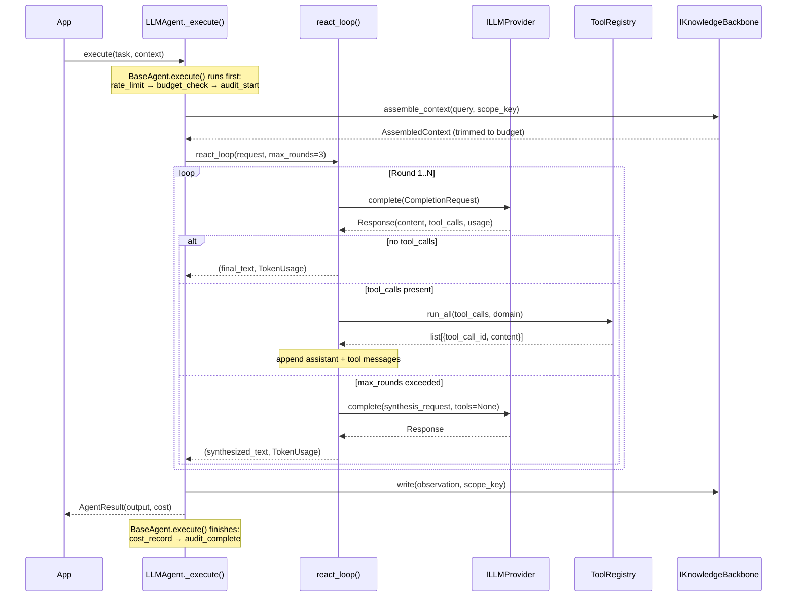
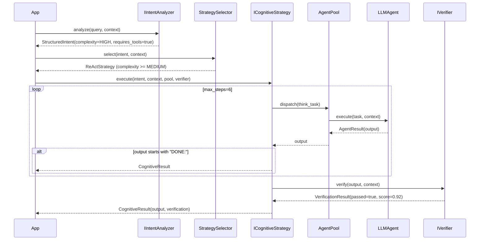
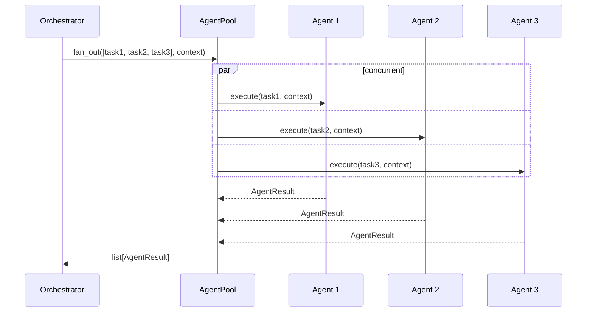
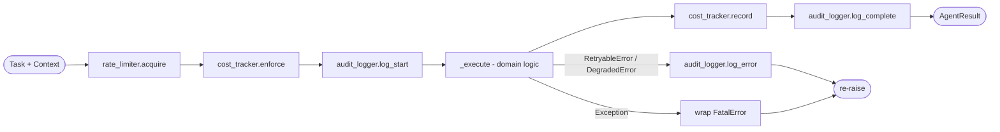

# Request Flow — Sequence Diagrams

End-to-end flow for the two most common patterns.

---

## Pattern A: LLMAgent with Tool Calling (most common)

---

## Pattern B: Full Pipeline (Intent → Strategy → Agent)

---

## Pattern C: Parallel Fan-out

Used by `ParallelStrategy` and `code_analysis` example (one agent per class).

---

## BaseAgent.execute() — Cross-cutting Pipeline

`_execute()` is the only method subclasses implement. The pipeline is sealed.
