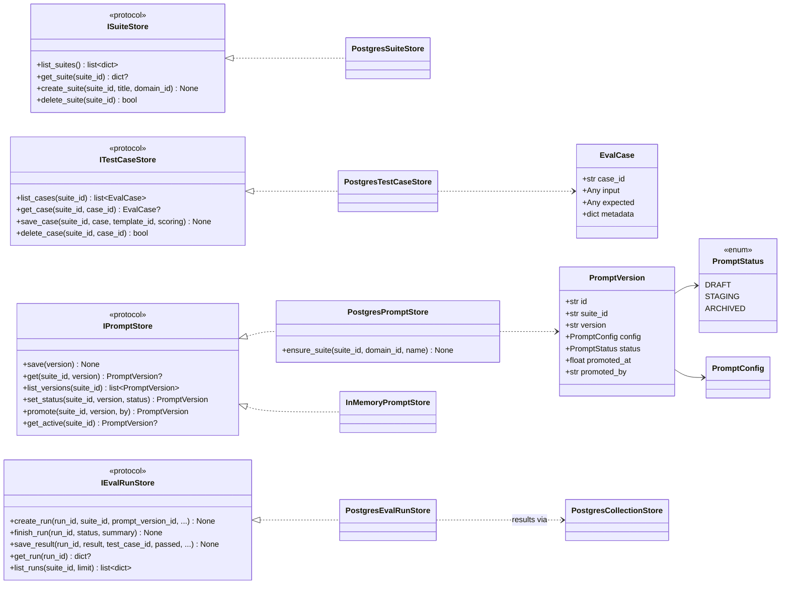
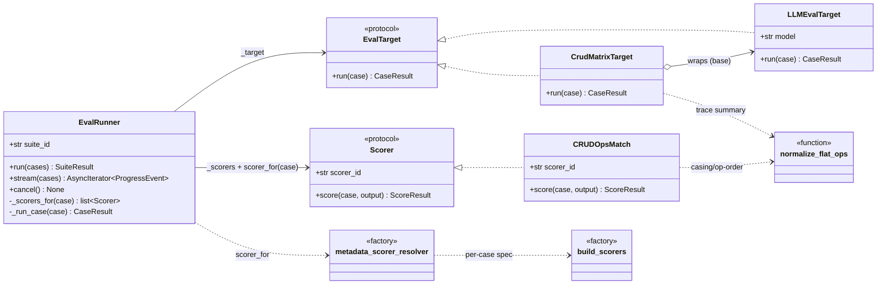
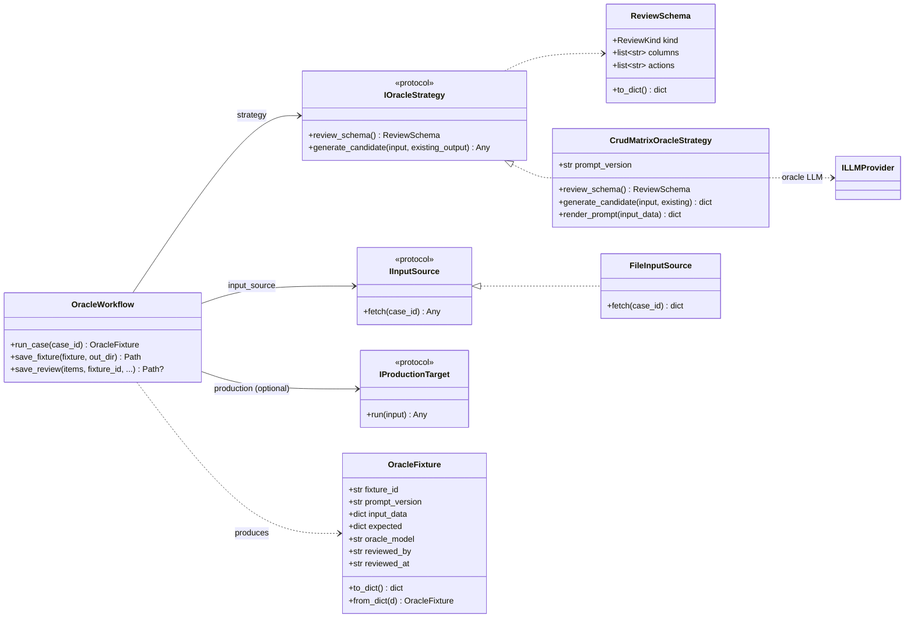
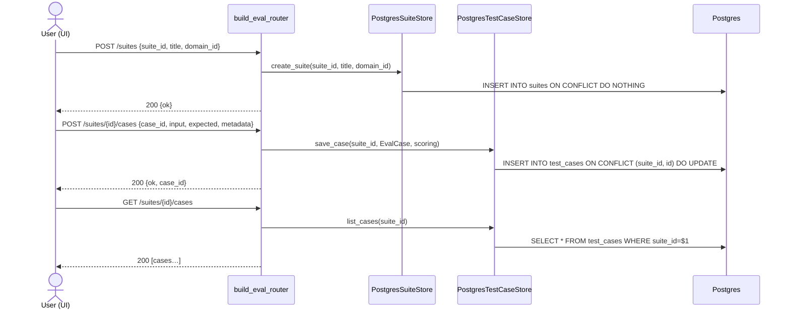
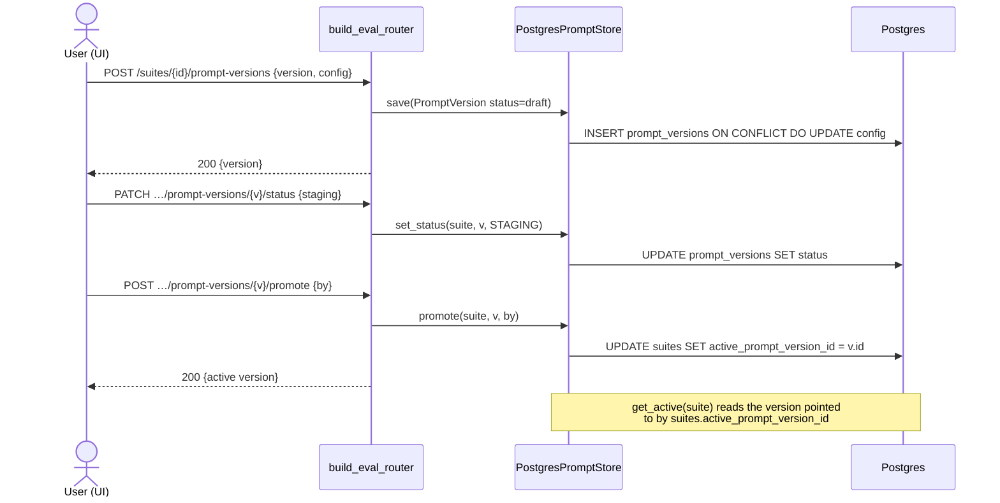
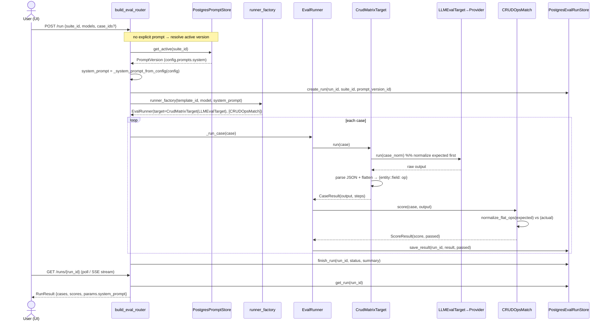

# Eval Architecture — Suite, Case, Run & Oracle Review

> Reference doc for the eval subsystem: how **Suites**, **Cases**, **Prompt
> Versions**, **Runs**, and the **Oracle Review** (Golden Dataset) pipeline fit
> together. Diagrams first (class + sequence), then the data model, HTTP API,
> and file formats.

**Mental model in one line:** a *Suite* owns versioned *Prompts* and *Cases*; a
*Run* executes the suite's active prompt against every case and scores the
output; *Oracle Review* is how a *Case's* expected answer (the "golden" ground
truth) is generated by an LLM oracle, human-approved, and promoted into a suite.

---

## 1. Domain hierarchy

```
systems ──< domains ──< suites ──┬──< prompt_versions   (one is "active")
                                  ├──< test_cases        (input + expected + scoring)
                                  └──< eval_runs ──< eval_results
```

| Entity | Table | Owns | Key idea |
|---|---|---|---|
| System | `systems` | domains | top-level grouping (e.g. `code-analysis`) |
| Domain | `domains` | suites | sub-grouping (e.g. `diagrams`) |
| **Suite** | `suites` | prompts, cases, runs | unit of evaluation; has `active_prompt_version_id` |
| **Prompt Version** | `prompt_versions` | — | versioned `PromptConfig` (JSONB) + lifecycle status |
| **Case** | `test_cases` | — | `input` + `expected` + per-case `scoring` spec; PK `(suite_id, id)` |
| **Run** | `eval_runs` | results | one execution of a suite |
| **Result** | `eval_results` | — | one scored case within a run |
| **Fixture** | JSON file | — | oracle-generated golden answer (pre-promotion); not a DB table |

---

## 2. Class diagram — Storage & domain entities



**Notes**
- Application code depends on the **protocols** (`ISuiteStore`, `IPromptStore`,
  …) defined in `ryuu-eval-core` / `ryuu-prompts`, never the Postgres classes —
  swapping a backend is one wiring change in `dev_server.py`.
- `PostgresPromptStore` tracks "live" via `suites.active_prompt_version_id`
  (a pointer), **separate** from a version's lifecycle `status`. A promoted
  version can still read `status=staging`; being the active pointer is what
  makes it live.
- `PostgresEvalRunStore` writes run rows to `eval_runs` and rides
  `PostgresCollectionStore` for per-case `eval_results`.

---

## 3. Class diagram — Run pipeline



**Notes**
- `EvalRunner._run_case` runs the target, then scores with `_scorers_for(case)`:
  a per-case resolver (`scorer_for`) wins when it returns a non-empty list,
  else the suite-level scorers. This is how a case's `scoring` JSONB spec drives
  `build_scorers()` without changing the suite default.
- The **category → behavior** registry `_SUITE_BEHAVIOR` (in `eval_suites.py`,
  keyed on `template_id`) maps `crud_matrix` → `(CrudMatrixTarget, [CRUDOpsMatch])`.
  Adding a domain = one registry entry, no `if/elif`.
- `normalize_flat_ops` collapses `Order::customerId` ≡ `order::customer_id` and
  `"RC"` ≡ `"CR"` before counting matches — applied in both `CRUDOpsMatch.score`
  and `CrudMatrixTarget`'s trace summary so they agree.

---

## 4. Class diagram — Oracle Review subsystem



**Notes**
- One `IOracleStrategy` per domain. It does two things: describe the review UI
  (`review_schema`) and generate the golden answer (`generate_candidate`).
- The **oracle prompt** (which generates ground truth) lives in YAML
  (`eval_consumer/.../prompts/java_spring.yaml`) — distinct from the
  **production prompt** (under test), which lives in the `prompt_versions` DB.
- A fixture is a JSON file, not a DB row, until **promoted** into a suite as a
  `test_case`.

---

## 5. Sequence — Create suite & add a case



---

## 6. Sequence — Prompt version lifecycle & promote



---

## 7. Sequence — Run a suite (the core eval loop)



---

## 8. Sequence — Oracle Review full lifecycle (Golden Dataset)

```mermaid
sequenceDiagram
    actor U as Reviewer (UI)
    participant R as build_eval_router
    participant LLM as LLM Provider
    participant OS as CrudMatrixOracleStrategy
    participant FS as Fixture files
    participant TC as PostgresTestCaseStore

    rect rgb(245,245,255)
    Note over U,LLM: 1. Meta-generate (optional) — turn production prompt into an oracle prompt
    U->>R: POST /oracle-review/meta-generate {production_prompt}
    R->>LLM: complete(meta-prompt messages)
    LLM-->>R: oracle_prompt (YAML)
    R-->>U: {oracle_prompt} (editable)
    end

    rect rgb(245,255,245)
    Note over U,FS: 2. Generate fixture (golden answer)
    U->>R: POST /oracle-review/generate {case_id, input_data, oracle_prompt}
    alt strategy mode
        R->>OS: generate_candidate(input_data)
        OS->>LLM: oracle LLM call
        LLM-->>OS: cells {entity:{field:{op,confidence,why}}}
        OS-->>R: candidate
    else override mode
        Note over R: use caller-supplied expected_override
    end
    R->>FS: write &lt;id&gt;.json (reviewed_by="")
    R->>FS: write &lt;id&gt;.review.json (low/med confidence cells)
    R-->>U: {fixture, review_items}
    end

    rect rgb(255,250,240)
    Note over U,LLM: 3. Execute / refine (optional, stateless)
    U->>R: POST /oracle-review/run-with-prompt {oracle_prompt, input_data}
    R->>LLM: complete(rendered prompt)
    LLM-->>R: cells + tokens/cost
    R-->>U: {cells, latency, cost}  (history kept per fixture)
    end

    rect rgb(255,245,245)
    Note over U,FS: 4. Review & APPROVE — fixture is the unit approved
    U->>R: GET /oracle-review/{id}  (load cells + needs_review)
    U->>R: POST /oracle-review/{id}/review {actions[], reviewed_by}
    Note over R: per cell: approve→conf=high · fix→op=corrected · remove→delete
    R->>FS: write &lt;id&gt;.json (reviewed_by, reviewed_at=today)
    R->>FS: update &lt;id&gt;.review.json (action per row)
    R-->>U: {updated count}
    end

    rect rgb(245,255,255)
    Note over U,TC: 5. Promote to suite → becomes a test_case
    U->>R: POST /oracle-review/{id}/promote-to-suite {target_suite_id, case_id}
    R->>R: flatten cells → expected {cells:[{entity,column,op}]}
    alt DB-backed
        R->>TC: ensure_suite + save_case(input, expected, metadata.source_fixture)
    else file-backed
        R->>R: write cases_dir/&lt;suite&gt;/&lt;case&gt;.yml
    end
    R->>R: append promote history (_promotes_store)
    R-->>U: {written_path, case_id, cells_count}
    end

    Note over U,TC: 6. The promoted case now participates in normal suite runs (§7)
```

---

## 9. HTTP API reference

Base path: `/api/eval`. Auth via injected `auth_dep`. DB-backed endpoints
return **501** when their store isn't wired (`prompt_store`/`test_case_store`/…
is `None`).

### Suites & cases

| Method | Path | Handler → store |
|---|---|---|
| GET / POST | `/suites` | list/create → `ISuiteStore` |
| GET / PUT / DELETE | `/suites/{id}` | get/update/delete → `ISuiteStore` |
| GET / POST | `/suites/{id}/cases` | list/create → `ITestCaseStore` |
| PUT / DELETE | `/suites/{id}/cases/{case_id}` | update/delete → `ITestCaseStore` |
| GET | `/suites/{id}/cases/{case_id}/provenance` | oracle provenance for an approved case |
| POST | `/suites/{id}/cases:generate` | generate cases |
| POST | `/suites/{id}/cases/{case_id}/run` | run a single case |

### Prompt versions

| Method | Path | Handler → store |
|---|---|---|
| GET / POST | `/suites/{id}/prompt-versions` | list/save → `IPromptStore` |
| GET | `/suites/{id}/prompt-versions/active` | `get_active` |
| POST | `/suites/{id}/prompt-versions/{v}/promote` | `promote` → sets active pointer |
| PATCH | `/suites/{id}/prompt-versions/{v}/status` | `set_status` |

### Runs

| Method | Path | Handler → store |
|---|---|---|
| POST | `/run` | start run (resolves active prompt) → `IEvalRunStore` |
| POST | `/run/single` | run one case |
| GET | `/run/stream/{run_id}` | SSE `ProgressEvent` stream |
| POST | `/run/cancel/{run_id}` | cancel |
| GET | `/runs/{run_id}` | `get_run` |
| GET | `/suites/{id}/runs` | `list_runs` |

### Oracle Review

| Method | Path | Handler (router.py) | Step |
|---|---|---|---|
| GET | `/oracle-review/` | `list_oracle_fixtures` (L2104) | list |
| GET | `/oracle-review/schema` | review UI schema | — |
| GET | `/oracle-review/providers` | LLM providers + catalog | — |
| POST | `/oracle-review/meta-generate` | `meta_generate_oracle_prompt` (L2301) | 1 |
| POST | `/oracle-review/generate` | write fixture + review.json | 2 |
| POST | `/oracle-review/run-with-prompt` | stateless oracle run | 3 |
| GET | `/oracle-review/{id}/runs` | `list_oracle_runs` (L2603) | 3 |
| GET | `/oracle-review/{id}` | fixture + review items | 4 |
| POST | `/oracle-review/{id}/review` | `update_oracle_review` (L2634) — **approve** | 4 |
| GET | `/oracle-review/{id}/prompt` | render oracle prompt | — |
| POST | `/oracle-review/{id}/run` | `run_oracle_preview` (L2711) | — |
| GET | `/oracle-review/{id}/export` | export fixture JSON | — |
| POST | `/oracle-review/{id}/promote-to-suite` | promote → suite case | 5 |
| GET | `/oracle-review/{id}/promotes` | `list_oracle_promotes` (L2859) | 5 |
| GET | `/oracle-promotes` | global promote history | — |
| DELETE | `/oracle-review/{id}` | delete fixture + review.json | — |

---

## 10. File formats

### Fixture — `artifacts/eval/oracle_fixtures/<domain>/<id>.json`

```jsonc
{
  "fixture_id": "case1_happy_path",
  "suite_id": "crud_matrix_llm",
  "prompt_version": "crud_matrix_oracle.v1",
  "oracle_model": "claude-opus-4-7",
  "reviewed_by": "",          // empty ⇒ NOT approved (shows "pending" in UI)
  "reviewed_at": "",          // ISO date when finalized
  "input_data": { /* route context / code under analysis */ },
  "expected": {
    "cells": {
      "Order": {
        "status": { "op": "C", "confidence": "high", "oracle_why": "…" },
        "id":     { "op": "",  "confidence": "medium", "oracle_why": "@GeneratedValue → DB assigns" }
      }
    },
    "valid_fields": { "Order": ["id", "status"] },
    "framework": "java_spring"
  },
  // Studio audit trail (empty for pre-studio fixtures):
  "production_prompt": "…",      // the prompt under test
  "oracle_prompt": "…",          // YAML prompt that generated the ground truth
  "oracle_prompt_version": "…",
  "meta_prompt_version": "…"
}
```

### Companion review — `<id>.review.json`

Lists only the cells needing a human decision (confidence ∈ low/medium):

```jsonc
{
  "fixture_id": "case1_happy_path",
  "generated_at": "2026-05-26",
  "needs_review": [
    {
      "entity": "Order", "field": "id", "op": "", "confidence": "medium",
      "oracle_why": "@GeneratedValue → DB assigns id, app never writes it",
      "action": "remove",      // null=pending · approve · fix · remove
      "corrected_op": null      // set when action="fix"
    }
  ]
}
```

**Approve cell semantics** (`POST /oracle-review/{id}/review`):
`approve` → set confidence `high` · `fix` → set `op=corrected_op`, confidence
`high` · `remove` → delete the cell. Finalizing with a `reviewed_by` stamps
`reviewed_at=today()` on the whole fixture → that's what flips it to "approved".

### Oracle input contract — `route_context_json`

The oracle prompt is templated with `{{ route_context_json }}`, produced
upstream by `_build_route_context()`. Its canonical schema **does** carry the
grounding the oracle needs — entity field schemas AND per-method field access:

```jsonc
{
  "route":        { "endpoint": "/api/orders/{id}", "http_method": "PUT",
                    "use_case": "Update order status", "action": "update" },
  "call_chain":   [ { "class": "OrderService", "method": "update", "method_key": "…" } ],
  "entities":     [ { "short_name": "Order", "fqn": "…", "class_key": "…",
                      "db_table": "orders", "annotations": ["@Entity","@Table(…)"],
                      "fields": [ { "name": "totalPrice", "db_column": "total_price",
                                    "annotations": ["@Column"] }, … ] } ],
  "method_access":[ { "class": "OrderService", "method": "update",
                      "read":  ["id","status"],          // → op R
                      "write": ["status","totalPrice"],  // → op C/U
                      "annotations": ["@Transactional"] } ]
}
```

So when the input conforms, **nothing is guessed**:
- `entities[].fields[].{name, db_column}` ground the field names + casing
  (`_extract_valid_fields` reads exactly this, preferring `db_column`).
- `method_access[].{read, write}` ground the **op** directly — a field in
  `read` → `R`, in `write` → `C`/`U`. The call chain only explains the *why*.

> ⚠️ **Fixture-shape caveat.** Some in-repo fixtures (e.g.
> `studio_test_post_orders.json`) are stored in a *different, non-conformant*
> shape — `{project_id, total, contexts: { "<route>": { call_edges,
> call_classes, step_actions, route } }}` — with **no `entities` and no
> `method_access`**. For those, the oracle has nothing to ground field names on
> and falls back to inferring them; that inference is what the human reviewer
> must check. This is a fixture/projection mismatch, **not** the oracle input
> contract. Do not hand-author a fake `entities` block to paper over it —
> regenerate the fixture from a proper `route_context_json` instead.

The oracle `expected` is stored in the **nested** form so each cell keeps its
audit trail — `op` + `confidence` + `why` (the scorer reads only `op`):

```jsonc
"expected": {
  "cells": { "MonthlyTimesheet": {
    "employeeId": { "op": "R", "confidence": "high", "why": "findById hydrates the entity on GET" } } },
  "valid_fields": { "MonthlyTimesheet": [ /* empty until projection emits entities */ ] }
}
```

`CRUDOpsMatch._to_flat_ops` accepts three `expected` shapes: flat
`{e::f: op}`, `{cells: [{entity,column,op}]}`, and the nested
`{cells: {entity:{field:{op,…}}}}` above — so a rich, human-readable golden
answer scores identically to a flattened one. `normalize_flat_ops` keeps the
comparison casing-insensitive (camelCase field ≡ snake_case db_column).

---

## 11. Design decisions (why it's shaped this way)

- **Protocols in core, impls in storage.** App code depends on
  `ISuiteStore`/`IPromptStore`/… — low blast radius when swapping Postgres for
  memory/sqlite.
- **DB-only suites.** Suites/cases/runs read from Postgres (no file fallback) to
  remove file-vs-DB ambiguity. Oracle *fixtures* remain files until promoted.
- **Active pointer ≠ status.** Promotion sets `suites.active_prompt_version_id`;
  a version's `status` (draft/staging/archived) is independent lifecycle state.
- **Run resolves the active prompt.** `POST /run` with no explicit prompt uses
  `get_active(suite).config` via `_system_prompt_from_config` — promote → next
  run uses it automatically.
- **Per-case scoring.** A case's `scoring` JSONB drives `build_scorers()` through
  `EvalRunner.scorer_for`; falls back to suite-level scorers when absent.
- **Casing-insensitive CRUD compare.** `normalize_flat_ops` collapses
  camelCase/snake_case and op order so only genuine op differences fail a cell.
- **Generic UI rendering.** The web `DataView` component renders any case
  input/output as JSON / Table / Call-chain / Diff (see
  `docs/eval-ui-dataview-plan.md`).

---

## 12. Source map

| Concern | File |
|---|---|
| Protocols | `packages/ryuu-eval-core/src/ryuu_eval_core/protocols.py` |
| Runner | `packages/ryuu-eval-core/src/ryuu_eval_core/runner.py` (`EvalRunner`) |
| Prompt store | `packages/ryuu-prompts/src/ryuu_prompts/store.py` |
| Postgres stores | `packages/infrastructure/storage/ryuu-storage-postgres/src/ryuu_storage_postgres/{suite,test_case,eval_run,prompt}_store.py` |
| Scorers factory | `packages/ryuu-eval-scorers/src/ryuu_eval_scorers/factory.py` (`build_scorers`, `metadata_scorer_resolver`) |
| Oracle core | `packages/ryuu-eval-oracle/src/ryuu_eval_oracle/` (`OracleWorkflow`, `ReviewSchema`, `OracleFixture`, `FileInputSource`) |
| CRUD oracle | `eval_consumer/crud_matrix_oracle/` (`CrudMatrixOracleStrategy`, `normalizer.py`) |
| CRUD target/scorer | `eval_consumer/crud_matrix_llm/{target,scorer}.py` |
| Suite wiring | `eval_suites.py` (`runner_factory`, `_SUITE_BEHAVIOR`) |
| HTTP router | `packages/ryuu-eval/src/ryuu_eval/http/router.py` (`build_eval_router`) |
| Composition root | `dev_server.py` |
| Demo seed | `scripts/seed_eval.py` |
```
