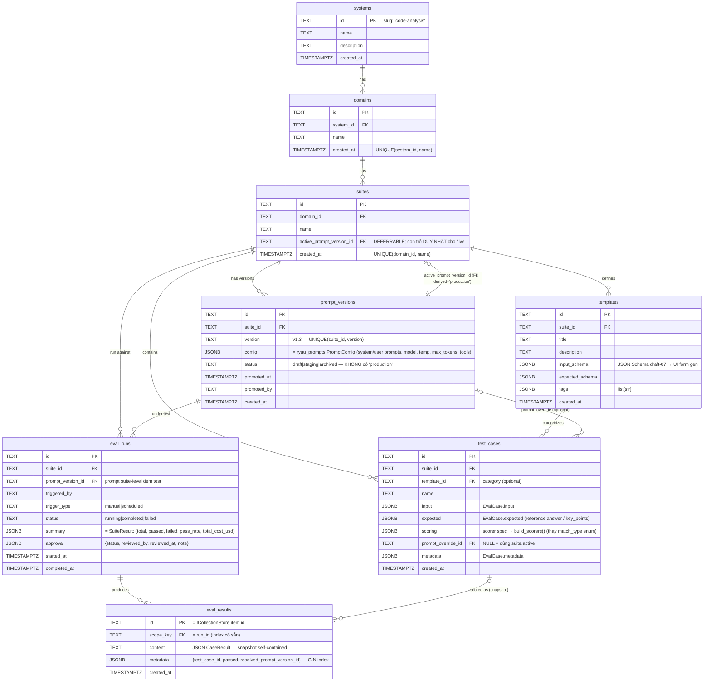

# Eval & Prompt Store — Schema (Phương án A: Postgres + JSONB)

> Single source of truth cho **eval offline** lẫn **prompt store production**.
> Cột quan hệ + FK cho phần *cần kiểm toán / atomic*; `JSONB` cho phần *động*.
> Ánh xạ thẳng vào `ryuu-eval-core` (`EvalCase`, `EvalCaseTemplate`, `SuiteResult`),
> `ryuu-eval-scorers` (scorer registry), `ryuu-prompts` (`PromptConfig`) và
> `ryuu-storage-postgres` (`PostgresCollectionStore`).

---

## ERD



---

## Quy ước đọc ERD

| Ký hiệu | Nghĩa |
|---|---|
| `||--o{` | one-to-many (1 cha, nhiều con) |
| `|o--||` | optional-to-one (con trỏ FK có thể NULL → đúng 1) |
| `|o--o{` | optional many-to-many-ish (FK nullable) |
| `PK` / `FK` | khóa chính / khóa ngoại |
| comment `"..."` | ràng buộc UNIQUE / ý nghĩa cột |

**Phân loại cột:**
- **Quan hệ (TEXT + FK):** id, *_id, status, version, timestamps → cần JOIN, FK, transaction.
- **`JSONB` (động):** config, input, expected, scoring, summary, approval, *_schema, metadata.

---

## Bản đồ ánh xạ framework

| Schema | Framework | Ghi chú |
|---|---|---|
| `prompt_versions.config` | `ryuu_prompts.PromptConfig` | serialize/deserialize qua `PromptRegistry` (DB-backed) |
| `prompt_versions.{status, promoted_*}` + `suites.active_prompt_version_id` | **mới — thêm lifecycle vào `ryuu-prompts`** | status + `promote()` + `IPromptStore` |
| `templates.*` | `ryuu_eval_core.EvalCaseTemplate` | `input_schema`/`expected_schema` = JSONB |
| `test_cases.{input, expected, metadata}` | `ryuu_eval_core.EvalCase` | 1-1 |
| `test_cases.scoring` | `ryuu_eval_scorers` registry | `build_scorers(spec) → list[Scorer]` (mới, generic) |
| `eval_runs.{summary, approval}` | `ryuu_eval_core.SuiteResult` + approval | `pass_rate`, `total_cost_usd` → `summary` |
| `eval_results` (row) | `ryuu_eval_core.CaseResult` | qua `PostgresCollectionStore`, `scope_key=run_id` |

---

## 2 abstraction mới cần thêm vào framework (propose-before-adding)

1. **`ryuu-prompts`:** thêm `IPromptStore` (DB-backed, map vào `prompt_versions`) + lifecycle
   (`status`, `promote()`, active-pointer). `PromptConfig` giữ nguyên làm content model.
2. **`ryuu-eval-scorers`:** thêm `build_scorers(spec: dict) -> list[Scorer]` — factory dựng
   scorer từ JSONB `test_cases.scoring`. Registry pattern: scorer mới = 1 entry, không sửa schema.

---

## `test_cases.scoring` — payload mẫu (thay enum `match_type`)

```json
{
  "scorers": [
    { "type": "contains",  "config": { "required": ["CREATE", "READ"] } },
    { "type": "llm-judge", "config": { "criteria": "correctness", "rubric": "..." } }
  ],
  "combine": "and",
  "forbidden": ["GraphQL"]
}
```

`combine` → bọc `Composite`. `forbidden` cross-cutting → `Constraint` phủ định, check trước.

## `eval_results.content` — snapshot self-contained (fix reproducibility)

```json
{
  "test_case_id": "tc_001",
  "resolved_prompt_version_id": "pv_004",
  "input_snapshot":    { "...": "..." },
  "expected_snapshot": { "...": "..." },
  "scoring_snapshot":  { "...": "..." },
  "output": "CREATE /users POST...",
  "scores": [ { "scorer_id": "contains", "score": 1.0, "passed": true, "reason": "" } ],
  "passed": true, "cost_usd": 0.0021, "latency_ms": 1200, "steps": []
}
```
