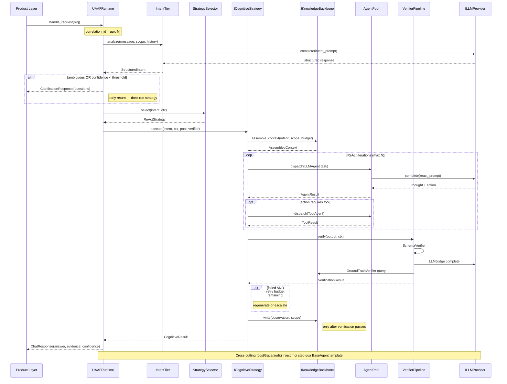
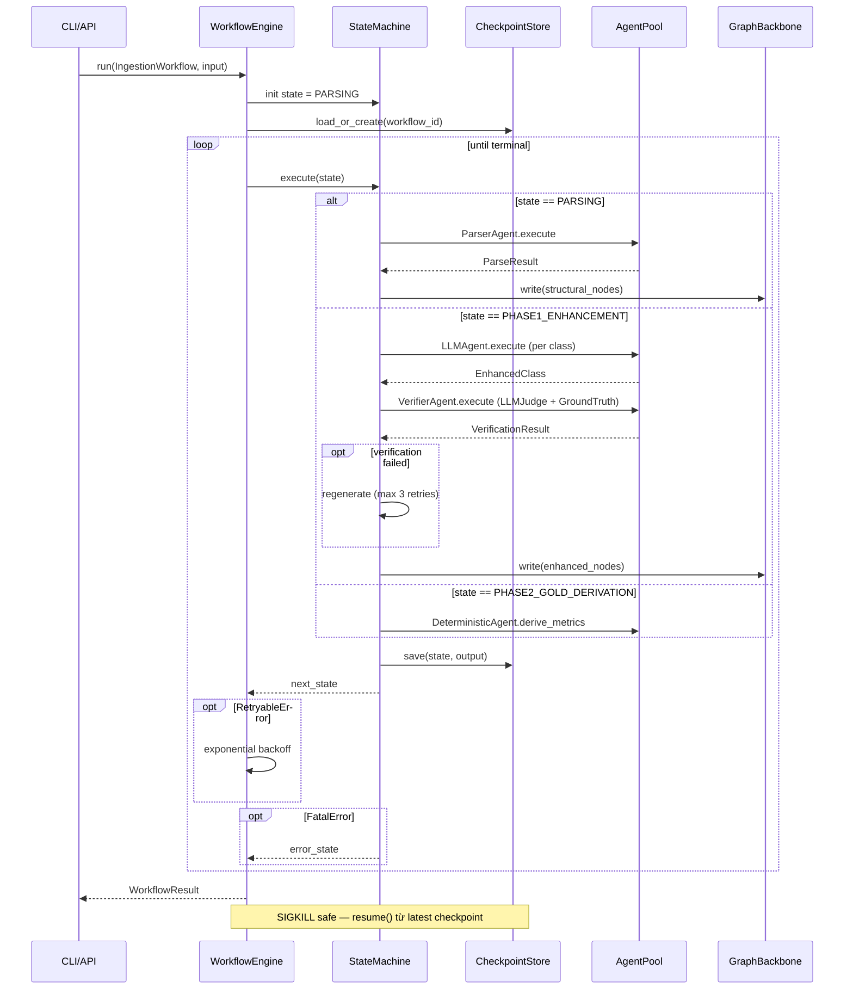
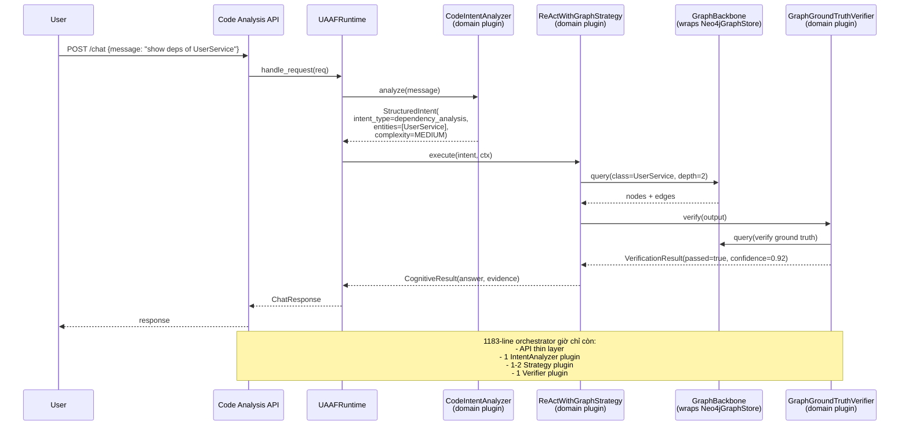

# Spec: UAAF — Universal Agentic AI Framework

> Spec-driven development output cho framework dùng chung 3 product: **AI Code Analysis**, **Personal AI Assistant**, **MAAF Per-Domain**.
>
> File này là **source of truth** trước khi viết code. Đọc kỹ, comment vào, sửa trước khi implement.

**Status**: Draft v1.1 — Phase gates đã pass, sẵn sàng proceed Plan
**Last Updated**: 2026-05-07
**Author**: Claude (Sonnet 4.6)
**Reviewers**: phuongtt@core-corp.co.jp
**Related docs**:
- `docs/ improvements/UAAF-universal-agentic-framework.md` (concept gốc)
- `docs/decisions/005-uaaf-framework.md` (ADR — quyết định build, separate repo, anyio)
- `CLAUDE.md` (project conventions)

**Resolved decisions** (2026-05-07):
- **Repo strategy**: Separate repo `uaaf-framework` (independent versioning, có thể open source về sau).
- **Async runtime**: `anyio` (asyncio + trio compatible — quan trọng cho future open source).
- **Target products**: 5+ product (Code Analysis, Todo app, Stock trading, Flashcard, AI-powered coding practice, ...).

---

## 1. Objective

### Vấn đề hiện tại

Có 5+ product muốn xây trên cùng nền tảng AI agent:

| Product | Mode chính | Spine dữ liệu | Trust | Critical risk | Trạng thái |
|---|---|---|---|---|---|
| AI Code Analysis | Hybrid (batch ingest + chat) | Graph (Neo4j) | Medium-high | Hallucination → sai analysis | Đang chạy, chat là tech debt |
| Todo app | Conversational | Memory | Low | — | Trong design |
| Stock trading system | Hybrid (signals + advisory chat) | Hybrid (market graph + memory) | **High** (compliance, audit 7y) | Sai trade → tài chính | Trong design |
| Flashcard system | Conversational + scheduled batch (spaced repetition) | Memory (semantic + episodic) | Low-medium | — | Trong design |
| AI-powered coding practice | Conversational + batch (gen problem, run code) | Hybrid (code graph + user progress memory) | Medium | **Sandbox escape khi run code** | Trong design |
| ...future product | (tbd) | (tbd) | (tbd) | (tbd) | — |

**Implication cho framework**:
- **Multi-trust**: Stock = HIGH compliance vs Todo = LOW → `TrustLevel` per domain quyết định verifier stack được activate.
- **Sandbox CRITICAL** cho 2/5 product (Stock `place_order`, AI coding practice `run_code`) → `SandboxManager` không phải optional, phải robust từ Phase 0.
- **Backbone diversity**: 2 memory-only, 1 graph-primary, 2 hybrid → `IKnowledgeBackbone` abstraction được validate (không phải over-engineering).
- **Cost sensitivity**: Stock + Code Analysis high-cost queries vs Todo low-cost → `ModelRouter` (intent×complexity → tier) tiết kiệm rõ rệt.

Hiện tại:

- **Chat của Code Analysis** (1183-line orchestrator + 360-line intent classifier) là **fragile**: 5 method procedural duplication, 2 code path coexist (handler registry mới + legacy if-chain), workers instantiate cứng, confidence là heuristic vu vơ, không có verifier, `try/except: pass` nuốt errors. Không reusable, không testable.
- **2 product kia** nếu build từ đầu sẽ **lặp lại** 7 pattern chung: cognitive layer, intent understanding, memory hierarchy, tool execution, multi-agent + verifier, cross-cutting, provider abstraction.
- **Rule of three đã đáp ứng** — đây là điều kiện UAAF doc gốc đề ra để justify framework hóa.

### Mục tiêu

Xây **UAAF** — framework Python lõi cung cấp:

1. **Foundation** chung: `BaseAgent`, cross-cutting (cost/trace/audit/retry), provider abstraction.
2. **Pluggable** layers: cognitive strategy, knowledge backbone, intent analyzer, verifier — mỗi layer là plugin product implement riêng.
3. **Multi-mode**: conversational request-response và batch workflow (state machine + checkpoint) coexist trong cùng runtime.
4. **Migration path** rõ ràng cho Code Analysis chat (refactor trước), 2 product kia adopt sau.

### Người dùng

- **Primary**: 5+ internal product team (Code Analysis, Todo, Stock trading, Flashcard, AI coding practice).
- **Secondary**: Open source community (sau khi v1.0 stable) — đó là lý do Q3 chọn `anyio` thay vì pure asyncio.
- **Tertiary**: Future internal product team muốn xây AI agent mà không phải reinvent cross-cutting + provider + sandbox.

### Success looks like

- Code Analysis chat giảm từ ~1500 dòng spaghetti xuống ~600 dòng (handlers + adapters), test coverage tăng từ ~0% logic chat lên >70%.
- 4 product mới (Todo, Stock, Flashcard, AI coding practice) chỉ phải implement domain-specific plugins (intent analyzer, cognitive strategy, tool definitions, prompt) — KHÔNG đụng vào cost/trace/retry/provider/verifier/sandbox.
- Một correlation_id trace được toàn bộ flow: user request → intent classify → cognitive strategy → tool call → LLM call → verify → response.
- Cost mỗi request hiển thị real-time, có hard cap per-domain enforce ở framework level (không phải product tự nhớ).
- Stock trading audit log đáp ứng compliance 7 năm tự động (qua `AuditLogger`), không cần product team tự build.
- AI coding practice `run_code` chạy trong sandbox isolated, escape trong test → fail. Sandbox config là 1 dòng trong domain config, không phải code custom mỗi product.
- v1.0 release đủ điều kiện open source: clean public API, doc đầy đủ, không lock vào provider/vendor cụ thể.

---

## 2. Tech Stack

| Layer | Choice | Reason |
|---|---|---|
| Language | Python 3.11+ | Tất cả 5 product Python; `Protocol`, `Self`, structural pattern matching |
| Async | **`anyio`** (≥4.0) | Compatible cả asyncio và trio → quan trọng cho open source (user chọn runtime). Tránh thread-per-call hack hiện tại (`_run_async`) |
| Type system | `Protocol` + `dataclass` + `pydantic` v2 | Protocol cho interface, dataclass cho POPO, pydantic cho boundary validation |
| Testing | `pytest` + `anyio[test]` + `pytest-cov` + `hypothesis` | anyio test plugin support cả backends; hypothesis cho property-based tests trên Protocol contracts |
| LLM SDKs | `openai` ≥1.40, `anthropic` ≥0.40 | Đã dùng — keep |
| Sandbox | `subprocess` + `resource` limits cho v1; container-based optional | AI coding practice `run_code` + Stock `place_order` cần isolation. Container plug-in sau |
| Tracing | `opentelemetry-api` + console exporter mặc định | Standard, không lock vào vendor; OSS dễ adopt |
| Packaging | `pyproject.toml` (PEP 621), `hatchling` build | Modern; PyPI publish-ready từ Phase 0 |
| Docs | Markdown + Mermaid + `mkdocs-material` | Render được trong GitHub + có thể host docs site khi open source |
| License | Apache 2.0 (planned) | OSS-friendly, patent grant, enterprise-acceptable |

### Non-dependencies (KHÔNG đưa vào framework)

- **LangChain / LlamaIndex / CrewAI**: triết lý của UAAF là *abstract chỗ thực sự lặp lại*; mấy framework này abstract quá nhiều, dẫn đến over-coupling. UAAF cạnh tranh trực tiếp về scope, nhưng nhỏ và explicit hơn.
- **Vector DB / Graph DB cụ thể**: framework chỉ định nghĩa interface `IGraphStore`, `IVectorStore`. Implementation (Neo4j, Qdrant, …) ở phía product.
- **Pydantic AI / Instructor**: structured output là concern của LLM provider adapter, không phải framework.
- **Pure asyncio** (đã reject): user chọn `anyio` để runtime portable cho open source.
- **Specific cloud SDKs** (boto3, google-cloud, …): không trong core. Product layer tự thêm khi cần (vd Stock trading có thể cần market data SDK).

---

## 3. Commands

```bash
# Install (development)
pip install -e ".[dev]"

# Run tests
pytest                              # all tests
pytest tests/unit                   # unit only
pytest tests/integration            # cần Neo4j/Redis chạy
pytest --cov=uaaf --cov-report=html # coverage report

# Lint + format
ruff check uaaf/ tests/
ruff format uaaf/ tests/
mypy uaaf/

# Build
python -m build                     # tạo wheel + sdist trong dist/

# Docs
mkdocs serve                        # docs site local
```

---

## 4. Project Structure

**Repo strategy** (resolved): **separate repo** `uaaf-framework` từ Phase 0. Lý do:
- Force clean public API contract — không tempt import private symbols across boundaries.
- Independent versioning Semver — product team plan upgrade rõ ràng.
- Open source readiness từ ngày 1: license, CI, contribution guide ở đúng repo.
- 5 product downstream depend qua `pip install uaaf>=0.1` — clear dependency direction.

```
uaaf-framework/                        # SEPARATE GIT REPO (private during dev, public when v1.0)
├── pyproject.toml
├── README.md
├── CHANGELOG.md
├── LICENSE                            # Apache 2.0
├── CONTRIBUTING.md                    # OSS-ready từ Phase 0
├── .github/
│   ├── workflows/                     # CI: test, lint, type, build, contract tests
│   └── ISSUE_TEMPLATE/
│
├── uaaf/
│   ├── __init__.py                    # public API re-exports
│   │
│   ├── runtime/                       # entry point
│   │   ├── config.py                  # RuntimeConfig, DomainConfig, RuntimeMode
│   │   ├── runtime.py                 # UAAFRuntime — top-level facade
│   │   └── context.py                 # ExecutionContext, ContextScope
│   │
│   ├── intent/                        # Intent tier
│   │   ├── analyzer.py                # IIntentAnalyzer Protocol + base
│   │   ├── models.py                  # StructuredIntent, ComplexityLevel
│   │   ├── selector.py                # StrategySelector
│   │   └── clarification.py           # auto-trigger clarification flow
│   │
│   ├── cognitive/                     # Cognitive tier
│   │   ├── strategy.py                # ICognitiveStrategy Protocol
│   │   ├── strategies/
│   │   │   ├── direct.py              # 1 LLM call
│   │   │   ├── react.py               # ReAct loop
│   │   │   ├── best_of_n.py
│   │   │   ├── evaluator_optimizer.py
│   │   │   └── self_consistency.py
│   │   └── verifier.py                # IVerifier Protocol + pipeline
│   │
│   ├── knowledge/                     # Knowledge tier
│   │   ├── backbone.py                # IKnowledgeBackbone Protocol
│   │   ├── memory/
│   │   │   ├── store.py               # IMemoryStore Protocol
│   │   │   ├── working.py
│   │   │   ├── episodic.py
│   │   │   ├── semantic.py
│   │   │   ├── self_learning.py
│   │   │   └── backbone.py            # MemoryBackbone implementation
│   │   ├── graph/
│   │   │   ├── store.py               # IGraphStore Protocol
│   │   │   └── backbone.py            # GraphBackbone implementation
│   │   ├── hybrid.py                  # HybridBackbone
│   │   └── context_assembler.py       # token-budget aware assembly
│   │
│   ├── execution/                     # Execution tier
│   │   ├── agent.py                   # BaseAgent (template method) + AgentResult
│   │   ├── pool.py                    # AgentPool
│   │   ├── tool.py                    # ITool Protocol, ToolRegistry, ToolExecutor
│   │   └── sandbox.py                 # SandboxManager (subprocess/container)
│   │
│   ├── workflow/                      # Batch mode
│   │   ├── engine.py                  # WorkflowEngine
│   │   ├── state_machine.py
│   │   └── checkpoint.py              # ICheckpointStore Protocol
│   │
│   ├── providers/                     # Provider tier
│   │   ├── llm.py                     # ILLMProvider Protocol
│   │   ├── adapters/
│   │   │   ├── openai.py
│   │   │   ├── anthropic.py
│   │   │   └── self_hosted.py
│   │   ├── router.py                  # ModelRouter (intent×complexity → provider)
│   │   └── circuit_breaker.py
│   │
│   ├── observability/                 # Cross-cutting
│   │   ├── cost.py                    # CostTracker, CostPolicy
│   │   ├── rate_limit.py              # RateLimiter, RatePolicy
│   │   ├── tracer.py                  # Tracer (OTel wrapper)
│   │   ├── audit.py                   # AuditLogger
│   │   └── errors.py                  # tiered errors: Retryable/Degraded/Fatal
│   │
│   └── _testing/                      # public test utilities
│       ├── fakes.py                   # FakeLLMProvider, FakeKnowledgeBackbone
│       └── fixtures.py                # pytest fixtures
│
├── tests/
│   ├── unit/                          # per-module unit tests
│   │   ├── intent/
│   │   ├── cognitive/
│   │   ├── knowledge/
│   │   ├── execution/
│   │   └── providers/
│   ├── integration/                   # cross-module, fake LLM
│   │   ├── test_conversational_flow.py
│   │   └── test_batch_workflow.py
│   └── contract/                      # plugin contract tests
│       └── test_strategy_contract.py
│
├── docs/
│   ├── index.md                       # README mở rộng
│   ├── concepts/                      # 7 patterns explained
│   ├── guides/                        # how-tos
│   │   ├── new-domain.md              # tutorial: tạo domain mới
│   │   ├── new-strategy.md            # tutorial: thêm cognitive strategy
│   │   └── migration-from-chat.md     # cho Code Analysis team
│   └── reference/                     # API ref (auto-gen)
│
└── examples/                          # Mỗi example chạy được standalone, dùng cho doc + smoke test
    ├── todo_app/                      # Conversational + MemoryBackbone + DirectStrategy
    ├── stock_advisory/                # Hybrid + HybridBackbone + ReActStrategy + GroundTruthVerifier
    ├── flashcard/                     # Conversational + scheduled batch + MemoryBackbone
    ├── coding_practice/               # Sandbox-heavy + run_code tool + ReActStrategy
    └── code_analysis/                 # Existing — batch ingest + chat + GraphBackbone
```

### Mỗi product layout (downstream)

```
prod-grade-code-analysis/              # product repo — KHÔNG thay đổi structure cũ ở src/
├── pyproject.toml                     # depends on uaaf>=0.1
├── src/
│   ├── adapters/                      # giữ nguyên Neo4jGraphStore — implement uaaf.knowledge.graph.IGraphStore
│   ├── domain/                        # NEW — domain-specific plugins
│   │   ├── intent_analyzer.py         # implements IIntentAnalyzer cho code analysis
│   │   ├── strategies/                # ReActWithGraphStrategy, …
│   │   ├── prompts/                   # giữ nguyên src/prompts/
│   │   └── verifiers/                 # GraphGroundTruthVerifier
│   └── api/                           # giữ nguyên src/api/
└── tests/
```

### Cross-repo dependency direction

```
              ┌──────────────────────────┐
              │   uaaf-framework (PyPI)  │  ← stable contract, semver
              └────────────┬─────────────┘
                           │ depends on
       ┌───────────┬───────┼───────┬─────────────┐
       │           │       │       │             │
       ▼           ▼       ▼       ▼             ▼
  Code Analysis  Todo   Stock  Flashcard  Coding Practice
  (existing)              ↑
                          └── Stock có thêm internal deps:
                              market data SDK, audit storage
```

Framework KHÔNG biết product nào tồn tại. Product import `uaaf.*` qua public API.

---

## 5. Code Style

### Interface = Protocol, không phải ABC

```python
from typing import Protocol, runtime_checkable

@runtime_checkable
class ICognitiveStrategy(Protocol):
    strategy_id: str

    def applicable(self, intent: StructuredIntent, context: ExecutionContext) -> bool: ...
    def estimate_cost(self, intent: StructuredIntent, context: ExecutionContext) -> CostEstimate: ...

    async def execute(
        self,
        intent: StructuredIntent,
        context: ExecutionContext,
        agent_pool: AgentPool,
        verifier: Verifier,
    ) -> CognitiveResult: ...
```

**Lý do dùng Protocol thay vì ABC**: Pythonic, structural typing, không ép subclass — product có thể implement bằng class, dataclass, hoặc adapter wrapper.

**Exception**: `BaseAgent` dùng ABC + template method vì cần ép cross-cutting không thể override:

```python
from abc import ABC, abstractmethod

class BaseAgent(ABC):
    """
    Tất cả agent extend class này. Cross-cutting inject sẵn — không opt-out được.
    Subclass CHỈ implement _execute(). KHÔNG override execute().
    """
    agent_id: str
    cost_tracker: CostTracker          # injected
    tracer: Tracer                     # injected
    audit_logger: AuditLogger          # injected
    rate_limiter: RateLimiter          # injected

    @abstractmethod
    async def _execute(self, task: Task, context: ExecutionContext) -> AgentResult:
        """Subclass implement here. Framework lo phần còn lại."""

    async def execute(self, task: Task, context: ExecutionContext) -> AgentResult:
        # template method — KHÔNG override
        async with self.tracer.span(self.agent_id, task.task_id, context.correlation_id):
            await self.rate_limiter.acquire(context.scope, self.agent_id)
            self.audit_logger.log_start(task, context)
            try:
                result = await self._execute(task, context)
                self.cost_tracker.record(context.scope, result.cost)
                self.audit_logger.log_complete(task, result)
                return result
            except RetryableError:
                raise
            except Exception as exc:
                self.audit_logger.log_error(task, exc)
                raise
```

### Naming

- Interfaces: `IXxx` (Protocol) — `IIntentAnalyzer`, `ICognitiveStrategy`, `IKnowledgeBackbone`. Tránh `Xxx` chung chung.
- Implementations: tên domain — `LLMIntentAnalyzer`, `ReActStrategy`, `GraphBackbone`.
- Models: dataclass `Xxx` không prefix — `StructuredIntent`, `AgentResult`, `CostEstimate`.
- Errors: tier rõ ràng — `RetryableError`, `DegradedError`, `FatalError`.

### Errors tiered (không phải `try/except: pass`)

```python
class FrameworkError(Exception): ...

class RetryableError(FrameworkError):
    """Transient — caller retry với exponential backoff."""

class DegradedError(FrameworkError):
    """Capability tạm thời giảm — caller có thể fallback (cheaper model, deterministic path)."""

class FatalError(FrameworkError):
    """Không tự khôi phục được — caller log + escalate."""
```

**Quy tắc**: agent code KHÔNG `except Exception: pass`. Phải catch tier cụ thể, hoặc let it propagate. CI lint sẽ enforce.

### Async-first qua `anyio`, không thread hack, không lock vào asyncio

Tất cả I/O method là `async`. Framework dùng `anyio` primitives (KHÔNG asyncio trực tiếp) để runtime portable:

```python
# ✅ Đúng — anyio
import anyio

async def fetch_in_parallel(urls: list[str]) -> list[str]:
    async with anyio.create_task_group() as tg:
        results: list[str] = [""] * len(urls)
        async def _fetch(i: int, url: str) -> None:
            results[i] = await client.get(url)
        for i, url in enumerate(urls):
            tg.start_soon(_fetch, i, url)
    return results

# ❌ Sai — lock vào asyncio
async def fetch_in_parallel(urls):
    return await asyncio.gather(*(client.get(u) for u in urls))

# ❌ Sai — anti-pattern hiện có trong intent_classifier._run_async
def classify_sync(msg):
    return asyncio.run(classify_async(msg))   # tạo thread mới khi đã trong event loop
```

**Lint rule** sẽ enforce:
- Không `import asyncio` trong `uaaf/` ngoài `uaaf/_internal/asyncio_compat.py`.
- Không `asyncio.run()` trong async context.
- Không `Thread(target=runner).start()` để chạy coroutine.

---

## 6. Testing Strategy

### Levels

| Level | Where | Ratio | Coverage requirement |
|---|---|---|---|
| Unit | `tests/unit/` | 70% | mỗi module có test, mock dependencies |
| Integration | `tests/integration/` | 20% | dùng `FakeLLMProvider` từ `uaaf._testing`, no real network |
| Contract | `tests/contract/` | 10% | mỗi Protocol có test verify implementation tuân thủ |

### Coverage targets

- Core (`runtime`, `execution`, `observability`): **>90%**
- Cognitive strategies, providers: **>85%**
- Helpers, dataclasses: **>70%**
- Overall: **>85%** (CI gate)

### Fakes & fixtures

Framework xuất `uaaf._testing`:

```python
from uaaf._testing import FakeLLMProvider, FakeKnowledgeBackbone, fake_runtime

@pytest.fixture
def runtime():
    return fake_runtime(
        llm_response={"intent": "create_task", "confidence": 0.9},
        backbone_data={"tasks": []},
    )

async def test_react_strategy_executes(runtime):
    result = await runtime.handle_request(...)
    assert result.confidence > 0.8
```

Product team dùng fakes này để test domain plugins mà KHÔNG cần Neo4j hay LLM real.

### Contract tests

Mỗi Protocol có suite parametric — product implement Protocol phải pass:

```python
# tests/contract/test_strategy_contract.py
@pytest.mark.parametrize("strategy_factory", STRATEGY_REGISTRY.values())
async def test_strategy_returns_cognitive_result(strategy_factory):
    strategy = strategy_factory()
    result = await strategy.execute(fake_intent, fake_context, fake_pool, fake_verifier)
    assert isinstance(result, CognitiveResult)
    assert result.confidence is not None
```

---

## 7. Architecture

### 7.1 High-level tier diagram

```
┌────────────────────────────────────────────────────────────────────────┐
│                          PRODUCT LAYER                                 │
│  Code Analysis │ Personal AI │ MAAF │ ...future                        │
└─────────────────────────────┬──────────────────────────────────────────┘
                              │ uses
┌─────────────────────────────▼──────────────────────────────────────────┐
│                         UAAF RUNTIME                                   │
│                                                                        │
│  ┌──────────────────────────────────────────────────────────────────┐  │
│  │ INTERACTION TIER  RequestHandler │ WorkflowEngine │ StreamManager│  │
│  └──────────────────────────────────────────────────────────────────┘  │
│  ┌──────────────────────────────────────────────────────────────────┐  │
│  │ INTENT TIER       IntentAnalyzer │ ComplexityEstimator │ Selector│  │
│  └──────────────────────────────────────────────────────────────────┘  │
│  ┌──────────────────────────────────────────────────────────────────┐  │
│  │ COGNITIVE TIER    Strategies (Direct/ReAct/BestN/EvalOpt/...)    │  │
│  │                   Verifier Pipeline (Schema/LLMJudge/GroundTruth)│  │
│  └──────────────────────────────────────────────────────────────────┘  │
│  ┌──────────────────────────────────────────────────────────────────┐  │
│  │ EXECUTION TIER    AgentPool │ ToolRegistry │ ToolExecutor │ Sand │  │
│  └──────────────────────────────────────────────────────────────────┘  │
│  ┌──────────────────────────────────────────────────────────────────┐  │
│  │ KNOWLEDGE TIER    KnowledgeBackbone (Memory │ Graph │ Hybrid)    │  │
│  │                   ContextAssembler (token budget)                │  │
│  └──────────────────────────────────────────────────────────────────┘  │
│  ┌──────────────────────────────────────────────────────────────────┐  │
│  │ PROVIDER TIER     ModelRouter │ Adapters │ CircuitBreaker        │  │
│  └──────────────────────────────────────────────────────────────────┘  │
│  ┌──────────────────────────────────────────────────────────────────┐  │
│  │ CROSS-CUTTING     CostTracker │ RateLimiter │ Tracer │ Audit     │  │
│  │                   (every tier observed)                          │  │
│  └──────────────────────────────────────────────────────────────────┘  │
└────────────────────────────────────────────────────────────────────────┘
```

### 7.2 Class diagram (Mermaid)

```mermaid
classDiagram
    %% ==== Runtime ====
    class RuntimeConfig {
        +runtime_id: str
        +mode: RuntimeMode
        +domains: Dict~str,DomainConfig~
        +knowledge_backbone: KnowledgeBackboneConfig
        +providers: List~ProviderConfig~
        +cognitive_strategies: Dict
        +cost_policy: CostPolicy
        +trust_default: TrustLevel
    }

    class UAAFRuntime {
        -config: RuntimeConfig
        -intent_tier: IntentTier
        -cognitive_tier: CognitiveTier
        -execution_tier: ExecutionTier
        -knowledge_tier: KnowledgeTier
        -provider_tier: ProviderTier
        +handle_request(req) ChatResponse
        +run_workflow(workflow) WorkflowResult
        +shutdown()
    }
    UAAFRuntime --> RuntimeConfig

    %% ==== Intent ====
    class IIntentAnalyzer {
        <<interface>>
        +analyze(message, scope, history) StructuredIntent
    }
    class StructuredIntent {
        +intent_type: str
        +action: str
        +entities: Dict
        +complexity: ComplexityLevel
        +confidence: float
        +ambiguous: bool
        +clarification_questions: List~str~
        +suggested_strategy: StrategyId
        +suggested_model_tier: ModelTier
    }
    class StrategySelector {
        +select(intent, context) ICognitiveStrategy
    }
    IIntentAnalyzer ..> StructuredIntent
    StrategySelector ..> StructuredIntent

    %% ==== Cognitive ====
    class ICognitiveStrategy {
        <<interface>>
        +strategy_id: str
        +applicable(intent, ctx) bool
        +estimate_cost(intent, ctx) CostEstimate
        +execute(intent, ctx, pool, verifier) CognitiveResult
    }
    class DirectStrategy
    class ReActStrategy
    class BestOfNStrategy
    class EvaluatorOptimizerStrategy
    ICognitiveStrategy <|.. DirectStrategy
    ICognitiveStrategy <|.. ReActStrategy
    ICognitiveStrategy <|.. BestOfNStrategy
    ICognitiveStrategy <|.. EvaluatorOptimizerStrategy

    class IVerifier {
        <<interface>>
        +verifier_id: str
        +verify(output, ctx) VerificationResult
    }
    class SchemaVerifier
    class LLMJudgeVerifier
    class GroundTruthVerifier
    class HumanReviewVerifier
    IVerifier <|.. SchemaVerifier
    IVerifier <|.. LLMJudgeVerifier
    IVerifier <|.. GroundTruthVerifier
    IVerifier <|.. HumanReviewVerifier

    class VerifierPipeline {
        -verifiers: List~IVerifier~
        +verify(output, ctx) VerificationResult
    }
    VerifierPipeline o-- IVerifier

    %% ==== Execution ====
    class BaseAgent {
        <<abstract>>
        +agent_id: str
        +cost_tracker: CostTracker
        +tracer: Tracer
        +audit_logger: AuditLogger
        +rate_limiter: RateLimiter
        +execute(task, ctx) AgentResult
        #_execute(task, ctx)* AgentResult
    }
    class LLMAgent
    class DeterministicAgent
    class VerifierAgent
    BaseAgent <|-- LLMAgent
    BaseAgent <|-- DeterministicAgent
    BaseAgent <|-- VerifierAgent

    class ITool {
        <<interface>>
        +tool_id: str
        +schema: ToolSchema
        +execute(args, ctx) ToolResult
    }
    class ToolRegistry {
        -tools: Dict~str,ITool~
        -allowlist_per_domain: Dict
        +register(tool, domain) None
        +get(tool_id, domain) ITool
    }
    class ToolExecutor {
        -registry: ToolRegistry
        -sandbox: SandboxManager
        +execute(tool_id, args, ctx) ToolResult
    }
    ToolRegistry o-- ITool
    ToolExecutor --> ToolRegistry

    %% ==== Knowledge ====
    class IKnowledgeBackbone {
        <<interface>>
        +backbone_type: BackboneType
        +assemble_context(intent, scope, budget) AssembledContext
        +write(observation, scope) None
        +query(query, scope) QueryResult
    }
    class MemoryBackbone {
        -layers: Dict~MemoryLayer,IMemoryStore~
    }
    class GraphBackbone {
        -graph: IGraphStore
        -vector_index: IVectorStore
    }
    class HybridBackbone {
        -primary: IGraphStore
        -secondary: MemoryBackbone
    }
    IKnowledgeBackbone <|.. MemoryBackbone
    IKnowledgeBackbone <|.. GraphBackbone
    IKnowledgeBackbone <|.. HybridBackbone

    %% ==== Provider ====
    class ILLMProvider {
        <<interface>>
        +provider_id: str
        +complete(prompt) Response
        +stream(prompt) AsyncIter
        +embed(text) Vector
        +estimate_cost(req) Cost
    }
    class ModelRouter {
        -providers: Dict
        -routing_matrix
        -circuit_breaker: CircuitBreaker
        +route(intent, complexity) ILLMProvider
        +record_failure(provider) None
    }
    ModelRouter o-- ILLMProvider

    %% ==== Workflow ====
    class WorkflowEngine {
        -state_machine: StateMachine
        -checkpoint_store: ICheckpointStore
        +run(workflow, input) WorkflowResult
        +resume(workflow_id) WorkflowResult
    }

    %% ==== Cross-cutting (composed into BaseAgent) ====
    class CostTracker {
        +record(scope, cost) None
        +get_usage(scope) UsageSnapshot
        +enforce(scope, estimated) None
    }
    class Tracer {
        +span(agent_id, task_id, corr_id) ContextManager
    }
    class AuditLogger {
        +log_start(task, ctx)
        +log_complete(task, result)
        +log_error(task, exc)
    }
    class RateLimiter {
        +acquire(scope, agent_id) None
    }

    UAAFRuntime --> IIntentAnalyzer
    UAAFRuntime --> StrategySelector
    UAAFRuntime --> IKnowledgeBackbone
    UAAFRuntime --> ModelRouter
    UAAFRuntime --> WorkflowEngine
```



### 7.3 Sequence — Conversational request



### 7.4 Sequence — Batch workflow (Code ingestion)



### 7.5 Sequence — Code Analysis chat refactor (migration view)



---

## 8. Migration Plan (Code Analysis chat trước)

### Phase 0 — Foundation (1 tuần)

- Setup repo `uaaf/` (separate hoặc monorepo subfolder).
- Implement `BaseAgent` + cross-cutting (`CostTracker`, `Tracer`, `AuditLogger`, `RateLimiter`).
- Implement tiered errors + retry policy.
- Implement `ILLMProvider` Protocol + adapt `OpenAIAdapter` + `AnthropicAdapter` hiện tại.
- **Deliverable**: `pip install uaaf==0.1.0a1`, có thể wrap 1 LLM call qua `BaseAgent` và thấy trace + cost.

### Phase 1 — Intent + Strategy (2 tuần)

- Implement `StructuredIntent` schema + `IIntentAnalyzer` Protocol + `StrategySelector`.
- Implement 3 strategies: `DirectStrategy`, `ReActStrategy`, `EvaluatorOptimizerStrategy`.
- **Code Analysis migrate**: viết `CodeIntentAnalyzer` (domain plugin) replace `intent_classifier.py`. Giữ behavior cũ + log metric song song để verify equivalence.
- **Deliverable**: chat Code Analysis dùng UAAF intent + strategy. Legacy code path tắt sau 1 tuần parallel run.

### Phase 2 — Verifier first-class (1 tuần)

- Implement `IVerifier` Protocol + `SchemaVerifier`, `LLMJudgeVerifier`, `GroundTruthVerifier`, `VerifierPipeline`.
- **Code Analysis migrate**: implement `GraphGroundTruthVerifier` so LLM answer với graph traversal. Replace `_assess_confidence` heuristic.
- **Deliverable**: confidence từ heuristic chuyển sang verified score; có metric verifier_pass_rate.

### Phase 3 — Knowledge Backbone (1-2 tuần)

- Implement `IKnowledgeBackbone` Protocol + `GraphBackbone`, `MemoryBackbone`, `HybridBackbone`.
- Implement `ContextAssembler` với token budget.
- **Code Analysis migrate**: wrap `Neo4jGraphStore` thành `GraphBackbone`. Chat dùng `assemble_context()` thay vì gọi graph methods trực tiếp.
- **Deliverable**: chat Code Analysis có context assembly chuẩn; có thể swap backbone trong test bằng `FakeKnowledgeBackbone`.

### Phase 4 — Provider router + circuit breaker (3-5 ngày)

- Implement `ModelRouter` với routing matrix (intent_type × complexity → provider).
- Implement `CircuitBreaker` + fallback chain.
- **Code Analysis migrate**: replace adapter selection cứng bằng router. Cheap query (symbol lookup) → gpt-4o-mini; complex (impact analysis) → gpt-4o.
- **Deliverable**: cost giảm ≥30% cho chat queries không cần model lớn.

### Phase 5 — Onboard 4 product khác (rolling, 6-10 tuần)

Thứ tự suggest theo độ phức tạp tăng dần — mỗi product validates 1-2 abstraction:

1. **Todo app** (1 tuần) — đơn giản nhất, validate `MemoryBackbone` + `DirectStrategy`. Dùng làm canonical example trong docs.
2. **Flashcard system** (1-2 tuần) — validate `WorkflowEngine` (scheduled batch cho spaced repetition) + episodic memory layer.
3. **AI coding practice** (2-3 tuần) — validate `SandboxManager` cho `run_code` tool. Đây là check thực sự cho sandbox isolation.
4. **Stock trading system** (2-3 tuần) — cuối cùng vì trust=HIGH: validate `AuditLogger` 7-year retention, `GroundTruthVerifier` chống bad trade signals, sandbox cho `place_order` (paper trading mode).

**Deliverable**: 5 product chạy production trên UAAF core. Examples folder có 5 minimal end-to-end. CHANGELOG ghi rõ breaking changes per minor version. v0.x → v1.0 stable khi cả 5 ổn định ≥1 tháng.

### Strangler pattern, không big-bang

- Mỗi phase Code Analysis chạy song song legacy path với feature flag (`USE_UAAF_INTENT=true`).
- Verify metric equivalence trước khi tắt legacy.
- Rollback < 5 phút (flip flag).

---

## 9. Boundaries

### Always

- Mọi agent extend `BaseAgent` — không tạo agent class custom bypass cross-cutting.
- Mọi LLM call qua `ILLMProvider` interface — không gọi SDK trực tiếp trong domain code.
- Mọi tool register trong `ToolRegistry` với domain whitelist — không hardcode tool list trong agent.
- Mọi error tier hóa (Retryable / Degraded / Fatal) — KHÔNG `except Exception: pass`.
- Update CHANGELOG.md khi thay đổi public API. Semver strict.
- Thêm contract test khi thêm Protocol implementation mới.
- Verifier output trước khi memory/graph write — tránh poisoning.

### Ask first

- Thêm Protocol mới vào public API (mở rộng surface area).
- Thay đổi signature của `BaseAgent.execute()` template method.
- Thêm dependency mới vào `pyproject.toml`.
- Quyết định monorepo vs multi-repo cho 3 product.
- Breaking change của plugin contract (deprecation cycle ≥ 6 tháng).

### Never

- Domain logic trong `uaaf/` — không có if-else theo product name.
- Prompt template trong framework — chỉ `PromptRegistry` infrastructure.
- Hardcode model name (`gpt-4o`) trong cognitive strategy — dùng `ModelRouter` + `ModelTier` enum.
- Storage schema trong framework — chỉ Protocol, schema ở product side.
- Skip verifier "cho nhanh" — tối thiểu phải có `SchemaVerifier`.
- Bypass instrumentation bằng cách override `BaseAgent.execute()`.
- Force user implement tất cả tier — `mode` cho phép skip (vd `BATCH_ONLY` không cần Intent tier).

---

## 10. Success Criteria

Đánh dấu done khi tất cả conditions sau pass:

| # | Criteria | Verification |
|---|---|---|
| 1 | Code Analysis chat orchestrator giảm ≥50% LOC | `wc -l src/chat/*.py` trước/sau |
| 2 | Code Analysis chat test coverage ≥70% (logic, không phải models) | `pytest --cov=src.chat` |
| 3 | Một correlation_id trace qua 5 tier (intent→cognitive→tool→provider→verifier) | Manual: trigger 1 chat req, search log |
| 4 | Cost per chat query đo được, có hard cap enforce | Test: gửi 100 req, verify quota cap |
| 5 | UAAF core test coverage ≥85% | `pytest --cov=uaaf` |
| 6 | 2 product (Personal AI, MAAF) chạy minimal flow trên UAAF | Examples trong `examples/` chạy được |
| 7 | Migration Code Analysis chat KHÔNG break existing API | E2E test pass với cùng request/response shape |
| 8 | Verifier replace `_assess_confidence` heuristic | Code search: không còn `score += min(... * 0.08, ...)` pattern |
| 9 | Plugin contract documented + contract test pass | `tests/contract/` xanh |
| 10 | Migration tài liệu hóa | `docs/guides/migration-from-chat.md` xong |

---

## 11. Failure Modes & Mitigation

| Failure | Probability | Impact | Mitigation |
|---|---|---|---|
| Plugin contract breaking change | Medium | High (3 product cùng vỡ) | Semver strict; deprecation cycle ≥6 tháng; `pytest tests/contract/` chạy mỗi release |
| Strategy explosion (quá nhiều, không ai biết khi nào dùng) | Medium | Medium | Selector default sane; mỗi strategy có "when to use" doc; bắt đầu với 3 strategy, thêm dần |
| Verifier loop vô hạn | Low | Medium | Hard limit `max_verify_retries=3`; escalate human nếu fail |
| Knowledge backbone migration data loss | Low | Critical | Dual-write window; versioned schema; rollback plan |
| Cost runaway | Medium | High | `CostTracker.enforce()` chặn trước call; alert khi >80% budget |
| Cross-cutting bypass | Medium | High | Lint rule cấm override `BaseAgent.execute()`; PR review checklist |
| Provider all down | Low | Critical | Degraded mode: deterministic fallback (vd Code Analysis trả lời từ graph thuần, không LLM) |
| Over-fit domain Code Analysis | High | High | Build minimal example cho 2 product khác trước khi lock interface — phát hiện assumption sai sớm |
| Async deadlock từ thread hack legacy | Medium | High | Strict policy: framework purely async; lint rule cấm `asyncio.run()` trong code chạy trong async context |

---

## 12. Open Questions

### Resolved (2026-05-07)

- ~~**Q1 Monorepo vs separate repo?**~~ → **Separate repo** `uaaf-framework`. Lý do: open source readiness, force clean public API, independent versioning.
- ~~**Q2 Product list?**~~ → **5+ product**: Code Analysis (existing), Todo, Stock trading, Flashcard, AI coding practice, ...
- ~~**Q3 Async runtime?**~~ → **`anyio`** thay pure asyncio. Lý do: open source — user chọn asyncio hoặc trio.

### Còn lại — cần trả lời trước hoặc trong Phase 1

4. **Tracing target?** OTel console mặc định OK, nhưng production push lên đâu? (Jaeger / Tempo / Datadog / Honeycomb / nothing). Stock trading audit có thể cần long-term storage tách riêng.

5. **Cost budget storage?** In-memory (lose on restart) hay persistent (SQLite / Postgres / Redis)? Stock trading + AI coding practice cần persistent (cost reset hàng ngày được, nhưng audit cần preserve).

6. **Verifier cho non-graph product?**
   - Code Analysis: `GraphGroundTruthVerifier` (graph traversal làm reference).
   - Stock: `RuleVerifier` (compliance rules: KYC, position limit, market hours).
   - AI coding practice: `TestSuiteVerifier` (chạy unit test trên code LLM gen).
   - Todo / Flashcard: `SchemaVerifier` đủ.
   - → Cần tạo concept "domain-specific verifier" làm 1st class plugin.

7. **Streaming SSE/WebSocket?** Code Analysis stream qua callback ad-hoc. Framework expose interface gì? Suggest: `AsyncIterator[Event]` qua `anyio.create_memory_object_stream()`.

8. **Multi-tenancy?** `ContextScope` có cần `tenant_id` field? Stock có thể multi-tenant nếu serve nhiều brokerage.

9. **Plugin discovery?** Entry points (`pyproject.toml [project.entry-points]`) hay explicit register trong `RuntimeConfig`?
   - **Default suggest**: explicit register — debug rõ ràng hơn, plugin discovery là magic.

10. **Versioning tool registry?** Tool schema có thể đổi — version per tool hay version per registry snapshot? (Quan trọng cho Stock vì `place_order` schema thay đổi = audit trace risk.)

11. **Sandbox v1 design?** AI coding practice + Stock cần `run_code` / `place_order` isolation. Phase 0 chỉ subprocess + resource limit, hay cần container (Docker/Firecracker) từ đầu?
    - **Default suggest**: subprocess + `resource.setrlimit` + timeout cho v0.1. Container plugin trong v0.3+.

12. **OSS license confirm?** Apache 2.0 (default suggest) hay MIT hay BSL? Apache có patent grant, enterprise-friendly.

---

## 13. Out of scope (KHÔNG làm trong v1.0)

Để tránh scope creep:

- **GUI / dashboard cho framework**: observability data dùng OTel exporter sẵn có. Framework không build UI.
- **Vector DB managed service**: framework chỉ định nghĩa `IVectorStore` Protocol. Implementation (Qdrant, pgvector) ở product.
- **Auto-scaling agent pool**: pool là simple semaphore + asyncio. Auto-scale là job của infra, không framework.
- **Cross-language SDK**: Python only. Nếu sau có TypeScript product, build separate SDK theo cùng spec.
- **Built-in prompt templates**: framework cung cấp `PromptRegistry` infra (versioning, A/B), KHÔNG bundle prompt. Prompt là tài sản domain.
- **Workflow visual editor**: workflow = code-defined state machine. Visual editor là tooling layer, không core.

---

## 14. Glossary

| Term | Meaning |
|---|---|
| **Backbone** | Spine của data: memory hierarchy, graph DB, hoặc hybrid. Pluggable. |
| **BaseAgent** | Abstract class với template method `execute()` ép cross-cutting. |
| **Cognitive strategy** | Cách orchestrate LLM call: Direct, ReAct, BestOfN, EvaluatorOptimizer, ToT, ... |
| **ContextScope** | Tuple identity (user_id, session_id, domain, tenant_id) cho mọi request. |
| **CorrelationId** | UUID xuyên suốt 1 request, gắn vào mọi span/log/cost record. |
| **Domain** | Một product hoặc một sub-application trong product (vd MAAF có nhiều domain). |
| **ExecutionContext** | Bundle scope + correlation_id + budget_remaining + cancellation token. |
| **Plugin contract** | Protocol + contract test mà product implement phải pass. |
| **StructuredIntent** | Output của intent tier, schema chung của framework. |
| **Trust level** | LOW/MEDIUM/HIGH — quyết định verification stack được activate. |
| **Verifier pipeline** | Chain `IVerifier` chạy tuần tự để judge output. |

---

## 15. Phase gates

Trước khi proceed sang Phase implement:

- [x] User confirm product list (Q2: Todo, Stock, Flashcard, AI coding practice, Code Analysis, ...) — 2026-05-07
- [x] User chọn separate repo (Q1) — 2026-05-07
- [x] User confirm `anyio` (Q3) — 2026-05-07
- [x] Spec committed vào `docs/ improvements/uaaf-framework-spec.md`
- [x] ADR `docs/decisions/005-uaaf-framework.md` — ghi quyết định + trade-offs
- [ ] Phase 0 task breakdown `docs/ improvements/uaaf-phase0-tasks.md` (planning skill output)
- [ ] User review ADR + Phase 0 tasks → approve để start implement
- [ ] Tạo repo `uaaf-framework` (private) trên GitHub — gate cuối trước Phase 0 task #1

**Status**: 5/8 gates passed. Next action: tạo Phase 0 task breakdown.
