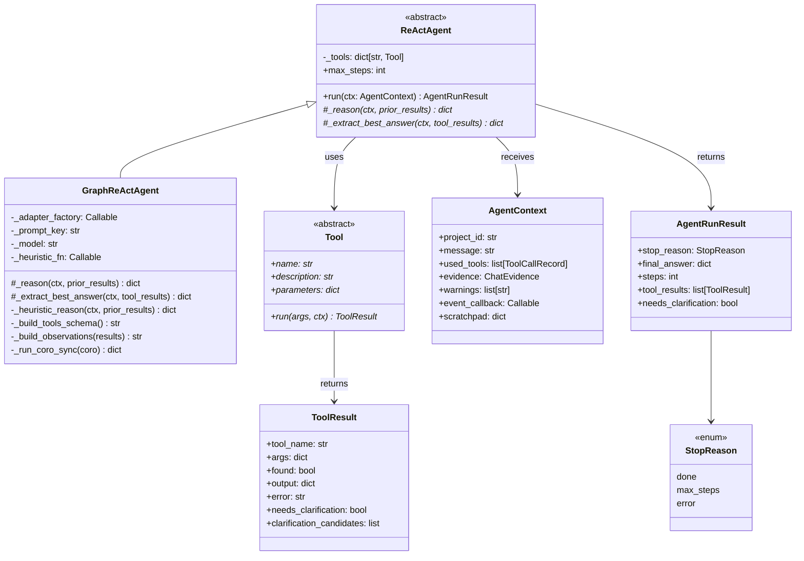
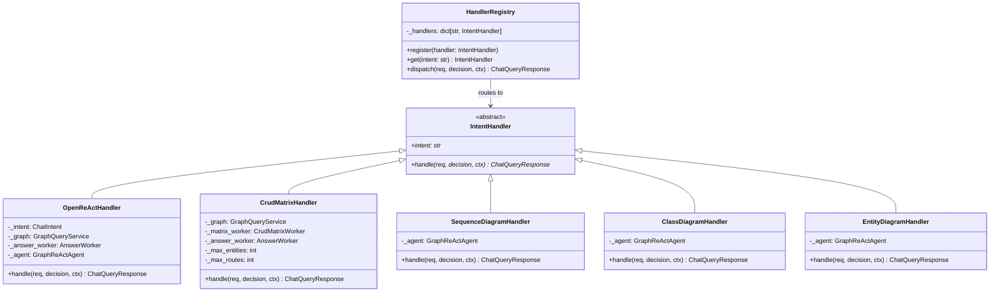
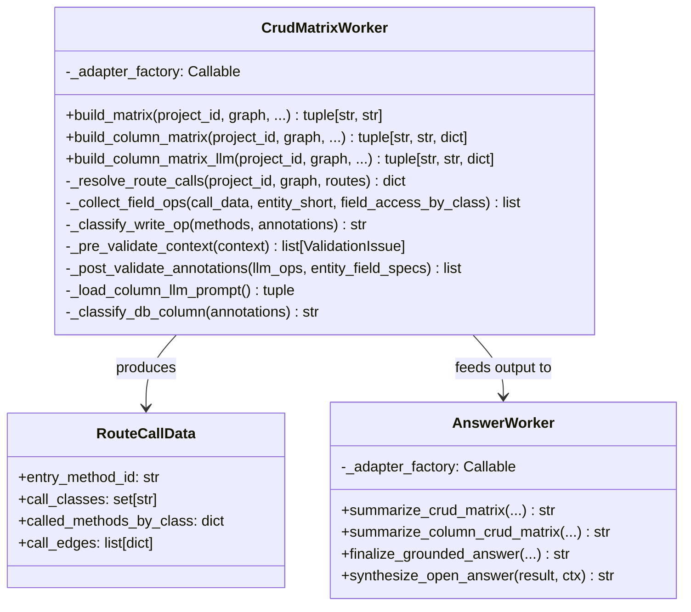
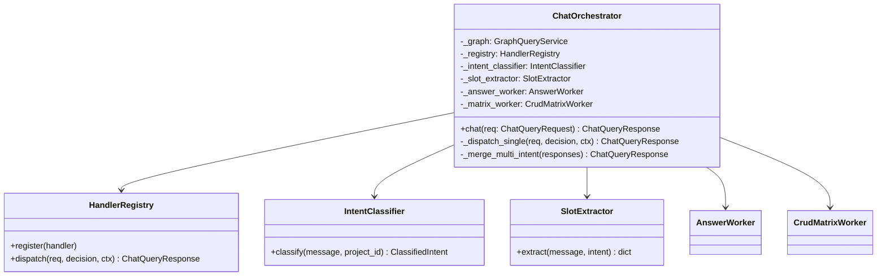

# LLM / ReAct Architecture Handoff — UAAF Migration

**Date:** 2026-05-21  
**Branch:** `codex/web-phase-rerun`  
**Purpose:** Tài liệu này mô tả toàn bộ kiến trúc LLM và ReAct agent hiện tại của hệ thống, tập trung vào ba subsystem: **Analysis (Chat Agent)**, **Entity CRUD Matrix**, và **Eval**. Đây là tài liệu bàn giao để migrate sang UAAF framework.

---

## 1. Tổng quan kiến trúc

```
User Request
    │
    ▼
POST /api/chat/query/stream          POST /api/diagrams/crud-matrix/stream
    │                                        │
    ▼                                        ▼
ChatOrchestrator                   CrudMatrixWorker.build_column_matrix_llm()
    │                                        │
    ├── IntentClassifier                      ├── per-route: LLM call (1 call/route)
    ├── SlotExtractor                         ├── progress_hook → SSE events
    ├── HandlerRegistry                       └── returns (markdown, artifact, structured)
    │       │
    │       ├── OpenReActHandler (5 intents)
    │       │       └── GraphReActAgent ──→ LLMAdapter.complete_json()
    │       │               └── Tools[14] ──→ GraphQueryService ──→ Neo4j
    │       │
    │       └── CrudMatrixHandler (1 intent, NO ReAct loop)
    │               └── CrudMatrixWorker
    │
    └── AnswerWorker → final text response
```

---

## 2. LLM Adapter Layer

### 2.1 Interface (Protocol)

**File:** `src/llm/llm_adapter.py`

```python
class LLMAdapter(Protocol):
    enabled: bool
    model: str
    last_input_tokens: int
    last_output_tokens: int

    async def complete_json(
        self,
        prompt: str,
        system_prompt: str | None = None,
        output_schema: dict | None = None,  # JSON Schema cho structured output
        schema_name: str | None = None,
    ) -> dict: ...

    def describe_status(self) -> str: ...
```

`complete_json()` là API duy nhất mà toàn bộ hệ thống dùng để gọi LLM. Input là text prompt, output luôn là `dict` (JSON-parsed).

### 2.2 Implementations

| Class | File | Provider | Structured Output |
|-------|------|----------|-------------------|
| `OpenAIAdapter` | `src/llm/openai_adapter.py` | OpenAI (gpt-4o, gpt-4o-mini) | `response_format=json_schema` |
| `AnthropicAdapter` | `src/llm/anthropic_adapter.py` | Anthropic (claude-*) | tool_use schema |

**OpenAIAdapter** có retry logic:
- `@llm_retry` decorator với backoff
- Transient errors: HTTP 5xx, 429, và OpenAI quirk (400 + `invalid_request_error` + no code)
- `max_retries=0` trên AsyncOpenAI client (retry do decorator tự xử lý)

### 2.3 Factory

**File:** `src/llm/adapter_factory.py`

```python
def get_llm_adapter(model: str, config: AppConfig) -> LLMAdapter:
    if model.startswith("claude-"):
        return AnthropicAdapter(api_key=config.anthropic_api_key, model=model, ...)
    return OpenAIAdapter(api_key=config.openai_api_key, model=model or config.openai_model, ...)
```

Workers và handlers nhận `adapter_factory: Callable[[str], LLMAdapter]` thay vì nhận adapter trực tiếp — giúp switch model theo từng request.

### 2.4 Prompt Registry

**File:** `src/llm/prompt_registry.py`  
**Prompts:** `src/prompts/chat/agents/*.yml`

Mỗi YAML prompt file có 2 fields:
- `system_prompt` — context và instruction cho LLM
- `user_prompt` — template có `{placeholder}` được format trước khi gọi LLM

Prompt key quan trọng:
- `REACT_AGENT_PROMPT_V1` → ReAct reasoning prompt (dùng cho OpenReActHandler)
- `src/prompts/chat/agents/crud_matrix_column_classify.v1.yml` → CRUD matrix column LLM prompt

---

## 3. ReAct Agent

### 3.1 Class Diagram



### 3.2 ReAct Loop (chi tiết)

**File:** `src/chat/agent/react_agent.py`

```
run(ctx):
  for step in range(max_steps):             # default max_steps=4 (OpenReAct: 8)
    decision = _reason(ctx, prior_results)
    │
    ├── LLM available?
    │     YES → load YAML prompt
    │            format user_msg với {message, hint, tools_schema, observations, step}
    │            await adapter.complete_json(user_msg, system_prompt)
    │            → expected: {"reasoning": "...", "action": "call_tool"/"finish",
    │                         "tool": "<name>", "args": {...}}
    │
    │     NO  → heuristic_fn(ctx, prior_results)
    │
    ├── decision["action"] == "finish" → return AgentRunResult(done)
    ├── tool = tools[decision["tool"]]
    ├── result = tool.run(decision["args"], ctx)
    ├── prior_results.append(result)
    └── result.needs_clarification → return AgentRunResult(needs_clarification)

  → max_steps hit → _extract_best_answer() → AgentRunResult(max_steps)
```

**Thread bridge** (`_run_coro_sync`): Vì `run()` là synchronous nhưng `adapter.complete_json()` là async, agent chạy LLM trong thread mới với `asyncio.run()`. Context vars được copy để `llm_ctx()` propagate đúng.

### 3.3 Heuristic Fallbacks (khi không có LLM key)

| Function | Dùng cho | Logic |
|----------|----------|-------|
| `_route_ladder_heuristic` | SequenceDiagram, ClassDiagram handlers | Step 0: resolve_route → Step 1: find_routes_by_use_case → Step 2: find_method_by_name |
| `finish_with_evidence_heuristic` | OpenReActHandler | Trả về tool output đầu tiên `found=True`, hoặc finish empty |

---

## 4. Intent Handlers

### 4.1 Class Diagram



### 4.2 OpenReActHandler

**File:** `src/chat/agent/handlers/open_react_handler.py`

Handles **5 intents**: `symbol_explain`, `dependency_analysis`, `graph_traversal`, `entity_interaction`, `route_use_case_lookup`

Flow:
1. `_seed_scratchpad(ctx, decision, intent)` — điền hint/target/expansion terms vào scratchpad
2. `event_callback(thinking: open_react)` — UI thấy "đang suy nghĩ"
3. `self._agent.run(ctx)` → GraphReActAgent loop (max 8 steps)
4. Nếu `needs_clarification` → return clarification response
5. `AnswerWorker.synthesize_open_answer(result, ctx)` → text response
6. Return `ChatQueryResponse`

**14 tools** được đăng ký:

| Tool | Mô tả |
|------|-------|
| `SearchSymbolsTool` | Full-text search class/method theo tên |
| `GetClassOverviewTool` | Properties + methods của một class |
| `GetClassRelationshipsTool` | DEPENDS_ON / CALLS / USES edges |
| `GetDependencyNeighborsTool` | Neighborhood graph đến depth N |
| `GetPathBetweenSymbolsTool` | Shortest path giữa 2 nodes |
| `GetEntitiesForClassOrRouteTool` | Entities liên quan đến class/route |
| `GetRepositoryInteractionsTool` | Repository ops cho một class |
| `GetCallSubgraphTool` | Method call graph đến depth N |
| `GetControlFlowsTool` | Control flow cho tập method_ids |
| `ResolveRouteTool` | Exact/fuzzy route resolution |
| `SearchRoutesFuzzyTool` | Fuzzy route search |
| `FindRoutesByUseCaseTool` | Semantic route search by use case |
| `FindMethodByNameTool` | Tìm method theo tên |
| `GetProjectOverviewTool` | Project-level summary |

### 4.3 CrudMatrixHandler

**File:** `src/chat/agent/handlers/crud_matrix_handler.py`

**KHÔNG dùng ReAct loop** — flow deterministic 3 phase:

```
Phase 1: verify entity classes
  graph.get_entity_class_keys_set(project_id, max_entities)
  → empty → return "Phase 1 not run" error

Phase 2: build CRUD matrix
  level = "entity" hoặc "column" (detect từ message keywords)
  
  if level == "column":
    if event_callback and LLM available:
      matrix_worker.build_column_matrix_llm(...)   ← LLM path
    else:
      matrix_worker.build_column_matrix(...)        ← rule-based fallback
  else:
    matrix_worker.build_matrix(...)                 ← entity-level rule-based

Phase 3: synthesize answer
  answer_worker.summarize_column_crud_matrix(...) hoặc summarize_crud_matrix(...)
  answer_worker.finalize_grounded_answer(...)
  → return ChatQueryResponse
```

---

## 5. Workers

### 5.1 Class Diagram (Workers)



### 5.2 CrudMatrixWorker — 3 modes

**File:** `src/chat/workers/crud_matrix_worker.py`

| Method | Level | Engine | Returns |
|--------|-------|--------|---------|
| `build_matrix()` | Entity | Rule-based (call graph heuristics) | `(markdown, artifact_path)` |
| `build_column_matrix()` | Column/Field | Rule-based (`field_access_map` từ Neo4j) | `(markdown, artifact_path, structured_json)` |
| `build_column_matrix_llm()` | Column/Field | **LLM per-route** | `(markdown, artifact_path, structured_json)` |

#### `build_column_matrix_llm()` — chi tiết

```
Input: project_id, graph, max_entities, max_routes,
       entity_filter, route_filter, model,
       progress_hook: Callable[[dict], None],   ← cho SSE streaming
       cancel_check: Callable[[], bool]          ← cho cancel

1. Fetch entity classes từ Neo4j (batch)
2. Fetch fields + class annotations (batch)
3. Drop enum-like classes, DTO types
4. Fetch routes (list_routes)
5. Resolve call subgraphs per route (_resolve_route_calls)
6. Fetch field_access_map (batch)
7. Fetch method annotations (batch)

for each route:
  emit("route_start")
  context = {entities, fields, call_chain, method_access, annotations, query_annotations}
  issues = _pre_validate_context(context)        ← Layer 1: block if errors
  if not blocked:
    raw_ops = adapter.complete_json(prompt, output_schema={...})
    corrected = _post_validate_annotations(raw_ops) ← Layer 3: annotation rules
  emit("route_done")

→ _build_column_markdown(columns, row_data)
emit("done", markdown=..., structured=...)
```

**Events emitted** (qua `progress_hook`):

| Event type | Nội dung |
|------------|---------|
| `connected` | project_id, model |
| `started` | total_routes, total_entities |
| `route_start` | index, total, route_label |
| `llm_attempt` | step, model, prompt_tokens |
| `route_done` | route_label, ops_count, elapsed_ms |
| `route_error` | route_label, error |
| `cancelled` | message |
| `done` | markdown, structured, stats |

#### Anti-hallucination — 3 layers

| Layer | Location | Mô tả |
|-------|----------|-------|
| **Layer 1** Pre-validate | `_pre_validate_context()` | Block LLM call nếu context rỗng/thiếu (error) hoặc warning |
| **Layer 2** Prompt | `crud_matrix_column_classify.v1.yml` | System prompt + JSON schema output constraint |
| **Layer 3** Post-validate | `_post_validate_annotations()` | 13 JPA annotation rules (e.g. `@Column(updatable=false)` → chỉ C+R, không U) |

---

## 6. ChatOrchestrator

**File:** `src/chat/orchestrator.py` (~1183 lines)



**Wiring trong constructor:**
```python
# 5 OpenReActHandler instances (một per intent)
for intent in OPEN_REACT_INTENTS:
    registry.register(OpenReActHandler(intent, graph, answer_worker, adapter_factory))

# 1 CrudMatrixHandler
registry.register(CrudMatrixHandler(graph, matrix_worker, answer_worker))

# Diagram handlers (dùng GraphReActAgent với route ladder heuristic)
registry.register(SequenceDiagramHandler(...))
registry.register(ClassDiagramHandler(...))
registry.register(EntityDiagramHandler(...))
```

**`OPEN_REACT_ENABLED`** env flag: nếu `false`, orchestrator dùng legacy if-chain thay HandlerRegistry.

---

## 7. API Endpoints liên quan

### 7.1 CRUD Matrix API

**File:** `src/api/app.py`

| Endpoint | Method | Mô tả |
|----------|--------|-------|
| `POST /api/diagrams/crud-matrix` | sync | Entity-level hoặc column rule-based |
| `POST /api/diagrams/crud-matrix/stream` | SSE | Column LLM — streaming per-route progress |
| `GET /api/diagrams/crud-matrix/history` | GET | Danh sách history runs |
| `GET /api/diagrams/crud-matrix/history/detail` | GET | Chi tiết một run |

**SSE Streaming flow** (`/stream` endpoint):

```
POST /api/diagrams/crud-matrix/stream
  │
  ├── asyncio.Queue (event_queue)   ← thread-safe bridge
  ├── threading.Event (cancel_event)
  │
  ├── asyncio.to_thread(run_worker)
  │     → CrudMatrixWorker.build_column_matrix_llm(
  │           progress_hook=emit,           ← ghi vào Queue từ thread
  │           cancel_check=cancel_event.is_set
  │       )
  │
  └── async generator (event_stream):
        while True:
          event = await queue.get(timeout=0.5)
          if disconnected: cancel_event.set(); break
          else: yield f"data: {json.dumps(event)}\n\n"
          # heartbeat: yield ": ping\n\n"
```

### 7.2 Chat Stream API

| Endpoint | Method | Mô tả |
|----------|--------|-------|
| `POST /api/chat/query/stream` | SSE | Chat query với event_callback → SSE |

### 7.3 Eval API

| Endpoint | Method | Mô tả |
|----------|--------|-------|
| `GET /api/eval/run/stream/{suite_id}` | SSE | Stream subprocess stdout |
| `POST /api/eval/run` | sync | Blocking subprocess run |
| `GET /api/eval/results` | GET | Latest JSON results từ `artifacts/eval/` |
| `GET /api/eval/history/{suite_id}` | GET | JSONL history |
| `GET /api/eval/status` | GET | Which suites đang chạy |
| `GET /api/eval/prompt/{suite_id}` | GET | LLM prompt YAML của suite |

**Eval Suites** (`_SUITE_SCRIPTS`):
```python
"chat_intent":     "tests/eval/test_chat_intent.py"
"crud_matrix":     "tests/column_crud_matrix_integration/run_all.py"
"crud_matrix_llm": "tests/column_crud_matrix_integration/run_all.py --engine llm --model gpt-4o-mini"
```

---

## 8. Eval System

### 8.1 Architecture

```
EvalPage (React)
  │  GET /api/eval/status
  │  GET /api/eval/results
  │  GET /api/eval/history/{suite_id}
  │
  └── "Run" button → GET /api/eval/run/stream/{suite_id}  (SSE)
          │
          └── asyncio.create_subprocess_exec(python run_all.py --json-out out.json)
                stream stdout → SSE log events
                on exit → _append_eval_history(suite_id, out_path)

Output: artifacts/eval/{suite_id}.json         ← latest results
        artifacts/eval/{suite_id}_history.jsonl ← run history
```

### 8.2 CRUD Matrix Integration Test

**File:** `tests/column_crud_matrix_integration/run_all.py`

Chạy test cases với golden expectations:
- Input: Java Spring Boot test fixtures trong `tests/column_crud_matrix_integration/datasets/`
- Engine: `rule` (default) hoặc `llm` (--engine llm)
- Output: JSON với pass/fail per case, confidence scores

**Framework:** `tests/column_crud_matrix_integration/framework.py`
- Load dataset → chạy CrudMatrixWorker → compare với golden expectations
- Metrics: precision, recall per CRUD operation per (entity, column)

---

## 9. Migration Notes cho UAAF

### 9.1 Các điểm cần thay thế

| Component hiện tại | File | UAAF equivalent |
|--------------------|------|-----------------|
| `ReActAgent` / `GraphReActAgent` | `src/chat/agent/react_agent.py` | UAAF Agent base |
| `Tool` ABC | `src/chat/agent/tool_base.py` | UAAF Tool interface |
| `AgentContext` | `src/chat/agent/agent_context.py` | UAAF RunContext / State |
| `ToolResult` | `src/chat/agent/tool_result.py` | UAAF ToolOutput |
| `HandlerRegistry` | `src/chat/agent/handler_registry.py` | UAAF Router / Dispatcher |
| `IntentHandler` | `src/chat/agent/handler_base.py` | UAAF Handler / Skill |
| `LLMAdapter` Protocol | `src/llm/llm_adapter.py` | UAAF LLM Provider |
| `adapter_factory.get_llm_adapter()` | `src/llm/adapter_factory.py` | UAAF ModelFactory |
| YAML prompt files | `src/prompts/chat/agents/*.yml` | UAAF Prompt templates |

### 9.2 Giữ nguyên

- `CrudMatrixWorker` — logic thuần Python, không phụ thuộc ReAct. Chỉ cần thay `adapter_factory` bằng UAAF LLM provider.
- `GraphQueryService` — Neo4j queries, không liên quan ReAct.
- `AnswerWorker` — text synthesis, độc lập.
- Tool implementations (`src/chat/agent/tools/*.py`) — chỉ cần implement UAAF Tool interface.
- Eval system — chạy subprocess, không liên quan agent framework.

### 9.3 Contract quan trọng cần giữ

1. **`complete_json(prompt, system_prompt, output_schema) → dict`**  
   Tất cả LLM calls đều expect JSON output. UAAF adapter cần enforce structured output (JSON Schema).

2. **`event_callback: Callable[[dict], None]`** trong `AgentContext`  
   Cơ chế push events ra SSE. UAAF cần cung cấp equivalent (streaming callback / observable).

3. **`cancel_check: Callable[[], bool]`** trong `build_column_matrix_llm()`  
   Cho phép cancel mid-run khi client disconnect. UAAF cần support cancellation token.

4. **`progress_hook` trong CrudMatrixWorker**  
   Distinct với ReAct event_callback — đây là worker-level progress (per-route), không phải agent-level thinking events.

5. **Thread bridge** (`_run_coro_sync`)  
   Hiện tại ReAct loop là sync, LLM calls là async. Nếu UAAF agent là async throughout, không cần bridge này nữa — đây là simplification.

### 9.4 LLMAdapter Calling Pattern — Cực kỳ dễ migrate

#### Calling architecture (Production)

**Nguyên tắc:** Không ai nhận `LLMAdapter` trực tiếp — tất cả nhận **factory function**:

```python
# Signature phổ biến
adapter_factory: Callable[[str], LLMAdapter]

# Cách gọi
adapter = self._adapter_factory("gpt-4o-mini")    # factory trả adapter theo model name
result = await adapter.complete_json(
    prompt=user_msg,
    system_prompt=pkg.system_prompt,
    output_schema={"type": "object", ...},        # JSON Schema → structured output
)
```

**Call graph:**

```
ChatOrchestrator (constructor)
    adapter_factory = lambda model: get_llm_adapter(model, cfg)
    
    ├── OpenReActHandler(adapter_factory=...)
    │       └── GraphReActAgent(adapter_factory=...)
    │               └── _reason(ctx, prior)
    │                   → adapter = adapter_factory("gpt-4o-mini")
    │                   → result = await adapter.complete_json(...)
    │                   → {"reasoning": "...", "action": "call_tool", "tool": "..."}
    │
    └── CrudMatrixWorker(adapter_factory=...)
            └── build_column_matrix_llm()
                → for each route:
                   adapter = adapter_factory("gpt-4o-mini")
                   raw = await adapter.complete_json(prompt, output_schema={ops: [...]})
                   raw["ops"] = [{entity, column, op, confidence, reasoning}]

POST /api/diagrams/crud-matrix/stream
    adapter_factory = lambda model: get_llm_adapter(model, cfg)
    worker = CrudMatrixWorker(adapter_factory=...)
```

#### Migration Strategy — 2-step wrapper approach

**Step 1:** Write UAAF → current interface adapter (không thay business code):

```python
# src/llm/uaaf_adapter_bridge.py
class UAAFLLMBridge:
    """Wrap UAAF LLM provider để satisfy LLMAdapter Protocol."""
    
    def __init__(self, uaaf_provider):
        self._provider = uaaf_provider       # UAAF provider instance
        self.enabled = True
        self.model = uaaf_provider.model_name
        self.last_input_tokens = 0
        self.last_output_tokens = 0

    async def complete_json(
        self,
        prompt: str,
        system_prompt: str | None = None,
        output_schema: dict | None = None,
        schema_name: str | None = None,
    ) -> dict:
        """Map sang UAAF API call."""
        messages = []
        if system_prompt:
            messages.append({"role": "system", "content": system_prompt})
        messages.append({"role": "user", "content": prompt})
        
        # UAAF call signature (adjust per UAAF SDK)
        response = await self._provider.generate(
            messages=messages,
            response_format=output_schema,     # JSON Schema (if UAAF supports)
            model=self.model,
        )
        
        # Extract JSON from response
        result = response.parsed if hasattr(response, "parsed") else json.loads(response.text)
        
        # Update token counts for observability
        if hasattr(response, "usage"):
            self.last_input_tokens = response.usage.input_tokens
            self.last_output_tokens = response.usage.output_tokens
        
        return result

    def describe_status(self) -> str:
        return f"UAAF/{self.model}"
```

**Step 2:** Update factory in `src/api/app.py`:

```python
# Before
from src.llm.adapter_factory import get_llm_adapter
adapter_factory = lambda model: get_llm_adapter(model, cfg)

# After
from src.llm.uaaf_adapter_bridge import UAAFLLMBridge
from uaaf import ModelProvider  # or equivalent UAAF import

def uaaf_adapter_factory(model: str):
    uaaf_provider = ModelProvider.get(model)  # UAAF factory
    return UAAFLLMBridge(uaaf_provider)

adapter_factory = uaaf_adapter_factory
```

**Result:** `GraphReActAgent`, `CrudMatrixWorker`, `OpenReActHandler`, `CrudMatrixHandler` — **không đụng gì** ✓

#### Prerequisites for smooth migration

UAAF framework **cần** hỗ trợ:

| Requirement | Detail | Impact if missing |
|-------------|--------|-------------------|
| **Structured JSON output** | Pass `response_format: dict` hoặc JSON Schema vào API call, nhận `dict` ra (không raw string) | Phải parse `json.loads()` + validate trong bridge |
| **Async API** | `complete_json()` phải async — tất cả LLM calls từ thread pool (`asyncio.to_thread`) | Phải viết sync wrapper hoặc refactor ReAct để async-first |
| **Model switching** | Factory nhận `model: str`, trả provider tương ứng | Cứng cõi model ngay ở khởi tạo → mất flexibility per-request |
| **Retry mechanism** | Hoặc built-in, hoặc wrapper tự tích hợp `@llm_retry` decorator | Transient errors (5xx, 429) không handle → fail faster |

#### Complexity assessment

| Phase | Difficulty | Effort | Risk |
|-------|-----------|--------|------|
| Bridge layer | 🟢 Easy | 1-2h | Low — isolated, testable |
| Factory wiring | 🟢 Easy | 30m | Low — just swap lambda |
| Tool implementations | 🟡 Medium | 4-6h | Medium — 14 tools, each calls GraphQueryService |
| Agent loop | 🟡 Medium | 3-4h | Medium — but ReAct loop logic is generic |
| Orchestrator | 🟡 Medium | 2-3h | Medium — multi-intent merge, edge cases |
| E2E testing | 🟡 Medium | 4-5h | Medium — SSE streaming, eval suite |
| **Total** | — | **17-21h** | — |

**Biggest risk:** Async/sync boundary. If UAAF is fully async, can eliminate `_run_coro_sync` thread bridge (simplification). If sync-only, need different strategy.

---

### 9.5 Thứ tự migrate đề xuất (revised)

```
Phase 1: LLM Adapter (easiest, do first)
  Write UAAFLLMBridge wrapper (1-2h)
  Update factory lambda in app.py (30m)
  → All downstream code (ReAct, CrudMatrix) works unchanged

Phase 2: Tools (independent, parallelize)
  Implement UAAF Tool interface cho 14 tools
  Tools chỉ gọi GraphQueryService — không state, easy to test

Phase 3: Handlers
  OpenReActHandler → UAAF Agent với 14 tools
  CrudMatrixHandler → UAAF Skill/Task (không dùng agent loop)
  Diagram handlers → UAAF Agent với tool subset

Phase 4: Router
  HandlerRegistry → UAAF intent router
  IntentClassifier kết nối với UAAF dispatcher

Phase 5: Orchestrator
  ChatOrchestrator → UAAF orchestrator / session manager
  Giữ nguyên multi-intent merge logic
  Có thể eliminate thread bridge nếu UAAF async-first

Phase 6: API
  SSE endpoints giữ nguyên structure, chỉ thay internal calls
  Eval system không thay đổi (subprocess-based)
```

---

## 10. File Map tổng hợp

```
src/
├── llm/
│   ├── llm_adapter.py          ← LLMAdapter Protocol (interface)
│   ├── openai_adapter.py       ← OpenAI implementation + retry
│   ├── anthropic_adapter.py    ← Anthropic implementation
│   ├── adapter_factory.py      ← get_llm_adapter() factory
│   ├── prompt_registry.py      ← load YAML prompts
│   └── token_logger.py         ← observability (llm_ctx, emit_llm_call)
│
├── chat/
│   ├── orchestrator.py         ← ChatOrchestrator (main entrypoint)
│   ├── models.py               ← ChatQueryRequest, ChatQueryResponse, ChatIntent, ...
│   ├── graph_query_service.py  ← GraphQueryService (Neo4j queries)
│   ├── intent_classifier.py    ← classify user message → ChatIntent
│   ├── slot_extractor.py       ← extract slots from message
│   │
│   ├── agent/
│   │   ├── react_agent.py      ← ReActAgent, GraphReActAgent, heuristics
│   │   ├── agent_context.py    ← AgentContext (shared run state)
│   │   ├── tool_base.py        ← Tool ABC
│   │   ├── tool_result.py      ← ToolResult dataclass
│   │   ├── handler_base.py     ← IntentHandler ABC
│   │   ├── handler_registry.py ← HandlerRegistry
│   │   │
│   │   ├── handlers/
│   │   │   ├── open_react_handler.py    ← OpenReActHandler (5 intents)
│   │   │   ├── crud_matrix_handler.py   ← CrudMatrixHandler (no ReAct)
│   │   │   ├── sequence_diagram_handler.py
│   │   │   ├── class_diagram_handler.py
│   │   │   └── entity_diagram_handler.py
│   │   │
│   │   └── tools/
│   │       ├── analysis_tools.py    ← GetCallSubgraphTool, GetControlFlowsTool, ...
│   │       ├── entity_tools.py      ← GetEntitiesForClassOrRouteTool, ...
│   │       ├── route_tools.py       ← ResolveRouteTool, FindRoutesByUseCaseTool, ...
│   │       ├── graph_tools.py       ← GetDependencyNeighborsTool, GetPathBetweenSymbolsTool, ...
│   │       └── class_tools.py       ← GetClassOverviewTool, SearchSymbolsTool, ...
│   │
│   └── workers/
│       ├── crud_matrix_worker.py    ← CrudMatrixWorker (3 modes)
│       ├── answer_worker.py         ← AnswerWorker
│       ├── sequence_diagram_worker.py
│       ├── class_diagram_worker.py
│       └── ...
│
├── prompts/chat/agents/
│   ├── react_agent_v1.yml                    ← ReAct reasoning prompt
│   └── crud_matrix_column_classify.v1.yml    ← CRUD matrix LLM prompt
│
└── api/
    └── app.py                 ← FastAPI endpoints (CRUD matrix SSE + Eval SSE)

tests/
└── column_crud_matrix_integration/
    ├── framework.py           ← Eval test framework
    ├── run_all.py             ← Eval runner (subprocess target)
    └── datasets/              ← Test fixtures + golden expectations
```
